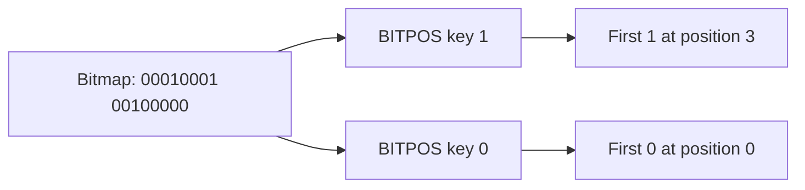

# How to Use BITPOS in Redis to Find First Set or Clear Bit

Author: [nawazdhandala](https://www.github.com/nawazdhandala)

Tags: Redis, Bitmap, BITPOS, BIT, Analytics

Description: Learn how to use BITPOS to find the position of the first set (1) or clear (0) bit in a Redis string bitmap, with optional range limiting.

---

`BITPOS` scans a Redis string bitmap and returns the position of the first bit matching the given value (0 or 1). This is useful for finding the lowest available ID in a bitmapped ID pool, or detecting the first user who has or has not performed an action.

## How BITPOS Works

`BITPOS` scans bits from left to right (MSB to LSB within each byte) and returns the 0-based position of the first bit matching the specified value. If a range is given, the scan is limited to that range.



## Syntax

```redis
BITPOS key bit [start [end [BYTE | BIT]]]
```

- `key` - Redis string key
- `bit` - `0` or `1` - the bit value to search for
- `start` - starting offset (optional)
- `end` - ending offset (optional)
- `BYTE` - interpret start/end as byte offsets (default)
- `BIT` - interpret start/end as bit offsets (Redis 7.0+)

Returns the bit position (0-based), or `-1` if no matching bit is found.

## Setup

```redis
# Users 3, 7, 10 have verified their email
SETBIT email-verified 3 1
SETBIT email-verified 7 1
SETBIT email-verified 10 1
```

## Examples

### Find the First Verified User

```redis
BITPOS email-verified 1
```

Output:

```text
(integer) 3
```

### Find the First Unverified User

```redis
BITPOS email-verified 0
```

Output: the position of the first 0 bit (users 0, 1, 2 are unverified).

```text
(integer) 0
```

### Find First Verified in a Range

Search only within bits 5-15 (users 5-15):

```redis
BITPOS email-verified 1 5 15 BIT
```

Output:

```text
(integer) 7
```

### Find First Bit in Byte Range

Search within bytes 1-2 (bits 8-23):

```redis
BITPOS email-verified 1 1 2
```

### Allocating the Next Available ID

Use a bitmap as a free-ID pool. The first 0 bit is the next available ID:

```redis
# Mark IDs 0, 1, 2 as used
SETBIT id-pool 0 1
SETBIT id-pool 1 1
SETBIT id-pool 2 1

# Find next free ID
BITPOS id-pool 0
# Returns 3 - the next available ID

# Allocate it
SETBIT id-pool 3 1
```

### Checking an Empty Bitmap

```redis
BITPOS empty-bitmap 1
# Returns -1 (no 1 bits found)
```

When searching for 0 bits in an empty key:

```redis
BITPOS empty-bitmap 0
# Returns 0 (all bits are implicitly 0)
```

## Edge Cases

- For a key with no matching bit, `BITPOS` returns `-1` when searching for `1`
- When searching for `0` without an end range on an all-ones bitmap, Redis returns a position just past the last byte
- Use the `BIT` index type (Redis 7.0+) for precise bit-level range queries

## Use Cases

- **ID allocation** - find the first free slot in a bitmapped ID space
- **First unprocessed task** - find the lowest-numbered task not yet marked complete
- **User onboarding checks** - find the first user who has not completed a step
- **Sparse bitmap scanning** - quickly locate the start of data in a sparse bitmap

## Summary

`BITPOS` is a targeted scan command that finds the first occurrence of a given bit value in a Redis bitmap. It is essential for ID pool management and sparse bitmap traversal. The `BIT` range mode (Redis 7.0+) adds bit-level precision, while the older `BYTE` mode works for coarser, block-level scanning.
