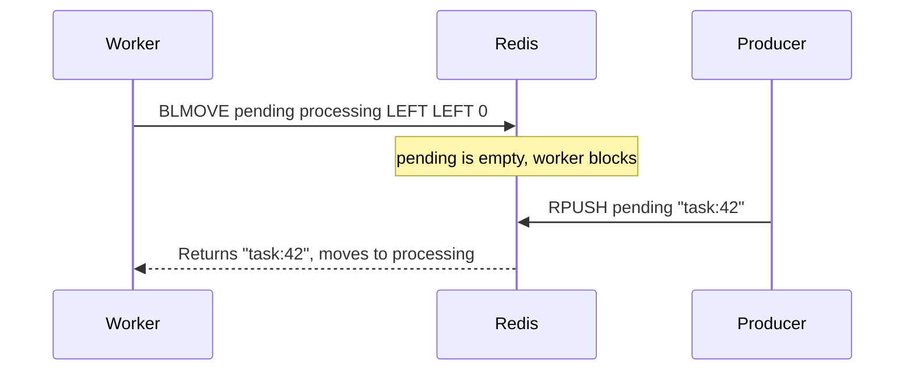

# How to Use BLMOVE in Redis for Blocking List Move

Author: [nawazdhandala](https://www.github.com/nawazdhandala)

Tags: Redis, List, BLMOVE, Command

Description: Learn how to use the Redis BLMOVE command to atomically and reliably move elements between lists with blocking support for empty sources.

---

## How BLMOVE Works

`BLMOVE` is the blocking variant of `LMOVE`. It atomically pops an element from a source list and pushes it to a destination list. If the source list is empty, the command blocks until an element becomes available or the timeout expires.

BLMOVE combines the reliability of LMOVE's atomic move with the efficiency of blocking commands, making it ideal for reliable queue patterns where consumers should not poll. It was introduced in Redis 6.2 as the blocking counterpart to LMOVE and the directional replacement for `BRPOPLPUSH`.



## Syntax

```redis
BLMOVE source destination LEFT|RIGHT LEFT|RIGHT timeout
```

- `source` - key of the source list
- `destination` - key of the destination list
- First `LEFT|RIGHT` - direction to pop from source
- Second `LEFT|RIGHT` - direction to push onto destination
- `timeout` - seconds to block; `0` blocks indefinitely; decimals supported since Redis 6.0

Returns the value of the moved element, or nil on timeout.

## Examples

### Basic Blocking Move

In terminal 1, block waiting for a task to move from pending to processing.

```redis
BLMOVE pending processing LEFT LEFT 10
```

In terminal 2, push a task.

```redis
RPUSH pending "task:1"
```

Terminal 1 immediately returns:

```text
"task:1"
```

After the move, check both lists.

```redis
LRANGE pending 0 -1
LRANGE processing 0 -1
```

```text
(empty array)
---
1) "task:1"
```

### Immediate Return When Source Is Non-Empty

If the source already has elements, BLMOVE does not block.

```redis
RPUSH pending "job:A" "job:B"
BLMOVE pending processing LEFT RIGHT 5
```

```text
"job:A"
```

### Timeout Expiry

```redis
DEL pending
BLMOVE pending processing LEFT LEFT 2
```

After 2 seconds:

```text
(nil)
(2.00s)
```

### Rotate a List

Use the same key for source and destination to rotate elements.

```redis
RPUSH carousel "slide1" "slide2" "slide3"
BLMOVE carousel carousel LEFT RIGHT 5
LRANGE carousel 0 -1
```

```text
1) "slide2"
2) "slide3"
3) "slide1"
```

## Use Cases

### Reliable Job Queue

Workers move tasks from a pending queue to a per-worker processing list. If the worker crashes, the task is still in the processing list and can be recovered.

```redis
-- Worker
BLMOVE jobs worker:1:processing LEFT LEFT 0

-- After successful completion
LREM worker:1:processing 1 "task:42"

-- Recovery: move stuck tasks back to main queue
BLMOVE worker:1:processing jobs RIGHT LEFT 1
```

### Multi-Stage Pipeline

Tasks flow through pipeline stages. Each stage worker blocks until upstream delivers work.

```redis
-- Stage 2 worker waits for stage 1 to produce output
BLMOVE stage1_output stage2_input LEFT RIGHT 0
```

### At-Least-Once Delivery

Store in-flight messages in a separate list until acknowledged.

```redis
-- Consumer atomically moves message to in-flight
BLMOVE inbox inflight LEFT LEFT 0

-- Process message
-- Acknowledge by removing from in-flight
LREM inflight 1 "msg:99"
```

### Circular Task Scheduling

Rotate a task list to implement round-robin scheduling without a separate index.

```redis
RPUSH scheduler "cron:backup" "cron:health" "cron:metrics"
-- Each scheduling tick moves the current task to the end
BLMOVE scheduler scheduler LEFT RIGHT 1
LINDEX scheduler 0
```

## Comparison with BRPOPLPUSH

`BRPOPLPUSH` (deprecated since Redis 6.2) is equivalent to `BLMOVE source destination RIGHT LEFT`. BLMOVE is strictly more flexible.

```redis
-- These are equivalent:
BRPOPLPUSH source dest 10
BLMOVE source dest RIGHT LEFT 10
```

## Performance Considerations

- BLMOVE is O(1) for the move operation itself.
- Blocking is handled server-side; the client connection is held open but the server is not busy-waiting.
- Multiple clients can block on the same source; the first to have blocked is served first.

## Summary

`BLMOVE` pairs the atomic reliability of LMOVE with the efficiency of blocking, creating a robust foundation for reliable queues and processing pipelines. It blocks the connection until source data is available, then atomically moves the element to the destination, ensuring no data loss even when workers crash mid-processing.
