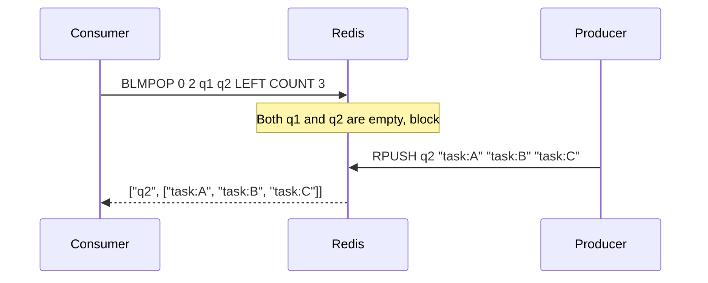

# How to Use BLMPOP in Redis for Blocking Multi-List Pop

Author: [nawazdhandala](https://www.github.com/nawazdhandala)

Tags: Redis, List, BLMPOP, Command

Description: Learn how to use the Redis BLMPOP command to block and wait for elements across multiple lists, combining batch pop with event-driven blocking.

---

## How BLMPOP Works

`BLMPOP` is the blocking variant of `LMPOP`. It scans multiple list keys from left to right and pops elements from the first non-empty one. If all lists are empty, it blocks the connection and waits until an element appears in any of the specified lists or the timeout expires.

BLMPOP was introduced in Redis 7.0 alongside LMPOP. It combines the multi-key awareness of LMPOP with the event-driven efficiency of BLPOP, making it the most versatile blocking list pop command in Redis.



## Syntax

```redis
BLMPOP timeout numkeys key [key ...] LEFT|RIGHT [COUNT count]
```

- `timeout` - seconds to block; `0` blocks indefinitely; decimals supported
- `numkeys` - the count of keys that follow
- `key [key ...]` - list of keys to check in order
- `LEFT|RIGHT` - direction to pop from
- `COUNT count` - optional; number of elements to pop per call (default 1)

Returns a two-element array `[key, [elements]]`, or nil on timeout.

## Examples

### Blocking Until Data Arrives

In terminal 1, block on two empty queues.

```redis
BLMPOP 10 2 q1 q2 LEFT COUNT 2
```

In terminal 2, push tasks to q2.

```redis
RPUSH q2 "task:X" "task:Y" "task:Z"
```

Terminal 1 immediately returns:

```text
1) "q2"
2) 1) "task:X"
   2) "task:Y"
```

COUNT 2 was honored - only 2 elements were popped even though 3 were available.

### Immediate Return When Non-Empty

If any listed key has elements, BLMPOP returns without blocking.

```redis
RPUSH q1 "immediate"
BLMPOP 5 2 q1 q2 LEFT
```

```text
1) "q1"
2) 1) "immediate"
```

### Timeout Expiry

```redis
DEL q1 q2
BLMPOP 2 2 q1 q2 LEFT
```

After 2 seconds:

```text
(nil)
(2.00s)
```

### Pop from the Right

```redis
RPUSH buffer "alpha" "beta" "gamma"
BLMPOP 5 1 buffer RIGHT COUNT 2
```

```text
1) "buffer"
2) 1) "gamma"
   2) "beta"
```

### Indefinite Block with Zero Timeout

```redis
BLMPOP 0 1 jobqueue LEFT
```

This blocks forever until a job arrives - suitable for persistent worker processes.

## Use Cases

### Multi-Queue Worker with Batch Processing

A worker drains batches from multiple queues, prioritizing critical work.

```redis
-- Worker fetches up to 10 tasks from the highest-priority non-empty queue
BLMPOP 30 3 queue:critical queue:high queue:low LEFT COUNT 10
```

### Fan-In Aggregation

Multiple producers write to separate lists; a single aggregator blocks and drains them.

```redis
BLMPOP 0 3 events:sensor1 events:sensor2 events:sensor3 LEFT COUNT 20
```

### Efficient Pipeline Consumer

Consumers block for work from multiple pipeline stages without polling.

```redis
-- Stage 3 worker waits for output from either stage 2a or stage 2b
BLMPOP 0 2 stage2a:output stage2b:output LEFT COUNT 5
```

### Graceful Shutdown with Timeout

Use a short timeout to allow the worker to check a shutdown flag periodically.

```redis
-- Loop with 5-second timeout for graceful shutdown check
BLMPOP 5 1 workqueue LEFT COUNT 10
-- Check shutdown flag
-- Loop again if not shutting down
```

## Differences from BLPOP

| Feature | BLPOP | BLMPOP |
|---|---|---|
| Multiple keys | Yes | Yes |
| Batch pop (COUNT) | No (pops 1) | Yes |
| Direction control | Fixed (LEFT for BLPOP, RIGHT for BRPOP) | Configurable |
| Introduced | Redis 1.0 | Redis 7.0 |

## Performance Considerations

- BLMPOP is O(N + M) where N is the number of keys checked and M is the number of elements popped.
- The blocking is server-side; no client polling occurs.
- Keys are checked in order - put higher-priority queues first.
- A large COUNT value can drain significant data in one call, reducing network overhead.

## Summary

`BLMPOP` is the most capable blocking list pop command in Redis, combining multi-key scanning, directional control, and batch pop into a single operation. It eliminates polling, supports priority queue patterns through key ordering, and delivers batches of work atomically. Use it when you need an efficient, event-driven consumer that can pull from multiple sources.
