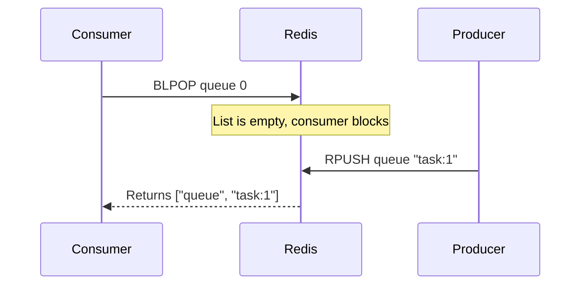

# How to Use BLPOP and BRPOP in Redis for Blocking List Pops

Author: [nawazdhandala](https://www.github.com/nawazdhandala)

Tags: Redis, List, BLPOP, BRPOP, Command

Description: Learn how to use BLPOP and BRPOP in Redis to block and wait for elements to appear in a list, enabling efficient event-driven queue consumers.

---

## How BLPOP and BRPOP Work

`BLPOP` and `BRPOP` are the blocking variants of `LPOP` and `RPOP`. Instead of immediately returning nil when a list is empty, they block the connection and wait until an element is available or a timeout expires.

- `BLPOP` - blocks and pops from the left (head) of the first non-empty list
- `BRPOP` - blocks and pops from the right (tail) of the first non-empty list

Both commands accept multiple keys, enabling a priority queue pattern where the first key with an available element wins.



## Syntax

```redis
BLPOP key [key ...] timeout
BRPOP key [key ...] timeout
```

- `key [key ...]` - one or more list keys to monitor, checked left to right
- `timeout` - maximum seconds to block; `0` means block indefinitely; decimal values (e.g., `1.5`) are supported since Redis 6.0

Returns a two-element array: `[key, value]` - the key from which the element was popped and the element itself. Returns nil on timeout.

## Examples

### Basic Blocking Pop

In one terminal, start a blocking pop with a 10-second timeout.

```redis
BLPOP myqueue 10
```

In a second terminal, push an element.

```redis
RPUSH myqueue "hello"
```

The first terminal immediately receives:

```text
1) "myqueue"
2) "hello"
```

### Timeout Expiry

If no element arrives before the timeout, BLPOP returns nil.

```redis
BLPOP emptylist 2
```

After 2 seconds:

```text
(nil)
(2.00s)
```

### Multiple Keys with Priority

BLPOP checks keys left to right and returns from the first non-empty one. This enables priority-based consumers.

```redis
RPUSH lowpriority "task:low"
BLPOP highpriority mediumpriority lowpriority 5
```

```text
1) "lowpriority"
2) "task:low"
```

Now add a high-priority item:

```redis
RPUSH highpriority "task:critical"
BLPOP highpriority mediumpriority lowpriority 5
```

```text
1) "highpriority"
2) "task:critical"
```

### Non-Empty List (Immediate Return)

If the list already has elements when BLPOP is called, it returns immediately without blocking.

```redis
RPUSH jobs "job:1" "job:2"
BLPOP jobs 5
```

```text
1) "jobs"
2) "job:1"
```

### BRPOP (Pop from Tail)

BRPOP is identical to BLPOP but pops from the right end (tail).

```redis
RPUSH stack "bottom" "middle" "top"
BRPOP stack 5
```

```text
1) "stack"
2) "top"
```

## Use Cases

### Worker Queue Consumer

A worker process blocks on BLPOP, waiting for new jobs without polling.

```redis
-- Worker loop (pseudocode represented as sequential commands)
BLPOP jobqueue 0
-- Process the job
BLPOP jobqueue 0
```

This is more efficient than polling with LPOP in a loop because it does not generate idle Redis commands.

### Event-Driven Notifications

Use BLPOP as a lightweight pub/sub replacement for one-to-one event delivery.

```redis
-- Notifier
RPUSH notify:user:42 '{"event":"order_shipped","orderId":99}'

-- User session handler blocks and picks up notification
BLPOP notify:user:42 30
```

### Priority Queue

Check multiple lists in priority order within a single BLPOP call.

```redis
RPUSH queue:critical "alert:1"
BLPOP queue:critical queue:high queue:normal queue:low 10
```

```text
1) "queue:critical"
2) "alert:1"
```

### Delayed Processing with Timeout

Use a short timeout to allow periodic housekeeping between pops.

```redis
-- Worker checks every 5 seconds if no job arrives
BLPOP workqueue 5
-- Do housekeeping (health check, metric flush, etc.)
BLPOP workqueue 5
```

## Behavior Under Concurrent Consumers

When multiple clients are blocked on the same key:

- The first client to have called BLPOP gets served first (FIFO among waiters).
- This ensures fair distribution of work across worker processes.

## Summary

`BLPOP` and `BRPOP` transform Redis lists into efficient, event-driven queues by blocking consumers until work is available. They eliminate polling overhead, support priority ordering through multiple-key syntax, and return the key name alongside the value so consumers know which queue served them. Use `timeout = 0` for indefinitely blocking workers, and include periodic re-blocking loops for housekeeping tasks.
