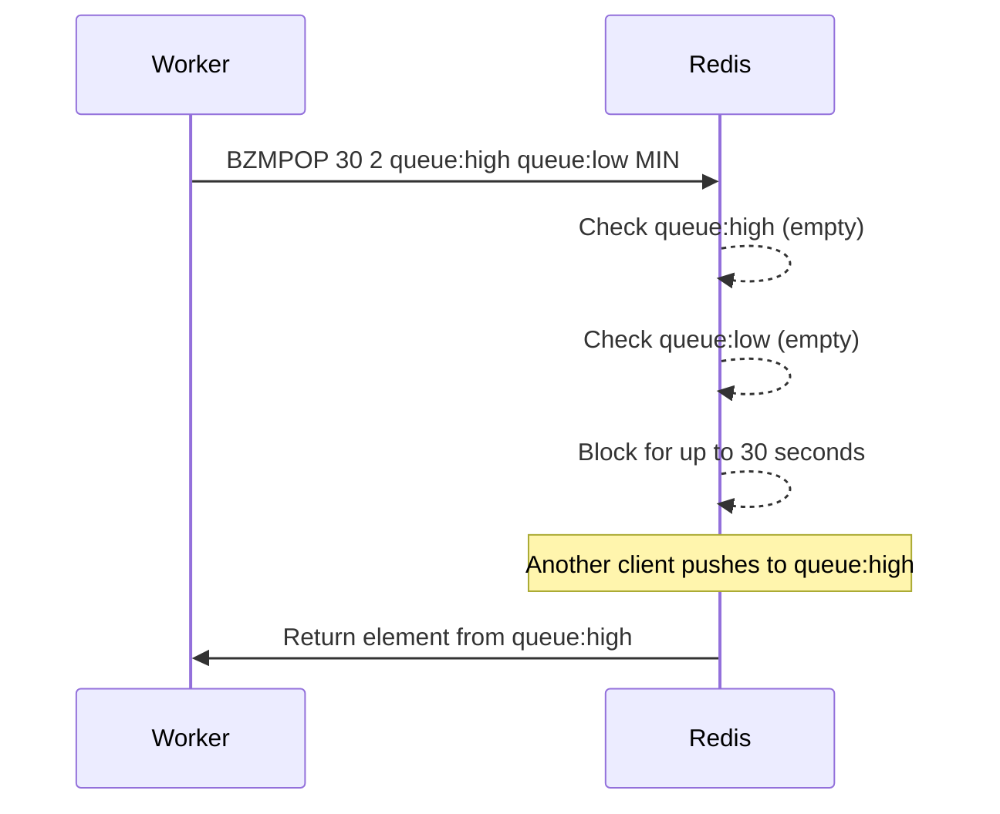

# How to Use BZMPOP in Redis for Blocking Multi-Sorted Set Pop

Author: [nawazdhandala](https://www.github.com/nawazdhandala)

Tags: Redis, BZMPOP, Sorted Set, Blocking, Queue

Description: Learn how to use BZMPOP in Redis to block and wait for elements across multiple sorted sets, with timeout control and practical worker queue examples.

---

## How BZMPOP Works

BZMPOP is the blocking variant of ZMPOP, introduced in Redis 7.0. It checks a list of sorted set keys in order and pops from the first non-empty one. If all keys are empty, the command blocks the connection until an element appears in any of the specified keys or the timeout expires.

This makes BZMPOP ideal for implementing worker processes that continuously poll task queues without busy-waiting, as the server-side blocking is more efficient than repeated polling.



## Syntax

```redis
BZMPOP timeout numkeys key [key ...] MIN|MAX [COUNT count]
```

- `timeout` - maximum seconds to block (0 means block indefinitely)
- `numkeys` - number of keys to check
- `key [key ...]` - list of sorted set keys to check in order
- `MIN|MAX` - pop element with lowest (MIN) or highest (MAX) score
- `COUNT count` - number of elements to pop (default: 1)

## Examples

### Basic blocking pop with a timeout

Wait up to 10 seconds for any element in either sorted set:

```redis
BZMPOP 10 2 jobs:urgent jobs:standard MIN
```

If both keys are empty, Redis blocks for up to 10 seconds. When an element arrives:

```text
1) "jobs:urgent"
2) 1) 1) "send-alert-email"
      2) "1"
```

If the timeout expires with no elements:

```text
(nil)
(10.05s)
```

### Blocking indefinitely (timeout = 0)

```redis
BZMPOP 0 1 jobs:queue MIN
```

This blocks the connection until an element is pushed to `jobs:queue`.

### Pop multiple elements when available

```redis
BZMPOP 5 2 tasks:high tasks:low MAX COUNT 3
```

If `tasks:high` is empty but `tasks:low` has elements, pops up to 3 highest-scored items:

```text
1) "tasks:low"
2) 1) 1) "render-video"
      2) "95"
   2) 1) "send-report"
      2) "80"
   3) 1) "sync-data"
      2) "72"
```

### Immediate return when data is available

If elements already exist when BZMPOP is called, it returns immediately without blocking:

```redis
ZADD priority:queue 100 "process-payment"
BZMPOP 5 1 priority:queue MIN
```

```text
1) "priority:queue"
2) 1) 1) "process-payment"
      2) "100"
```

## Worker Pattern

A typical worker loop using BZMPOP looks like this in pseudocode:

```bash
# Continuously process jobs using redis-cli in a loop
while true; do
  result=$(redis-cli BZMPOP 30 2 queue:critical queue:normal MIN)
  if [ -n "$result" ]; then
    echo "Processing: $result"
    # handle the job
  fi
done
```

## Use Cases

**Background job workers** - Workers block on BZMPOP and wake up only when work is available, eliminating CPU-wasting poll loops.

**Priority-aware consumers** - By listing high-priority queues first, workers naturally prefer high-priority work over lower-priority work when both are available.

**Multi-tenant processing** - Each tenant has their own sorted set; a worker uses BZMPOP to serve whichever tenant has pending work, processed in score order.

**Delayed job execution** - Score jobs by their Unix timestamp. Use BZMPOP MIN with a timeout to pick up the next job due to run.

## Comparison with BZPOPMIN / BZPOPMAX

| Feature | BZPOPMIN / BZPOPMAX | BZMPOP |
|---------|---------------------|--------|
| Multiple keys | Yes | Yes |
| Count option | No (always 1) | Yes |
| Redis version | 5.0+ | 7.0+ |
| Return format | Flat array | Nested array |

## Summary

BZMPOP combines the multi-key scanning of ZMPOP with server-side blocking, making it the right tool for worker processes that consume from multiple priority queues. The timeout parameter gives you control over how long to wait, and the COUNT option lets you batch-pop multiple items on each wake-up cycle. Use BZMPOP in worker loops to build efficient, priority-aware job consumers without polling overhead.
