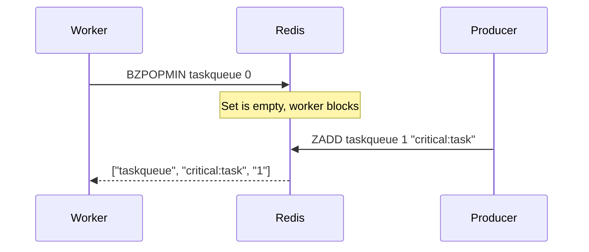

# How to Use BZPOPMIN and BZPOPMAX for Blocking Sorted Set Pop

Author: [nawazdhandala](https://www.github.com/nawazdhandala)

Tags: Redis, Sorted Set, BZPOPMIN, BZPOPMAX, Command

Description: Learn how to use BZPOPMIN and BZPOPMAX in Redis to block and wait for elements in a sorted set, enabling efficient event-driven priority queue consumers.

---

## How BZPOPMIN and BZPOPMAX Work

`BZPOPMIN` and `BZPOPMAX` are the blocking variants of ZPOPMIN and ZPOPMAX. They pop the member with the lowest (or highest) score from the first non-empty sorted set in a list of keys. If all specified sets are empty, the connection blocks until an element becomes available or the timeout expires.

This makes them ideal for priority queue workers that should sleep efficiently while waiting for work, rather than polling in a loop.



## Syntax

```redis
BZPOPMIN key [key ...] timeout
BZPOPMAX key [key ...] timeout
```

- `key [key ...]` - one or more sorted set keys, checked left to right
- `timeout` - seconds to block; `0` blocks indefinitely; decimal values supported since Redis 6.0

Returns a three-element array: `[key, member, score]`. Returns nil on timeout.

## Examples

### Basic Blocking Pop

In terminal 1, block on an empty sorted set.

```redis
BZPOPMIN taskqueue 10
```

In terminal 2, add a task.

```redis
ZADD taskqueue 3 "task:high" 1 "task:critical"
```

Terminal 1 immediately receives:

```text
1) "taskqueue"
2) "task:critical"
3) "1"
```

The member with the lowest score (1) is returned.

### Blocking on Highest Score (BZPOPMAX)

```redis
BZPOPMAX bidqueue 10
```

After a producer runs:

```redis
ZADD bidqueue 50 "bid:A" 75 "bid:B" 60 "bid:C"
```

Terminal 1 returns:

```text
1) "bidqueue"
2) "bid:B"
3) "75"
```

### Immediate Return When Non-Empty

```redis
ZADD ready 5 "job:1" 2 "job:2"
BZPOPMIN ready 10
```

```text
1) "ready"
2) "job:2"
3) "2"
```

No blocking - returns immediately because the set is non-empty.

### Timeout Expiry

```redis
DEL empty
BZPOPMIN empty 2
```

After 2 seconds:

```text
(nil)
(2.00s)
```

### Multiple Keys with Priority

BZPOPMIN checks keys left to right and pops from the first non-empty one.

```redis
ZADD normal 5 "task:normal"
BZPOPMIN critical high normal 10
```

```text
1) "normal"
2) "task:normal"
3) "5"
```

"critical" and "high" were empty; "normal" had a task.

### Indefinite Block

```redis
BZPOPMIN jobqueue 0
```

Blocks forever until a job is available. Suitable for persistent workers.

## Use Cases

### Priority Queue Consumer

Workers block until the highest-priority task is available.

```redis
-- Worker (lowest score = highest priority)
BZPOPMIN priority:queue 0
```

Different task types are inserted with different scores:

```redis
ZADD priority:queue 1 "alert:critical" 5 "task:normal" 10 "task:background"
```

The worker receives "alert:critical" first.

### Scheduled Job Executor

Use timestamps as scores. BZPOPMIN delivers the earliest scheduled job.

```redis
ZADD scheduled 1711900100 "job:B" 1711900000 "job:A" 1711900200 "job:C"
BZPOPMIN scheduled 30
```

```text
1) "scheduled"
2) "job:A"
3) "1711900000"
```

### Auction / Highest Bid Processor

Pop the highest bid when the auction ends.

```redis
ZADD bids 50.0 "bidder:1" 75.0 "bidder:2" 60.0 "bidder:3"
BZPOPMAX bids 0
```

```text
1) "bids"
2) "bidder:2"
3) "75"
```

### Multi-Queue Priority Routing

Route work across queues with fallback priority.

```redis
BZPOPMIN queue:critical queue:high queue:low 5
```

Workers always pick from the most urgent queue available.

### Background Task Worker Loop

```text
loop:
    result = BZPOPMIN workqueue 30
    if result is nil:
        # Timeout: do housekeeping
        continue
    key, task, score = result
    process(task)
```

## Comparison with BLPOP / BLMOVE

| Feature | BZPOPMIN / BZPOPMAX | BLPOP / BRPOP |
|---|---|---|
| Data structure | Sorted set | List |
| Order | By score | Insertion order |
| Returns | key, member, score | key, member |
| Priority ordering | Built-in (by score) | Manual (separate lists) |

## Performance Considerations

- BZPOPMIN / BZPOPMAX are O(log N) for the pop operation.
- Blocking is server-side; clients do not poll.
- Multiple workers blocking on the same key are served in FIFO order (first to block = first served).
- Use multiple keys for priority-based routing rather than a single key with multiple score levels.

## Summary

`BZPOPMIN` and `BZPOPMAX` are efficient, event-driven consumers for Redis sorted sets. They block until an element is available, support multiple keys for priority routing, and return the key, member, and score as a three-element array. Use them to build priority queue workers that consume zero CPU while idle, replacing polling loops with push-based delivery.
