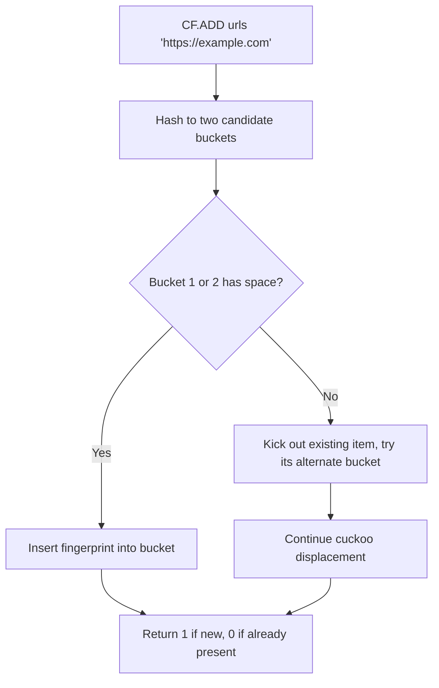

# How to Use CF.ADD in Redis Cuckoo Filter to Add Elements

Author: [nawazdhandala](https://www.github.com/nawazdhandala)

Tags: Redis, RedisBloom, Cuckoo Filter, Probabilistic, Command

Description: Learn how to use CF.ADD in Redis to add elements to a Cuckoo filter, which supports deletions unlike a Bloom filter, with similar low false positive rates.

---

## How CF.ADD Works

`CF.ADD` adds an element to a Cuckoo filter in Redis. A Cuckoo filter is a probabilistic data structure similar to a Bloom filter but with two key differences: it supports deletion of individual elements, and it reports whether an element was already present at insert time. Like a Bloom filter it can produce false positives but not false negatives.



## Cuckoo Filter vs Bloom Filter

| Feature | Bloom Filter | Cuckoo Filter |
|---------|-------------|--------------|
| Deletion | Not supported | Supported (CF.DEL) |
| Duplicate handling | Silently ignores | Tracks count (up to limit) |
| Space efficiency | Slightly better | Slightly worse |
| Lookup speed | O(k) hash functions | O(1) with 2 buckets |
| False positives | Yes | Yes |
| False negatives | No | No |

## Syntax

```redis
CF.ADD key item
```

- `key` - the Cuckoo filter key (auto-created with defaults if not present)
- `item` - the element to add

Returns:
- `1` - element was successfully added (new)
- `0` - element was already in the filter

Returns an error if the filter is full and cannot expand.

## Default Filter Settings

Auto-created Cuckoo filters use:
- Initial capacity: 1024 buckets
- Bucket size: 2 fingerprints per bucket
- Maximum iterations: 500 (cuckoo displacement limit)
- Expansion: 1 (each expansion doubles size)

Use `CF.RESERVE` before `CF.ADD` for custom settings.

## Examples

### Add a Single Element

```redis
CF.ADD visited "https://example.com/page1"
```

```text
(integer) 1
```

### Add Duplicate Element

```redis
CF.ADD visited "https://example.com/page1"
```

```text
(integer) 0
```

The element was already in the filter.

### Add Multiple Elements Sequentially

```redis
CF.ADD products "product:1001"
CF.ADD products "product:1002"
CF.ADD products "product:1003"
```

### Use CF.RESERVE for Custom Capacity

```redis
CF.RESERVE events 1000000
CF.ADD events "event:abc123"
```

## Checking After Addition

```redis
CF.ADD colors "red"
CF.ADD colors "blue"

CF.EXISTS colors "red"
-- (integer) 1

CF.EXISTS colors "green"
-- (integer) 0 (definitely not in filter)
```

## Deleting Elements (Cuckoo Advantage)

Unlike Bloom filters, Cuckoo filters support deletion:

```redis
CF.ADD products "discontinued:item"
CF.EXISTS products "discontinued:item"
-- (integer) 1

CF.DEL products "discontinued:item"
CF.EXISTS products "discontinued:item"
-- (integer) 0
```

This is the primary reason to choose a Cuckoo filter over a Bloom filter.

## Use Cases

### Inventory Tracking with Returns

Track items in inventory where items can be added and removed:

```redis
CF.RESERVE active_inventory 1000000

-- Item arrives
CF.ADD active_inventory "item:12345"

-- Item sold or removed
CF.DEL active_inventory "item:12345"
```

### Dynamic Block Lists

Maintain a block list that can be updated:

```redis
-- Block a user
CF.ADD blocked_users "user:777"

-- Unblock a user
CF.DEL blocked_users "user:777"
```

### Session Revocation

Track valid session tokens and revoke them on logout:

```redis
-- On login
CF.ADD valid_sessions "session:token_xyz"

-- On logout
CF.DEL valid_sessions "session:token_xyz"

-- On request: check if session is still valid
CF.EXISTS valid_sessions "session:token_xyz"
```

## CF.ADD vs BF.ADD

Choose based on whether you need deletion:

```redis
-- Need deletion? Use Cuckoo filter
CF.ADD mutable_set "element"
CF.DEL mutable_set "element"

-- No deletion needed? Use Bloom filter (slightly more memory efficient)
BF.ADD immutable_set "element"
```

## Summary

`CF.ADD` inserts an element into a Redis Cuckoo filter and returns `1` if the element was new or `0` if it was already present. The key advantage of Cuckoo filters over Bloom filters is support for deletion via `CF.DEL`. Use `CF.ADD` when your use case requires both adding and removing individual elements from a probabilistic membership set.
