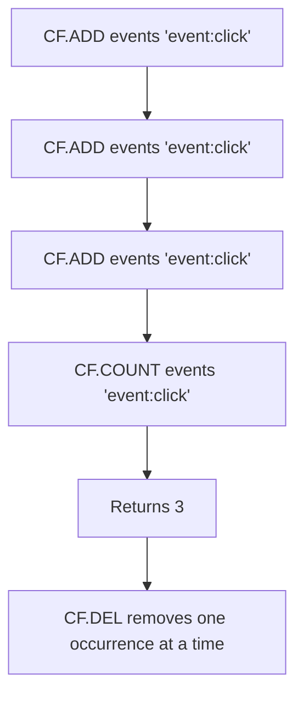

# How to Use CF.COUNT in Redis Cuckoo Filter for Count Queries

Author: [nawazdhandala](https://www.github.com/nawazdhandala)

Tags: Redis, RedisBloom, Cuckoo Filter, Probabilistic, Command

Description: Learn how to use CF.COUNT in Redis to get the number of times an element has been inserted into a Cuckoo filter, useful for tracking duplicate insertions.

---

## How CF.COUNT Works

`CF.COUNT` returns the number of times a specific element has been inserted into a Cuckoo filter. Unlike `CF.EXISTS` which only answers "present or not," `CF.COUNT` tells you how many copies of the fingerprint are stored. This is useful when the same element may be added multiple times and you need to know the insertion count before deleting.



## Syntax

```redis
CF.COUNT key item
```

- `key` - the Cuckoo filter key
- `item` - the element to count

Returns an integer: the number of times the element has been inserted.
Returns `0` if the element is not present or the key does not exist.

## Examples

### Count a Single Insertion

```redis
CF.ADD inventory "item:A"
CF.COUNT inventory "item:A"
```

```text
(integer) 1
```

### Count Multiple Insertions of the Same Element

```redis
CF.ADD bag "red"
CF.ADD bag "red"
CF.ADD bag "red"
CF.COUNT bag "red"
```

```text
(integer) 3
```

### Count After Partial Deletion

```redis
CF.ADD bag "blue" "blue"   -- using MADD
-- Actually with CF.MADD:
-- CF.MADD bag blue blue

-- Or sequential:
CF.ADD bag "blue"
CF.ADD bag "blue"

CF.DEL bag "blue"
CF.COUNT bag "blue"
```

```text
(integer) 1
```

One deletion reduces the count by one.

### Count a Non-Existent Element

```redis
CF.COUNT inventory "item:Z"
```

```text
(integer) 0
```

## When Multiple Insertions Occur

Cuckoo filters allow the same element to be inserted multiple times, up to the bucket size limit (typically 2 to 8 per bucket). Each `CF.ADD` of the same element increments the stored count of that fingerprint.

This behavior is intentional and useful for:
- Multi-set membership: track that an item appears N times
- Reliable deletion: if added 3 times, must be deleted 3 times before `CF.EXISTS` returns 0

```redis
CF.ADD multiset "item"
CF.ADD multiset "item"
CF.ADD multiset "item"

-- Must delete 3 times for item to be fully gone
CF.DEL multiset "item"
CF.DEL multiset "item"
CF.DEL multiset "item"

CF.EXISTS multiset "item"
-- (integer) 0
```

## Use Cases

### Idempotent Processing with Reference Counting

Track how many processes have claimed a task. Release the task only when all claims are dropped:

```redis
-- Two workers both claim the task
CF.ADD claimed_tasks "task:42"
CF.ADD claimed_tasks "task:42"

CF.COUNT claimed_tasks "task:42"
-- (integer) 2

-- Worker 1 finishes
CF.DEL claimed_tasks "task:42"

-- Worker 2 finishes
CF.DEL claimed_tasks "task:42"

-- Now task is fully unclaimed
CF.EXISTS claimed_tasks "task:42"
-- (integer) 0
```

### Tracking Ad Impressions Per Session

Count how many times an ad was shown to a session:

```redis
-- Each ad impression
CF.ADD "impressions:session:abc" "ad:banner_1"
CF.ADD "impressions:session:abc" "ad:banner_1"

CF.COUNT "impressions:session:abc" "ad:banner_1"
-- (integer) 2 -> shown twice this session
```

### Verifying Safe Deletion

Before deleting, check the count to understand what will happen:

```redis
CF.COUNT myfilter "element"
-- (integer) 3 -> element was added 3 times
-- Need 3 CF.DEL calls to fully remove it

-- Or use a loop in application code
```

## CF.COUNT Accuracy Note

`CF.COUNT` is accurate within the constraints of the Cuckoo filter's fingerprint size. If two different elements hash to the same fingerprint (a collision), their counts may be combined. This is rare but possible. For exact counting, use Redis native counters (`INCR`) or a Count-Min Sketch (`CMS.INCRBY` + `CMS.QUERY`).

## Summary

`CF.COUNT` returns the number of times a specific element has been inserted into a Redis Cuckoo filter. A return of `0` means the element is absent; higher values indicate multiple insertions. Use it to track reference counts, verify how many `CF.DEL` calls are needed to fully remove an element, and implement multi-set membership semantics. For precise frequency counting across many distinct items, use Count-Min Sketch instead.
