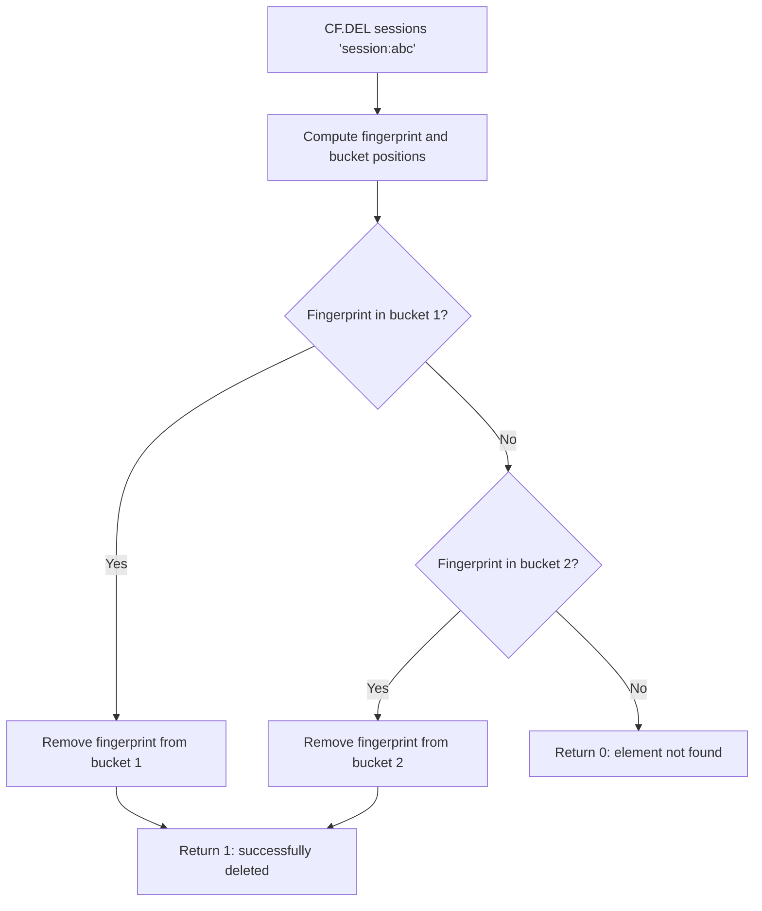
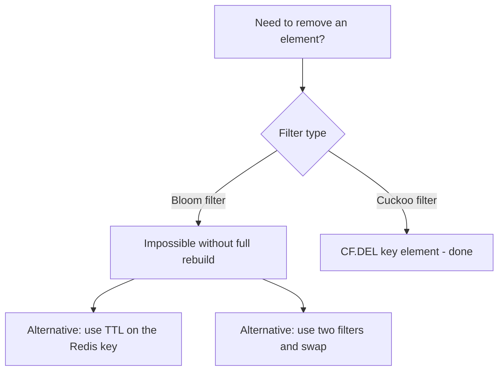

# How to Use CF.DEL in Redis Cuckoo Filter to Remove Elements

Author: [nawazdhandala](https://www.github.com/nawazdhandala)

Tags: Redis, RedisBloom, Cuckoo Filter, Probabilistic, Command

Description: Learn how to use CF.DEL in Redis to remove elements from a Cuckoo filter, a capability not available in Bloom filters, for dynamic membership management.

---

## How CF.DEL Works

`CF.DEL` removes an element from a Redis Cuckoo filter. This is the defining feature that distinguishes Cuckoo filters from Bloom filters. When you delete an element, subsequent `CF.EXISTS` calls return `0` for that element (unless it was added multiple times). The deletion works by locating and clearing the element's fingerprint from its bucket.



## Syntax

```redis
CF.DEL key item
```

- `key` - the Cuckoo filter key
- `item` - the element to remove

Returns:
- `1` - element was found and removed
- `0` - element was not found in the filter

## Examples

### Basic Deletion

```redis
CF.ADD myfilter "item1"
CF.ADD myfilter "item2"

CF.DEL myfilter "item1"
-- (integer) 1

CF.EXISTS myfilter "item1"
-- (integer) 0

CF.EXISTS myfilter "item2"
-- (integer) 1
```

### Delete Non-Existent Element

```redis
CF.DEL myfilter "never_added"
-- (integer) 0
```

### Multiple Insertions Require Multiple Deletions

Cuckoo filters track the count of identical insertions (up to the bucket size limit). Each `CF.ADD` of the same element increments the count, and each `CF.DEL` decrements it:

```redis
-- Add same item twice (uses CF.ADDNX to avoid this pattern normally)
CF.ADD myfilter "item"
CF.ADD myfilter "item"

-- First delete reduces count
CF.DEL myfilter "item"
CF.EXISTS myfilter "item"
-- (integer) 1 - still present

-- Second delete removes it
CF.DEL myfilter "item"
CF.EXISTS myfilter "item"
-- (integer) 0 - gone
```

## Use Cases

### Session Management

Track active sessions and remove them on logout or expiry:

```redis
CF.RESERVE active_sessions 1000000

-- Login
CF.ADD active_sessions "token:abc123"

-- Logout or session expired
CF.DEL active_sessions "token:abc123"

-- Verify on request
CF.EXISTS active_sessions "token:abc123"
-- (integer) 0 -> session invalid, require re-login
```

### Dynamic Block/Allow Lists

Add and remove users from a block list:

```redis
-- Block a misbehaving user
CF.ADD blocked_users "user:5678"

-- Check on request
CF.EXISTS blocked_users "user:5678"
-- (integer) 1 -> reject

-- User appeals and is unblocked
CF.DEL blocked_users "user:5678"

-- Now request is allowed
CF.EXISTS blocked_users "user:5678"
-- (integer) 0 -> allowed
```

### Negative Cache with TTL

Maintain a negative result cache that expires entries when the underlying data changes:

```redis
-- Product not found in catalog
CF.ADD missing_products "product:99999"

-- Product is added to catalog later
CF.DEL missing_products "product:99999"
-- Now product queries will hit the DB and find the new entry
```

### Token Revocation with Expiry

Track revoked API tokens and clean them up after they expire:

```redis
-- Revoke token
CF.ADD revoked_tokens "token:eyJ..."

-- Token's natural expiry reached; remove from revocation list
CF.DEL revoked_tokens "token:eyJ..."
-- No need to check this old token anymore
```

## Caution: False Deletion Risk

Deleting an element that was never added can corrupt the filter. If two different elements hash to the same fingerprint (a hash collision), deleting one may accidentally remove the other's fingerprint from the filter:

```redis
-- WARNING: only delete elements you are certain were added
-- Never delete based on guesses
```

To be safe, track insertions in your application and only call `CF.DEL` for items that were definitively added.

## CF.DEL vs Bloom Filter Limitation



If you find yourself needing to delete from a Bloom filter frequently, switch to a Cuckoo filter.

## Summary

`CF.DEL` removes an element from a Redis Cuckoo filter and returns `1` on success or `0` if the element was not found. This deletion capability is the primary reason to choose a Cuckoo filter over a Bloom filter. Use it for dynamic membership sets such as active sessions, block lists, negative result caches, and revocation lists where items need to be both added and removed over time. Only delete elements you are certain were previously added to avoid potential fingerprint collisions.
