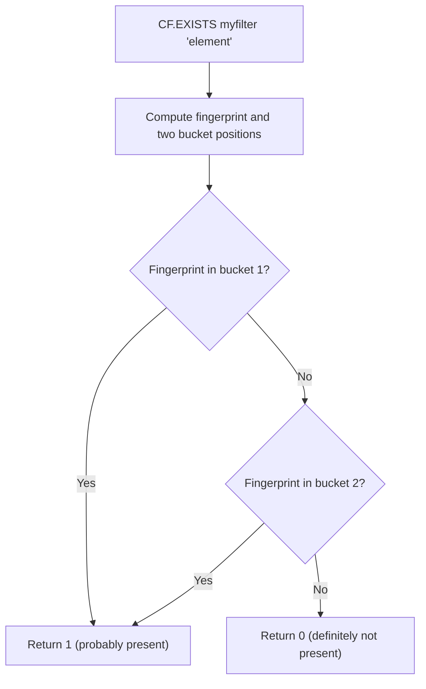

# How to Use CF.EXISTS in Redis Cuckoo Filter for Lookups

Author: [nawazdhandala](https://www.github.com/nawazdhandala)

Tags: Redis, RedisBloom, Cuckoo Filter, Probabilistic, Command

Description: Learn how to use CF.EXISTS in Redis to check whether an element is present in a Cuckoo filter with no false negatives and a configurable false positive rate.

---

## How CF.EXISTS Works

`CF.EXISTS` checks whether a given element is present in a Redis Cuckoo filter. It returns `0` if the element is definitely not in the filter (guaranteed no false negative) or `1` if the element is probably present (small chance of false positive). The lookup examines two candidate buckets and checks for the element's fingerprint.



## Syntax

```redis
CF.EXISTS key item
```

- `key` - the Cuckoo filter key
- `item` - the element to check

Returns:
- `0` - element is definitely not in the filter
- `1` - element is probably in the filter (may be a false positive)

Returns `0` if the key does not exist.

## Examples

### Basic Membership Check

```redis
CF.ADD products "product:A"
CF.ADD products "product:B"

CF.EXISTS products "product:A"
-- (integer) 1

CF.EXISTS products "product:C"
-- (integer) 0
```

### After Deletion

A key difference from Bloom filters: existence checks correctly reflect deletions:

```redis
CF.ADD active_sessions "session:abc"
CF.EXISTS active_sessions "session:abc"
-- (integer) 1

CF.DEL active_sessions "session:abc"
CF.EXISTS active_sessions "session:abc"
-- (integer) 0
```

This would not work with a Bloom filter, which cannot delete elements.

### Non-Existent Filter Returns 0

```redis
CF.EXISTS missing_filter "anything"
-- (integer) 0
```

## CF.EXISTS vs BF.EXISTS

| Feature | CF.EXISTS | BF.EXISTS |
|---------|----------|----------|
| Supports deletions | Yes (reflected immediately) | No |
| False negatives | None | None |
| False positives | Yes (small probability) | Yes (small probability) |
| Performance | O(1) | O(k) hash functions |

## Use Cases

### Request Deduplication

Check if an incoming request has already been processed:

```redis
CF.EXISTS processed_requests "req:xyz789"
-- If 1: likely duplicate, reject
-- If 0: new request, process and add
CF.ADD processed_requests "req:xyz789"
```

Unlike a Bloom filter approach, you can expire processed requests by deleting them:

```redis
-- After request TTL expires, remove from filter
CF.DEL processed_requests "req:xyz789"
```

### Dynamic Block List

Check if a user is on the block list:

```redis
CF.EXISTS blocked_users "user:42"
-- If 1: block access
-- If 0: allow access
```

And you can unblock without recreating the filter:

```redis
CF.DEL blocked_users "user:42"
```

### Cache Negative Results

Track database misses, with the ability to clear individual entries when data is created:

```redis
-- User not found in DB - add to negative cache
CF.ADD missing_user_ids "user:9999"

-- Check before querying DB
CF.EXISTS missing_user_ids "user:9999"
-- If 1: skip DB query

-- User is later created
CF.DEL missing_user_ids "user:9999"
-- Now DB will be queried again for this user
```

### Token Revocation

Check if an auth token has been revoked:

```redis
-- On token revocation
CF.ADD revoked_tokens "token:eyJ..."

-- On request authentication
CF.EXISTS revoked_tokens "token:eyJ..."
-- If 1: reject (token revoked)
-- If 0: token may be valid, proceed with full validation
```

## Understanding the False Positive Rate

The false positive rate depends on the filter's configured `BUCKETSIZE` and how full the filter is. As the filter fills beyond 95% capacity, the false positive rate rises above the configured target. Monitor fill rate with:

```redis
CF.INFO myfilter
```

Look at "Number of items inserted" vs "Number of buckets" to gauge fill rate.

## Summary

`CF.EXISTS` checks membership in a Redis Cuckoo filter with zero false negatives and a small configurable false positive rate. Unlike Bloom filters, Cuckoo filter lookups correctly reflect element deletions made with `CF.DEL`. Use it for dynamic membership sets where items need to be both added and removed, such as session validation, block lists, negative caches, and token revocation.
