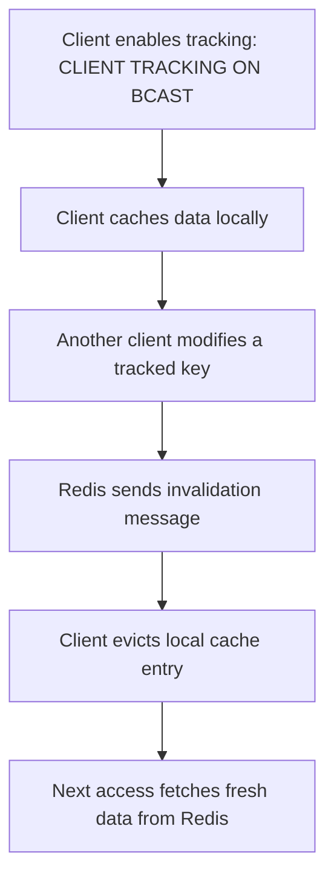
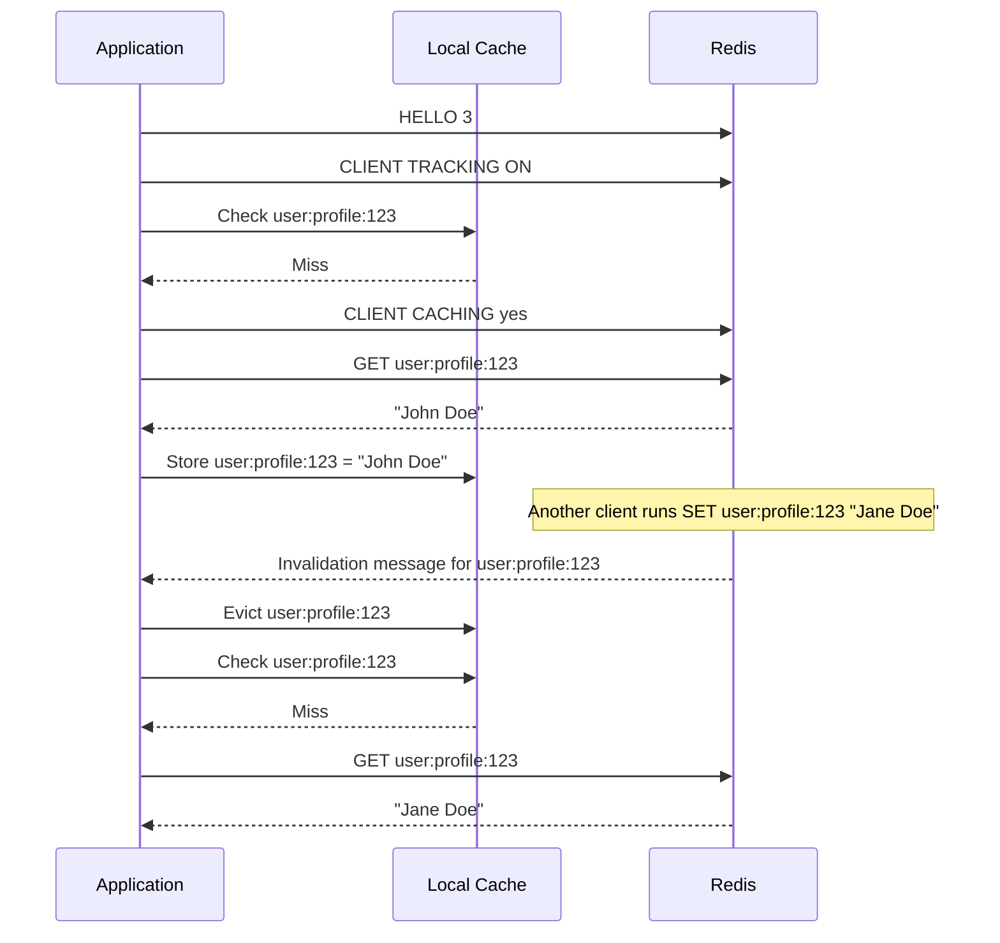

# How to Use CLIENT CACHING in Redis for Client-Side Caching

Author: [nawazdhandala](https://www.github.com/nawazdhandala)

Tags: Redis, CLIENT, Caching, Performance, RESP3

Description: Learn how to use CLIENT CACHING in Redis to control client-side caching invalidation tracking, enabling applications to cache data locally and receive notifications when it changes.

---

## Overview

`CLIENT CACHING` is part of Redis's client-side caching protocol, which allows clients to cache data locally and receive invalidation messages when cached keys change. `CLIENT CACHING yes` opts the current command into the tracking list, and `CLIENT CACHING no` excludes it. This is used in combination with `CLIENT TRACKING` (enabled with `RESP3` protocol or via `CLIENT TRACKING ON`) to give fine-grained control over which key accesses are tracked for invalidation.



## Prerequisites

Client-side caching requires:
1. RESP3 protocol (via `HELLO 3`) or `CLIENT TRACKING ON` with a Pub/Sub invalidation channel
2. `CLIENT CACHING` is meaningful only when tracking is enabled

## Enabling Tracking

### With RESP3

```redis
HELLO 3
CLIENT TRACKING ON
```

### With RESP2 and an invalidation channel

```redis
CLIENT TRACKING ON BCAST PREFIX user: REDIRECT 12
```

Where `12` is the ID of another connection subscribed to `__redis__:invalidate`.

## CLIENT CACHING Syntax

```redis
CLIENT CACHING yes
CLIENT CACHING no
```

- `yes`: Include the next command's accessed keys in the tracking list (default when tracking is on)
- `no`: Exclude the next command's accessed keys from the tracking list

This affects only the next command issued after `CLIENT CACHING`.

## How It Works

When `CLIENT TRACKING` is enabled without the `BCAST` option (normal mode), Redis only tracks keys that the client has explicitly read. `CLIENT CACHING yes` before a command ensures the key is tracked. `CLIENT CACHING no` before a command tells Redis to skip tracking for that specific read.

### Track a specific key

```redis
CLIENT TRACKING ON
CLIENT CACHING yes
GET user:profile:123
```

Redis will now send an invalidation notification if `user:profile:123` changes.

### Skip tracking for a transient read

```redis
CLIENT TRACKING ON
CLIENT CACHING no
GET temporary:counter:abc
```

The key `temporary:counter:abc` is read but not added to the invalidation tracking list.

## Full Client-Side Caching Workflow



## Broadcast Mode vs Normal Mode

| Mode | How tracking works | CLIENT CACHING use |
|------|-------------------|-------------------|
| Normal (`CLIENT TRACKING ON`) | Only keys explicitly read are tracked | Use `CLIENT CACHING yes/no` to opt in/out per command |
| Broadcast (`CLIENT TRACKING ON BCAST PREFIX foo:`) | All keys matching the prefix are tracked regardless of reads | `CLIENT CACHING` is less relevant; all matching keys trigger invalidations |

## Practical Use Case: Selective Caching

Not every key is worth caching locally. Use `CLIENT CACHING no` for frequently changing data and `CLIENT CACHING yes` for stable configuration data:

```redis
CLIENT TRACKING ON

# Track this - config changes rarely
CLIENT CACHING yes
HGETALL config:global

# Do not track this - changes every second
CLIENT CACHING no
GET stats:requests:total
```

## Summary

`CLIENT CACHING yes/no` controls whether the next command's accessed keys are added to the invalidation tracking list for client-side caching. It is effective only when `CLIENT TRACKING` is enabled. Use `CLIENT CACHING yes` to opt into tracking for keys you want to cache locally, and `CLIENT CACHING no` to skip tracking for volatile or uncacheable data. This gives fine-grained control over which data is subject to invalidation notifications, reducing unnecessary invalidation traffic for data that does not benefit from local caching.
