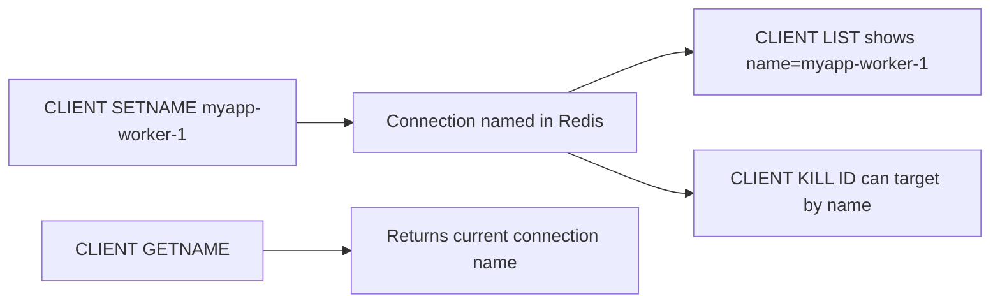

# How to Use CLIENT GETNAME and CLIENT SETNAME in Redis

Author: [nawazdhandala](https://www.github.com/nawazdhandala)

Tags: Redis, CLIENT, Debugging, Connection, Monitoring

Description: Learn how to use CLIENT SETNAME to assign a descriptive name to a Redis connection and CLIENT GETNAME to retrieve it, making it easier to identify connections in CLIENT LIST output.

---

## Overview

`CLIENT SETNAME` assigns a human-readable name to the current connection. `CLIENT GETNAME` retrieves that name. Named connections are much easier to identify in `CLIENT LIST` output and when using `CLIENT KILL`, especially in environments with many concurrent connections from multiple services or connection pools.



## Syntax

```redis
CLIENT SETNAME connection-name
CLIENT GETNAME
```

`CLIENT SETNAME` returns `OK`. `CLIENT GETNAME` returns the name string or an empty bulk string if no name is set.

## Setting a Connection Name

```redis
CLIENT SETNAME api-server-1
```

```text
OK
```

## Getting the Current Name

```redis
CLIENT GETNAME
```

```text
"api-server-1"
```

### When no name is set

```redis
CLIENT GETNAME
```

```text
""
```

## Naming Rules

Connection names must not contain spaces. They can include letters, numbers, hyphens, and underscores:

```redis
# Valid names
CLIENT SETNAME myapp
CLIENT SETNAME worker-pool-3
CLIENT SETNAME service_backend_v2

# Invalid: contains space
CLIENT SETNAME "my app"
```

```text
(error) ERR Client names cannot contain spaces, newlines or special characters.
```

## Viewing Named Connections in CLIENT LIST

```redis
CLIENT SETNAME api-server
CLIENT LIST
```

```text
id=8 addr=127.0.0.1:54321 laddr=127.0.0.1:6379 fd=11 name=api-server age=0 idle=0 flags=N db=0 sub=0 psub=0 ssub=0 multi=-1 watch=0 qbuf=26 qbuf-free=40928 ...
```

Without a name, the `name=` field is empty, making it hard to distinguish connections from the same host.

## Practical Examples

### Labeling connection pool workers

In a connection pool, assign names based on the pool slot and service:

```redis
CLIENT SETNAME order-service-pool-0
```

With a pool of 10 connections, name them `order-service-pool-0` through `order-service-pool-9`. Then in `CLIENT LIST` output you can quickly see which pool slots are idle.

### Background job connections

```redis
CLIENT SETNAME background-reindex-job
```

### Monitoring and health check connections

```redis
CLIENT SETNAME health-check-agent
CLIENT NO-EVICT ON
CLIENT NO-TOUCH ON
```

### Killing connections by service name

If you need to disconnect all connections from a specific service after a deployment:

```redis
# List connections from the old deployment
CLIENT LIST

# Kill a specific named connection by its ID
CLIENT KILL ID 42
```

While `CLIENT KILL` does not filter by name directly, seeing the name in `CLIENT LIST` helps you identify which IDs to kill.

## Application Code Example

### Python (redis-py)

```python
import redis

r = redis.Redis(host='localhost', port=6379)
r.client_setname('payment-service-worker')

name = r.client_getname()
print(name)  # b'payment-service-worker'
```

### Node.js (ioredis)

```javascript
const redis = new Redis();
await redis.client('SETNAME', 'notification-service');
const name = await redis.client('GETNAME');
console.log(name); // 'notification-service'
```

## Removing a Connection Name

Set an empty string to remove the name:

```redis
CLIENT SETNAME ""
```

```text
OK
```

```redis
CLIENT GETNAME
```

```text
""
```

## Summary

`CLIENT SETNAME` assigns a human-readable label to the current Redis connection. `CLIENT GETNAME` retrieves it. Named connections are visible in `CLIENT LIST` output under the `name=` field, making it much easier to identify which connections belong to which services or pool slots. Set names immediately after connecting, especially in connection pools. Names cannot contain spaces and can be removed by setting an empty string.
