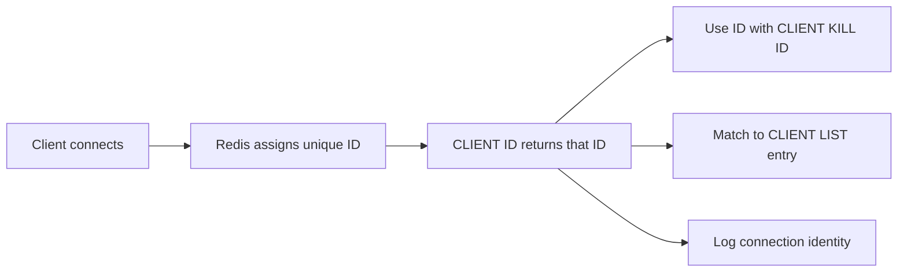

# How to Use CLIENT ID in Redis to Get Connection ID

Author: [nawazdhandala](https://www.github.com/nawazdhandala)

Tags: Redis, CLIENT, Connection, Debugging, Monitoring

Description: Learn how to use CLIENT ID in Redis to retrieve the unique numeric ID of the current connection, enabling precise connection tracking, targeted CLIENT KILL operations, and debugging.

---

## Overview

`CLIENT ID` returns the unique ID assigned to the current connection by Redis. This ID is monotonically increasing and unique for the lifetime of the server. It is useful for correlating connections in `CLIENT LIST` output, targeting specific connections with `CLIENT KILL`, and implementing patterns that require connection-level identity such as distributed locks with connection-scoped cleanup.



## Syntax

```redis
CLIENT ID
```

Returns an integer representing the current connection's unique ID.

## Basic Usage

```redis
CLIENT ID
```

```text
(integer) 42
```

The ID is guaranteed to be unique and monotonically increasing -- a new connection always gets an ID higher than any previously seen ID during the server's uptime.

## Using CLIENT ID with CLIENT LIST

The ID returned by `CLIENT ID` corresponds to the `id=` field in `CLIENT LIST` output:

```redis
CLIENT ID
```

```text
(integer) 42
```

```redis
CLIENT LIST
```

```text
id=42 addr=127.0.0.1:54321 laddr=127.0.0.1:6379 fd=8 name=api-server age=0 idle=0 flags=N db=0 sub=0 ...
```

## Using CLIENT ID for Targeted Killing

If you need to kill a specific connection (for example, to force a reconnect after a credential change):

```redis
# On connection A, get its ID
CLIENT ID
```

```text
(integer) 15
```

```redis
# From an admin connection, kill connection 15
CLIENT KILL ID 15
```

```text
(integer) 1
```

## CLIENT ID in Distributed Locking

A common use of `CLIENT ID` is to tag distributed locks with the owning connection ID so only that connection can release the lock:

```redis
# Get the current connection ID
CLIENT ID
```

```text
(integer) 77
```

```redis
# Acquire lock with connection ID as the value
SET lock:resource 77 NX EX 30
```

```redis
# Later, release the lock only if we own it (compare-and-delete via Lua)
EVAL "if redis.call('get', KEYS[1]) == ARGV[1] then return redis.call('del', KEYS[1]) else return 0 end" 1 lock:resource 77
```

This ensures the lock is not accidentally released by a different connection that reused the same application-level identifier.

## Monotonic ID Property

IDs are monotonically increasing within a server's lifetime. After a server restart, IDs reset. This means:

- You can determine relative connection order from IDs
- An ID from before a restart is meaningless after a restart
- IDs are not globally unique across cluster nodes

## Checking Another Connection's ID

`CLIENT ID` only returns the ID for the connection issuing the command. To see the IDs of all connections:

```redis
CLIENT LIST
```

To retrieve a specific connection's info:

```redis
CLIENT INFO
```

## Application Usage

### Python

```python
import redis

r = redis.Redis(host='localhost', port=6379)
conn_id = r.client_id()
print(f"Connection ID: {conn_id}")
```

### Node.js (ioredis)

```javascript
const redis = new Redis();
const id = await redis.client('ID');
console.log(`Connection ID: ${id}`);
```

## Summary

`CLIENT ID` returns the unique numeric identifier for the current Redis connection. IDs are monotonically increasing per server instance and reset on restart. Use `CLIENT ID` to correlate connections in `CLIENT LIST`, target specific connections with `CLIENT KILL ID`, log connection identity in application diagnostics, and implement connection-scoped distributed locking patterns. The ID is connection-local -- you can only retrieve your own connection's ID with this command.
