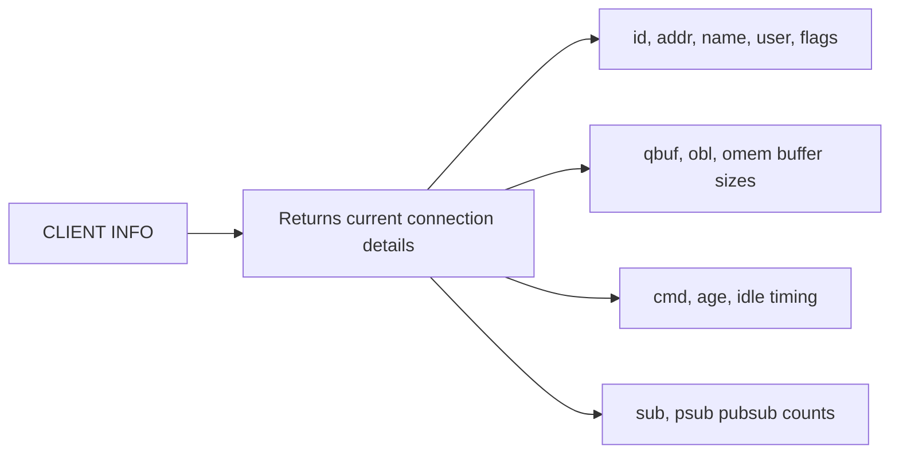

# How to Use CLIENT INFO in Redis to Get Connection Details

Author: [nawazdhandala](https://www.github.com/nawazdhandala)

Tags: Redis, CLIENT, Debugging, Monitoring, Connection

Description: Learn how to use CLIENT INFO in Redis to retrieve detailed information about the current connection, including flags, buffer sizes, command history, and authentication state.

---

## Overview

`CLIENT INFO` returns detailed information about the current client connection in the same format as `CLIENT LIST`, but only for the connection issuing the command. It is useful for self-inspection -- verifying your connection's name, authenticated user, flags, and buffer state -- without parsing the output of `CLIENT LIST` for all connections.



## Syntax

```redis
CLIENT INFO
```

Returns a bulk string with a single line of connection attributes.

## Basic Output

```redis
CLIENT INFO
```

```text
id=42 addr=127.0.0.1:54321 laddr=127.0.0.1:6379 fd=8 name=api-server age=0 idle=0 flags=N db=0 sub=0 psub=0 ssub=0 multi=-1 watch=0 qbuf=26 qbuf-free=40928 argv-mem=10 multi-mem=0 tot-mem=61466 rbs=16384 rbp=16384 obl=0 oll=0 omem=0 events=r cmd=client|info user=default library-name= library-ver= resp=2 tot-cmds=5
```

## Field Reference

| Field | Description |
|-------|-------------|
| `id` | Unique connection ID |
| `addr` | Client remote address and port |
| `laddr` | Redis server local address and port |
| `fd` | File descriptor number |
| `name` | Connection name (set with CLIENT SETNAME) |
| `age` | Seconds since connection was created |
| `idle` | Seconds since the last command was issued |
| `flags` | Connection flags (see below) |
| `db` | Currently selected database |
| `sub` | Number of channel subscriptions |
| `psub` | Number of pattern subscriptions |
| `multi` | Number of commands in MULTI queue (-1 if not in MULTI) |
| `qbuf` | Query buffer length |
| `qbuf-free` | Free space in query buffer |
| `obl` | Output buffer length |
| `oll` | Output list length (queued replies) |
| `omem` | Output buffer memory usage |
| `cmd` | Last command issued |
| `user` | Authenticated username |
| `resp` | RESP protocol version |
| `tot-cmds` | Total commands executed on this connection |

## Client Flags

The `flags` field is a string of single-character flags:

| Flag | Meaning |
|------|---------|
| `N` | Normal connection, no special flags |
| `S` | Replica connection |
| `M` | Primary (master) connection |
| `x` | Executing a MULTI/EXEC block |
| `b` | Waiting for a blocking command |
| `t` | CLIENT NO-TOUCH enabled |
| `e` | CLIENT NO-EVICT enabled |
| `P` | Pub/Sub subscriber |
| `T` | Tracking enabled (client-side cache) |

## Practical Examples

### Verify your connection name

```redis
CLIENT SETNAME my-worker
CLIENT INFO
```

```text
id=42 ... name=my-worker ...
```

### Verify authenticated user

```redis
AUTH alice secretpass
CLIENT INFO
```

```text
... user=alice ...
```

### Check if NO-EVICT is set

```redis
CLIENT NO-EVICT ON
CLIENT INFO
```

Look for `e` in the `flags` field:

```text
... flags=Ne ...
```

### Inspect buffer usage

After issuing many commands, check buffer state:

```redis
CLIENT INFO
```

Look at `qbuf`, `obl`, and `omem`. Large values may indicate a slow consumer or backpressure issue.

## CLIENT INFO vs CLIENT LIST

| Command | Scope | Use Case |
|---------|-------|----------|
| `CLIENT INFO` | Current connection only | Self-inspection, debugging your own connection |
| `CLIENT LIST` | All connections | Monitoring all clients, finding connections to kill |

`CLIENT INFO` is faster and returns less data. For programmatic self-inspection in application code, prefer `CLIENT INFO`.

## Application Code Example

### Python (redis-py)

```python
import redis

r = redis.Redis(host='localhost', port=6379)
r.client_setname('payment-worker')
info = r.client_info()
print(info)
# {'id': 42, 'addr': '127.0.0.1:54321', 'name': 'payment-worker', 'user': 'default', ...}
```

## Summary

`CLIENT INFO` returns detailed state information about the current Redis connection in the same format as `CLIENT LIST`. Key fields include the connection ID, name, authenticated username, flags (indicating NO-EVICT, NO-TOUCH, Pub/Sub state), buffer sizes, and last command executed. Use it for self-inspection and debugging your own connection without the overhead of parsing all connections from `CLIENT LIST`. It is the preferred way for application code to verify its own connection state.
