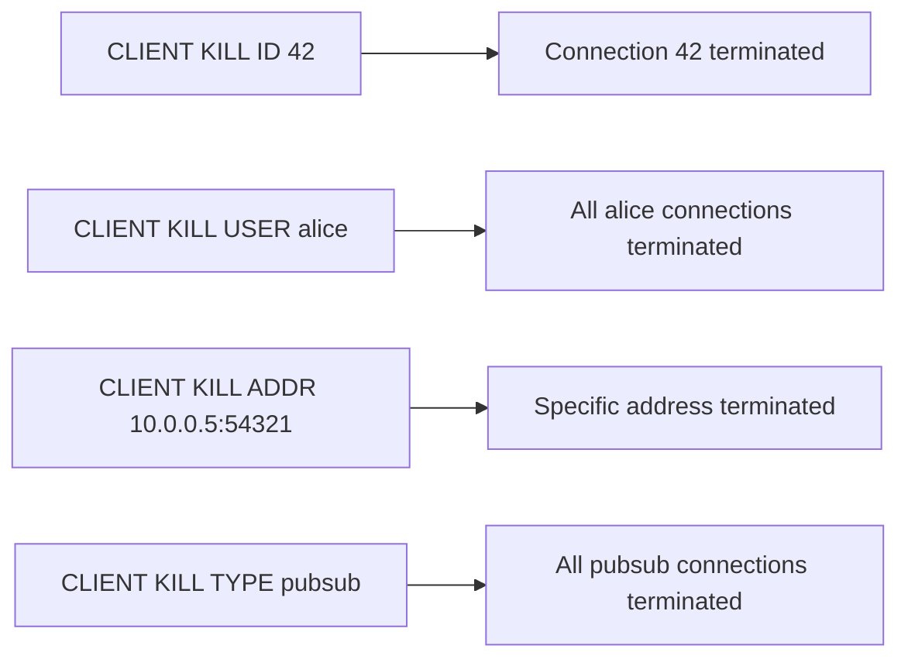
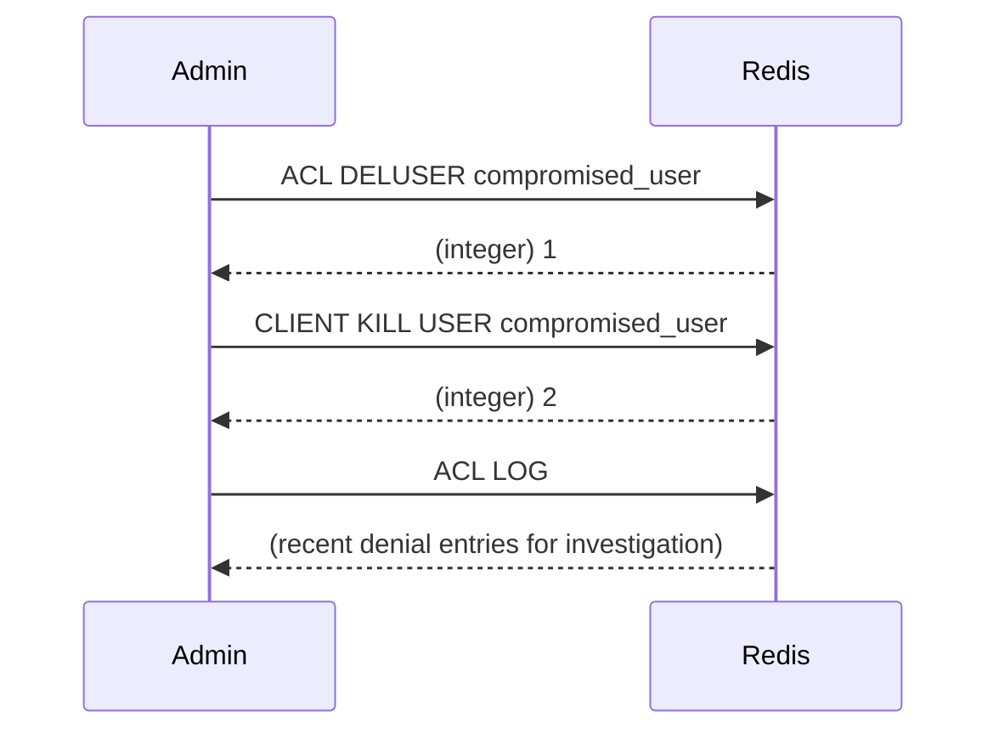

# How to Use CLIENT KILL in Redis to Terminate Connections

Author: [nawazdhandala](https://www.github.com/nawazdhandala)

Tags: Redis, Client, Connection, Administration, Security

Description: Learn how to use CLIENT KILL in Redis to forcefully terminate one or more client connections by ID, address, username, or other filters, useful for security response and connection management.

---

## Overview

`CLIENT KILL` forcefully closes one or more Redis client connections. It supports multiple filter modes: terminate by connection ID, by address, by username, by client type, or by a combination of filters. This is useful for security responses (disconnecting unauthorized users), clearing stale connections, and connection pool maintenance.



## Syntax

```redis
CLIENT KILL ID client-id
CLIENT KILL ADDR addr:port
CLIENT KILL LADDR local-addr:port
CLIENT KILL USER username
CLIENT KILL SKIPME yes|no
CLIENT KILL MAXAGE seconds
CLIENT KILL ID id [ADDR addr] [USER username] [SKIPME yes|no]
```

The modern form accepts multiple filters. The old `CLIENT KILL addr:port` form is deprecated.

## Killing by Connection ID

```redis
# Get the ID of a connection from CLIENT LIST
CLIENT LIST

# Kill a specific connection
CLIENT KILL ID 15
```

```text
(integer) 1
```

## Killing by Address

```redis
CLIENT KILL ADDR 192.168.1.50:54321
```

```text
(integer) 1
```

## Killing by Username

Disconnect all connections authenticated as a specific user:

```redis
CLIENT KILL USER alice
```

```text
(integer) 3
```

This is useful immediately after `ACL DELUSER alice` to ensure no active sessions remain.

## Killing by Client Type

```redis
# Kill all Pub/Sub subscriber connections
CLIENT KILL TYPE pubsub

# Kill all replica connections
CLIENT KILL TYPE replica

# Kill all normal (non-pubsub, non-replica) connections
CLIENT KILL TYPE normal
```

Valid types: `normal`, `pubsub`, `replica`, `master`, `multi`

## Killing by Maximum Age

Disconnect connections older than a specified number of seconds:

```redis
# Kill all connections idle for more than 3600 seconds (1 hour)
CLIENT KILL MAXAGE 3600
```

```text
(integer) 5
```

## SKIPME Option

By default, `CLIENT KILL` does not kill the connection issuing the command. Use `SKIPME no` to include the current connection:

```redis
# Kill all normal connections INCLUDING the current one
CLIENT KILL TYPE normal SKIPME no
```

## Combining Filters

Filters can be combined to narrow the target set:

```redis
# Kill all connections from alice on a specific address
CLIENT KILL USER alice ADDR 10.0.0.5:54321
```

```text
(integer) 1
```

## Security Response Workflow



```redis
# 1. Disable and delete the compromised user
ACL SETUSER compromised_user off
ACL DELUSER compromised_user
ACL SAVE

# 2. Kill all active connections from that user
CLIENT KILL USER compromised_user

# 3. Review recent ACL log entries
ACL LOG COUNT 20
```

## Killing Stale Connections

```redis
# Kill all connections idle for more than 30 minutes (1800 seconds)
CLIENT KILL MAXAGE 1800
```

## Return Value

For the modern filter form, `CLIENT KILL` returns an integer: the number of clients killed. Returns `0` if no clients matched.

For the old address form, it returns `OK` (one client killed) or an error.

## Summary

`CLIENT KILL` terminates Redis client connections using flexible filter criteria: connection ID, remote address, username, client type, or maximum age. The modern multi-filter form is preferred over the deprecated address-only form. Use `CLIENT KILL USER` immediately after `ACL DELUSER` to close active sessions from deleted users. Use `CLIENT KILL MAXAGE` to clean up stale or idle connections. The `SKIPME` option controls whether the issuing connection itself is included in the kill set.
