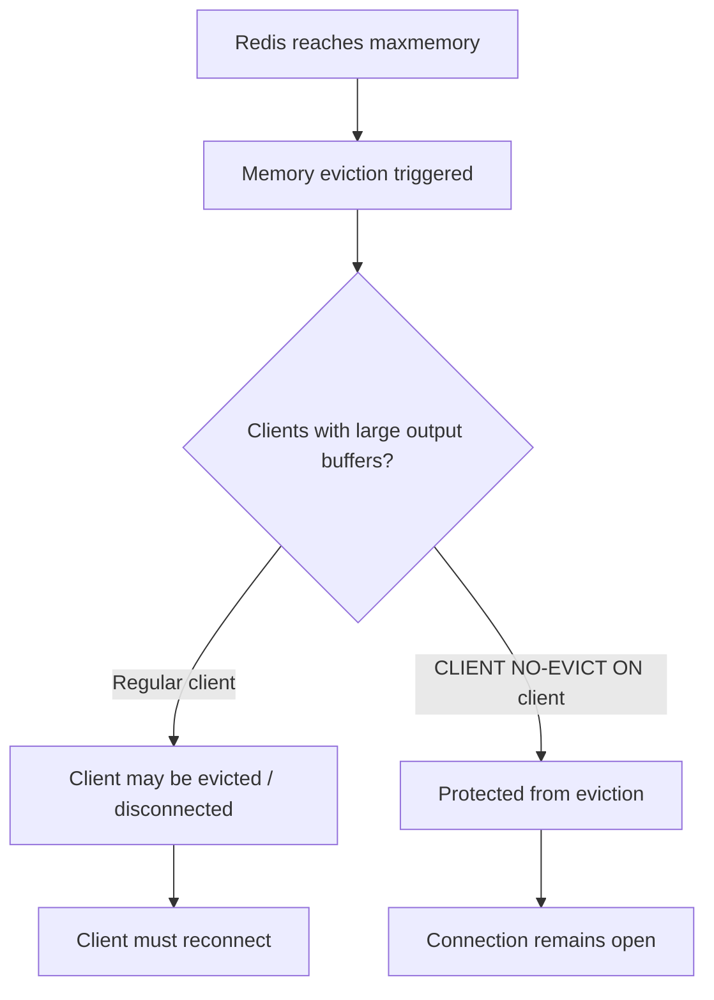

# How to Use CLIENT NO-EVICT in Redis to Protect Client Memory

Author: [nawazdhandala](https://www.github.com/nawazdhandala)

Tags: Redis, CLIENT, Memory Management, Connection, Performance

Description: Learn how to use CLIENT NO-EVICT in Redis to mark a connection as protected from client eviction when Redis reaches its maxmemory limit, preventing critical connections from being dropped.

---

## Overview

When Redis is under memory pressure and `maxmemory` is configured, it may evict client connections to free memory used by their output buffers. `CLIENT NO-EVICT` marks the current connection as exempt from this eviction policy, ensuring it is not closed to reclaim memory. This is critical for administrative connections or monitoring clients that must remain available even under high load.



## Syntax

```redis
CLIENT NO-EVICT ON
CLIENT NO-EVICT OFF
```

`ON` enables protection for the current connection. `OFF` removes the protection.

Returns `OK`.

## Basic Usage

### Protect the current connection

```redis
CLIENT NO-EVICT ON
```

```text
OK
```

### Remove protection

```redis
CLIENT NO-EVICT OFF
```

```text
OK
```

## When Client Eviction Happens

Redis can evict clients when their memory usage (output buffer + query buffer) pushes the server over its `maxmemory` limit. This behavior is controlled by the `client-eviction` configuration. Client eviction is separate from key eviction -- it removes entire connections, not data keys.

Clients most at risk of eviction are those with large output buffers, typically:
- Slow consumers in Pub/Sub subscriptions
- Clients that have issued commands producing large result sets and are consuming output slowly

## Configuring Client Eviction

In `redis.conf`, client eviction can be enabled:

```text
maxmemory 1gb
maxmemory-policy allkeys-lru
```

Client eviction is a separate protection mechanism that activates when key eviction alone is insufficient to free memory.

## Verifying Protection Status

Use `CLIENT INFO` to check if the current client has `no-evict` set:

```redis
CLIENT NO-EVICT ON
CLIENT INFO
```

```text
id=5 addr=127.0.0.1:54321 laddr=127.0.0.1:6379 fd=8 name= age=0 idle=0 flags=N db=0 sub=0 psub=0 ssub=0 multi=-1 watch=0 qbuf=26 qbuf-free=40928 argv-mem=10 multi-mem=0 tot-mem=61466 rbs=16384 rbp=16384 obl=0 oll=0 omem=0 events=r cmd=client|info user=default library-name= library-ver= resp=2 tot-cmds=3
```

The `flags` field will include `e` when `no-evict` is enabled. You can also use `CLIENT LIST` to view all connections and their flags.

## Use Cases

### Administrative monitoring connection

When running a monitoring script that queries `INFO`, `SLOWLOG`, and `LATENCY`, protect the connection so it is never dropped during memory spikes:

```redis
CLIENT NO-EVICT ON
CLIENT SETNAME monitoring-agent
```

### Sentinel and Cluster management connections

Internal Redis system connections used for replication and cluster communication benefit from eviction protection.

### Health check connections

A dedicated health check connection should remain available even when the server is under load:

```redis
CLIENT NO-EVICT ON
PING
```

## Combining with CLIENT NO-TOUCH

`CLIENT NO-EVICT` protects against eviction. `CLIENT NO-TOUCH` protects LRU timestamps. For a monitoring client that should be invisible to Redis internals, use both:

```redis
CLIENT NO-EVICT ON
CLIENT NO-TOUCH ON
```

## Summary

`CLIENT NO-EVICT ON` marks the current connection as exempt from Redis client eviction, which can disconnect clients with large output buffers when the server is under memory pressure. Use it for administrative connections, monitoring agents, and health check clients that must remain available regardless of memory conditions. Call `CLIENT NO-EVICT OFF` to remove the protection when it is no longer needed. Combine with `CLIENT NO-TOUCH` to also prevent the connection from affecting LRU-based eviction decisions.
