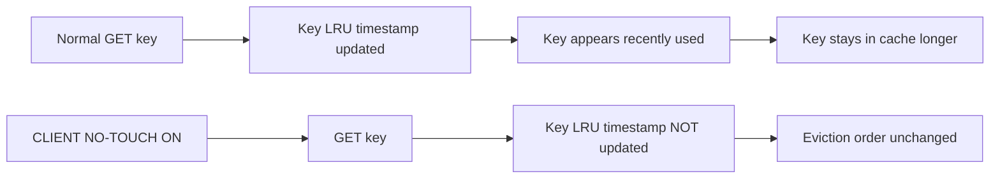

# How to Use CLIENT NO-TOUCH in Redis to Preserve LRU Order

Author: [nawazdhandala](https://www.github.com/nawazdhandala)

Tags: Redis, CLIENT, LRU, Memory Management, Cache

Description: Learn how to use CLIENT NO-TOUCH in Redis to prevent a connection's commands from updating the LRU or LFU access time of keys, useful for monitoring and background scan operations.

---

## Overview

`CLIENT NO-TOUCH` tells Redis not to update the LRU (Least Recently Used) or LFU (Least Frequently Used) access timestamps of keys accessed by the current connection. This is essential for monitoring scripts, background analytics, and audit tools that scan or read keys but should not influence which keys are evicted, preserving the natural access patterns of application traffic.



## Syntax

```redis
CLIENT NO-TOUCH ON
CLIENT NO-TOUCH OFF
```

Returns `OK`.

## Basic Usage

### Enable no-touch mode for the current connection

```redis
CLIENT NO-TOUCH ON
```

```text
OK
```

### Disable no-touch mode

```redis
CLIENT NO-TOUCH OFF
```

```text
OK
```

## Why LRU Updates Matter

Under `allkeys-lru` or `volatile-lru` eviction policies, Redis evicts the least recently accessed keys when memory is full. If a monitoring script regularly scans all keys with `GET` or `SCAN`, it refreshes the LRU timestamp for every key it touches, making all scanned keys appear recently used. This distorts the eviction pool and can cause genuinely hot application keys to be evicted while cold keys scanned by monitoring survive.

### Without CLIENT NO-TOUCH

```redis
# Monitoring script scans all keys (WITHOUT no-touch)
SCAN 0 COUNT 1000
GET user:session:abc
GET user:session:def
# Both keys now appear recently accessed
# Eviction algorithm may keep them instead of actual hot keys
```

### With CLIENT NO-TOUCH

```redis
CLIENT NO-TOUCH ON
# Scan keys without affecting LRU
SCAN 0 COUNT 1000
GET user:session:abc
GET user:session:def
# LRU timestamps unchanged
# Eviction algorithm based purely on application access patterns
```

## Use Cases

### Cache warmup validation

Check the state of cached keys without artificially warming them:

```redis
CLIENT NO-TOUCH ON
# Read keys to validate cache contents without affecting LRU order
GET cache:product:1001
GET cache:product:1002
```

### Analytics and reporting

Run analytics queries that touch many keys without contaminating eviction decisions:

```redis
CLIENT NO-TOUCH ON
# Collect statistics across all user keys
SCAN 0 MATCH user:* COUNT 100
```

### Backup and snapshot tools

Tools that read all keys for backup purposes should use `CLIENT NO-TOUCH ON` to avoid disrupting cache behavior during the backup window.

## Relationship with CLIENT NO-EVICT

| Command | Purpose |
|---------|---------|
| `CLIENT NO-TOUCH ON` | Commands from this connection do not update LRU/LFU timestamps of accessed keys |
| `CLIENT NO-EVICT ON` | This connection itself is protected from being evicted when Redis is under memory pressure |

For a fully transparent monitoring connection, use both:

```redis
CLIENT NO-EVICT ON
CLIENT NO-TOUCH ON
CLIENT SETNAME monitoring
```

## Verifying the Setting

Use `CLIENT INFO` to check current client flags:

```redis
CLIENT NO-TOUCH ON
CLIENT INFO
```

Look for the `T` flag in the `flags` field, which indicates `no-touch` is active.

## Summary

`CLIENT NO-TOUCH ON` prevents commands from the current connection from updating the LRU or LFU access timestamps of the keys they access. This ensures that monitoring scripts, backup tools, and analytics queries do not distort eviction decisions by making cold keys appear recently used. Pair it with `CLIENT NO-EVICT ON` for connections that should be fully transparent to Redis memory management. Use `CLIENT NO-TOUCH OFF` to restore normal LRU update behavior on the connection.
