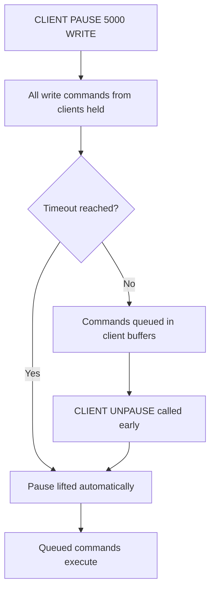
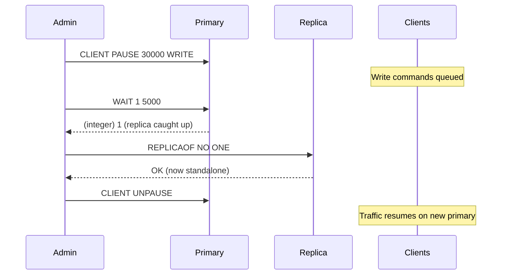

# How to Use CLIENT PAUSE in Redis to Halt Processing

Author: [nawazdhandala](https://www.github.com/nawazdhandala)

Tags: Redis, Client, Connection, Operation, Maintenance

Description: Learn how to use CLIENT PAUSE in Redis to temporarily halt client command processing, enabling safe failovers, configuration changes, and maintenance windows without dropping connections.

---

## Overview

`CLIENT PAUSE` temporarily stops Redis from processing commands from normal client connections for a specified number of milliseconds. Clients remain connected but their commands are queued. This is used to create a safe window for failover operations, replica promotion, or configuration changes that require a momentary pause in traffic without disconnecting clients.



## Syntax

```redis
CLIENT PAUSE timeout [WRITE | ALL]
```

- `timeout`: pause duration in milliseconds
- `WRITE`: pause only write commands (default in Redis 7.0+)
- `ALL`: pause both read and write commands

Returns `OK`.

## Basic Usage

### Pause all clients for 5 seconds

```redis
CLIENT PAUSE 5000
```

```text
OK
```

### Pause only write commands for 10 seconds

```redis
CLIENT PAUSE 10000 WRITE
```

```text
OK
```

### Pause all commands (reads and writes) for 2 seconds

```redis
CLIENT PAUSE 2000 ALL
```

```text
OK
```

## WRITE vs ALL Mode

| Mode | What is paused | Read commands | Write commands |
|------|---------------|---------------|----------------|
| `WRITE` | Write commands | Still processed | Queued |
| `ALL` | Everything | Queued | Queued |

`WRITE` mode (the default since Redis 7.0) is preferred for failover scenarios because it allows reads to continue while preventing writes from going to a replica being promoted.

## Failover Use Case



```redis
# On the current primary
CLIENT PAUSE 30000 WRITE

# Wait for replica to acknowledge all writes
WAIT 1 5000

# (Client reconnects to replica, which becomes the new primary)

# Unpause early once failover is confirmed
CLIENT UNPAUSE
```

## Configuration Change Use Case

To safely change a configuration that requires temporarily stopping writes:

```redis
# Pause writes for up to 2 seconds
CLIENT PAUSE 2000 WRITE

# Apply configuration change
CONFIG SET save "900 1 300 10"

# Resume immediately
CLIENT UNPAUSE
```

## Who is Not Paused

`CLIENT PAUSE` does not pause:
- The admin connection that issued the command
- Replica replication connections
- Pub/Sub message delivery (in `WRITE` mode)
- `CLIENT UNPAUSE` from other admin connections

## Queued Command Behavior

While paused, clients remain connected. Their commands accumulate in the client output buffer. When the pause ends (via timeout or `CLIENT UNPAUSE`), all queued commands execute. Clients with large enough buffers will not experience errors; clients with full output buffers may be disconnected.

## Checking Pause Status

Use `CLIENT INFO` or `CLIENT LIST` to see if a pause is active:

```redis
INFO clients
```

```text
...
blocked_clients:5
...
```

## Summary

`CLIENT PAUSE timeout [WRITE|ALL]` halts command processing for connected clients for up to `timeout` milliseconds. `WRITE` mode queues only write commands while allowing reads; `ALL` mode queues everything. Clients remain connected and their commands execute once the pause ends. Use `CLIENT PAUSE` for safe failovers, replica promotion, and maintenance windows. End the pause early with `CLIENT UNPAUSE` when the maintenance operation completes before the timeout.
