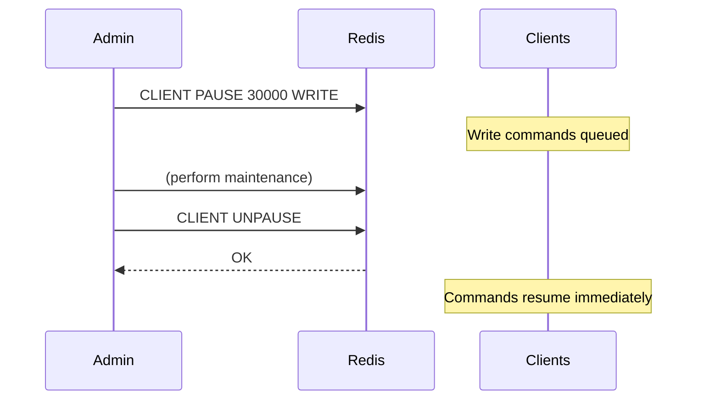
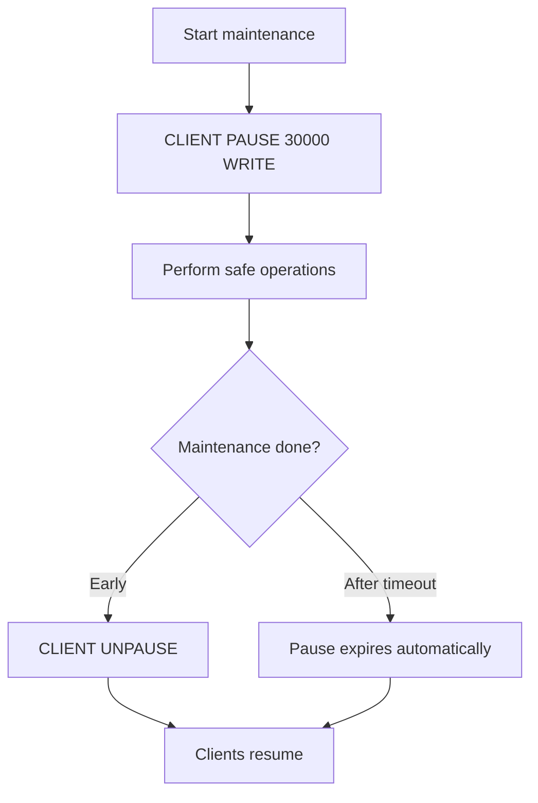

# How to Use CLIENT UNPAUSE in Redis to Resume Connections

Author: [nawazdhandala](https://www.github.com/nawazdhandala)

Tags: Redis, CLIENT, Connection, Operations, Maintenance

Description: Learn how to use CLIENT UNPAUSE in Redis to immediately resume command processing for all paused clients before the CLIENT PAUSE timeout expires.

---

## Overview

`CLIENT UNPAUSE` cancels an active `CLIENT PAUSE` and immediately resumes normal command processing for all clients. When `CLIENT PAUSE` is used to halt client traffic during a maintenance operation such as a failover or configuration change, `CLIENT UNPAUSE` provides a way to end the pause early without waiting for the timeout to expire.



## Syntax

```redis
CLIENT UNPAUSE
```

Returns `OK`. Has no effect if no pause is currently active.

## Basic Usage

### Resume paused clients immediately

```redis
# First, pause all write commands
CLIENT PAUSE 60000 WRITE

# Perform maintenance...

# Resume before timeout expires
CLIENT UNPAUSE
```

```text
OK
```

### Call with no active pause

```redis
CLIENT UNPAUSE
```

```text
OK
```

The command always returns `OK`, even when there is nothing to unpause.

## Workflow: Controlled Maintenance Window



### Example: Switch primary during failover

```redis
# Pause writes for up to 30 seconds during failover
CLIENT PAUSE 30000 WRITE

# Wait for replica to catch up
WAIT 1 5000

# Perform failover
REPLICAOF NO ONE

# Resume clients as soon as failover is complete
CLIENT UNPAUSE
```

## Relationship with CLIENT PAUSE

`CLIENT UNPAUSE` is the complement to `CLIENT PAUSE`:

| Command | Effect |
|---------|--------|
| `CLIENT PAUSE timeout [WRITE|ALL]` | Pauses clients for up to `timeout` milliseconds |
| `CLIENT UNPAUSE` | Cancels the pause immediately |

The pause expires on its own after the timeout, but `CLIENT UNPAUSE` provides deterministic control over when clients resume.

## Permissions

`CLIENT UNPAUSE` is an administrative command. Only users with the `connection` or `admin` ACL category can execute it:

```redis
ACL SETUSER ops_user on >opspass +client|unpause
```

## Summary

`CLIENT UNPAUSE` immediately cancels any active `CLIENT PAUSE` and allows all paused clients to resume sending commands. It always returns `OK`, even if no pause is active. Use it at the end of planned maintenance windows to resume traffic without waiting for the pause timeout to expire. Pair it with `CLIENT PAUSE` in failover scripts, configuration changes, and controlled maintenance procedures to minimize the window during which clients are halted.
