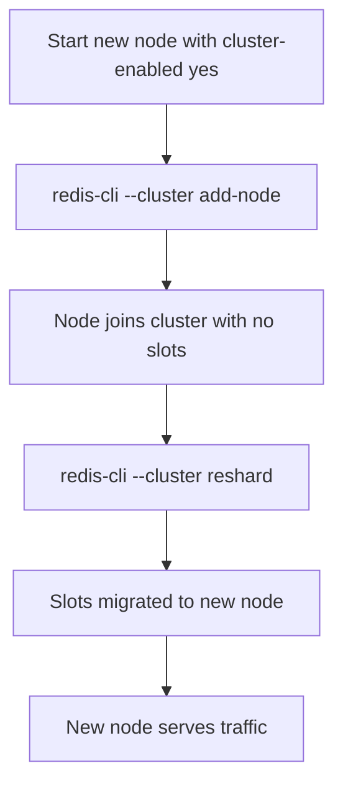

# How to Add and Remove Nodes in Redis Cluster

Author: [nawazdhandala](https://www.github.com/nawazdhandala)

Tags: Redis, Cluster, Operations, Scalability, Node Management

Description: Learn how to add new primary and replica nodes to a running Redis Cluster and safely remove nodes by migrating their slots and using CLUSTER FORGET.

---

## Overview

Redis Cluster supports live node addition and removal without downtime. Adding a node requires joining it to the cluster with `CLUSTER MEET` or `redis-cli --cluster add-node`, then resharding slots to it. Removing a node requires migrating all its slots to other nodes first, then issuing `CLUSTER FORGET` on all remaining nodes.



## Adding a Primary Node

### Step 1: Start the new node

Configure and start the new node with `cluster-enabled yes`:

```bash
redis-server /etc/redis/node-7007.conf
```

### Step 2: Add the node to the cluster

```bash
redis-cli --cluster add-node \
  192.168.1.13:7007 \
  192.168.1.10:7001 \
  -a clusterpassword
```

The first address is the new node. The second is any existing cluster node.

```text
>>> Adding node 192.168.1.13:7007 to cluster
>>> Performing Cluster Check (using node 192.168.1.10:7001)
[OK] All nodes agree about slots configuration.
[OK] All 16384 slots covered.
>>> Send CLUSTER MEET to node 192.168.1.13:7007
[OK] New node added correctly.
```

The new node joins but has no slots assigned yet.

### Step 3: Reshard slots to the new node

```bash
redis-cli --cluster reshard 192.168.1.10:7001 -a clusterpassword
```

Redis CLI prompts for:
1. How many slots to move: e.g., `1365` (to distribute evenly across 4 nodes)
2. The ID of the receiving node: the new node's ID from `CLUSTER NODES`
3. Source node IDs: type `all` to take slots from all current primaries proportionally

```text
How many slots do you want to move (from 1 to 16384)? 1365
What is the receiving node ID? <new-node-id>
Please enter all the source node IDs.
  Type 'all' to use all the nodes as source nodes for the hash slots.
  Type 'done' once you entered all the source nodes IDs.
Source node #1: all
```

## Adding a Replica Node

```bash
redis-cli --cluster add-node \
  192.168.1.13:7008 \
  192.168.1.10:7001 \
  --cluster-slave \
  --cluster-master-id <primary-node-id> \
  -a clusterpassword
```

The new node joins as a replica of the specified primary.

## Removing a Node

### Step 1: Migrate all slots away from the node

Before removing a primary, all its slots must be moved to other nodes:

```bash
redis-cli --cluster reshard 192.168.1.10:7001 -a clusterpassword
```

When prompted:
- Slots to move: the number of slots currently on the node being removed
- Receiving node: any other primary
- Source node: the ID of the node being removed

Repeat until the node has 0 slots. Verify:

```redis
CLUSTER NODES
```

The target node should show no slot range.

### Step 2: Remove the node from the cluster

```bash
redis-cli --cluster del-node \
  192.168.1.10:7001 \
  <node-id-to-remove> \
  -a clusterpassword
```

```text
>>> Removing node <node-id> from cluster 192.168.1.10:7001
>>> Sending CLUSTER FORGET messages to the cluster...
>>> SHUTDOWN the node.
```

This sends `CLUSTER FORGET` to all cluster nodes and shuts down the removed node.

## Removing a Replica Node

Replicas have no slots, so they can be removed directly without resharding:

```bash
redis-cli --cluster del-node \
  192.168.1.10:7001 \
  <replica-node-id> \
  -a clusterpassword
```

## Verifying After Changes

```redis
CLUSTER INFO
```

```text
cluster_state:ok
cluster_slots_assigned:16384
cluster_slots_ok:16384
cluster_known_nodes:7
cluster_size:4
```

```redis
CLUSTER NODES
```

Confirm the new node has its slots and the removed node is gone.

## Checking Reshard Progress

During resharding, you can monitor key migration:

```bash
redis-cli --cluster check 192.168.1.10:7001 -a clusterpassword
```

```text
>>> Performing Cluster Check (using node 192.168.1.10:7001)
M: a1b2c3... 192.168.1.10:7001
   slots:[0-4095] (4096 slots) master
M: new-id... 192.168.1.13:7007
   slots:[4096-5460] (1365 slots) master
...
[OK] All nodes agree about slots configuration.
[OK] All 16384 slots covered.
```

## Summary

To add a node to Redis Cluster, start it with `cluster-enabled yes`, join it with `redis-cli --cluster add-node`, then reshard slots to it with `redis-cli --cluster reshard`. To add a replica, use `--cluster-slave` and `--cluster-master-id`. To remove a node, first migrate all its slots away with `reshard`, then remove it with `redis-cli --cluster del-node` which issues `CLUSTER FORGET` on all remaining nodes. Replicas with no slots can be removed directly without resharding.
