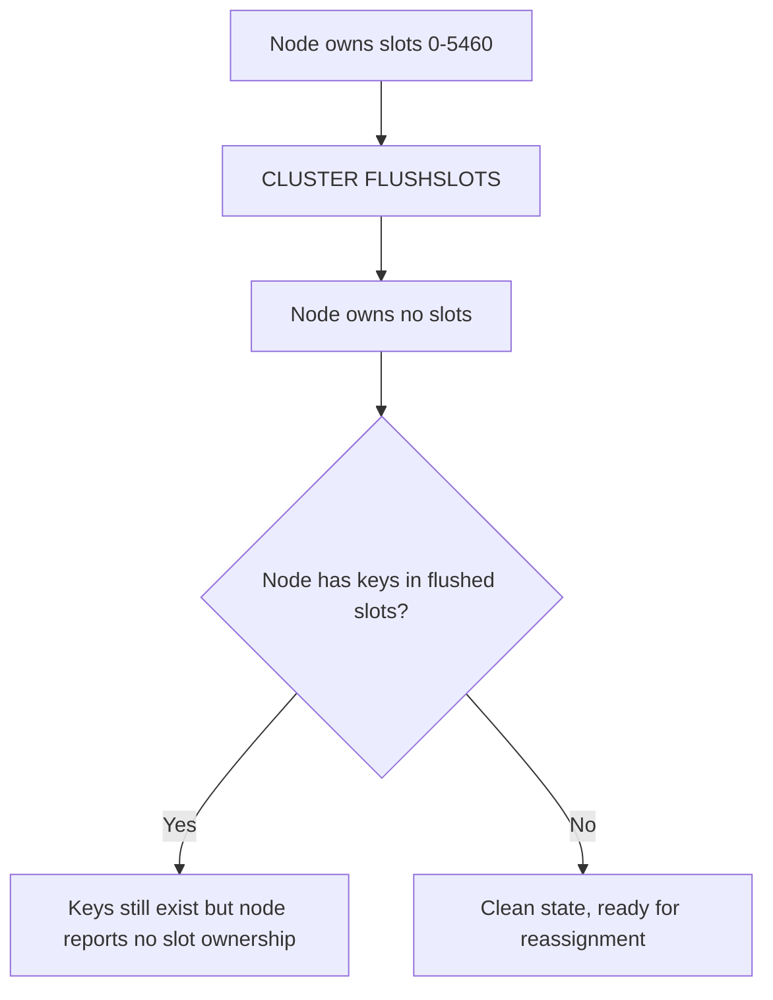

# How to Use CLUSTER FLUSHSLOTS in Redis

Author: [nawazdhandala](https://www.github.com/nawazdhandala)

Tags: Redis, Cluster, CLUSTER FLUSHSLOTS, Node Management, Operations

Description: Learn how to use CLUSTER FLUSHSLOTS in Redis to remove all slot assignments from a node, clearing its slot ownership so it can be used as a clean member without assigned slots.

---

## Overview

`CLUSTER FLUSHSLOTS` removes all slot assignments from the current node, setting it to a state where it owns no hash slots. This is a low-level administrative command used when manually reconfiguring cluster topology or when preparing a node to take on a new role (such as becoming a replica or having slots resharded to it from scratch).



## Syntax

```redis
CLUSTER FLUSHSLOTS
```

Returns `OK`. Can only be called on a node that has no keys in its database.

## Restriction: Node Must Be Empty

`CLUSTER FLUSHSLOTS` requires the node's database to be empty. If there are keys, it fails:

```redis
CLUSTER FLUSHSLOTS
```

```text
(error) ERR DB must be empty to perform CLUSTER FLUSHSLOTS.
```

First flush the node's data:

```redis
FLUSHALL
CLUSTER FLUSHSLOTS
```

```text
OK
```

## Verifying Before and After

### Before

```redis
CLUSTER NODES
```

```text
a1b2c3... 192.168.1.10:7001@17001 myself,master - 0 0 1 connected 0-5460
```

The node owns slots 0-5460.

### After CLUSTER FLUSHSLOTS

```redis
CLUSTER FLUSHSLOTS
CLUSTER NODES
```

```text
a1b2c3... 192.168.1.10:7001@17001 myself,master - 0 0 1 connected
```

No slot range appears after `connected`.

## CLUSTER INFO after FLUSHSLOTS

```redis
CLUSTER INFO
```

```text
cluster_slots_assigned:10924
cluster_slots_ok:10924
```

The cluster-wide count drops by the number of slots flushed from this node. Other nodes' slots remain unchanged.

## When to Use CLUSTER FLUSHSLOTS

`CLUSTER FLUSHSLOTS` is primarily a low-level tool for cluster administrators. Common use cases:

### Rebuilding a node's slot assignments

When a node's slot configuration is inconsistent or incorrect, flush and reassign:

```redis
FLUSHALL
CLUSTER FLUSHSLOTS
CLUSTER ADDSLOTS 0 1 2 3 4 ... 5460
```

### Decommissioning before removal

Before removing a node from the cluster, ensure it has no slot ownership (alongside migrating keys):

```redis
FLUSHALL
CLUSTER FLUSHSLOTS
# Then CLUSTER FORGET from other nodes
```

### Low-level cluster initialization

During manual cluster setup (without `redis-cli --cluster create`), start with clean nodes:

```redis
CLUSTER FLUSHSLOTS
CLUSTER ADDSLOTS 0 1 2 3 ...
```

## Difference from CLUSTER RESET

| Command | Effect on slots | Effect on data | Effect on known nodes |
|---------|----------------|----------------|----------------------|
| `CLUSTER FLUSHSLOTS` | Clears slot assignments | No effect | No effect |
| `CLUSTER RESET SOFT` | Clears slot assignments | No effect | Forgets all nodes |
| `CLUSTER RESET HARD` | Clears slot assignments | Flushes data | Forgets all nodes, new ID |

Use `CLUSTER FLUSHSLOTS` when you only need to clear slot ownership without affecting the node's knowledge of other cluster members.

## Summary

`CLUSTER FLUSHSLOTS` removes all slot assignments from the node it is called on. The node must have an empty database (no keys) for the command to succeed. Use it for low-level cluster reconfiguration, rebuilding slot assignments, or preparing a node for decommissioning. Unlike `CLUSTER RESET`, it does not affect the node's data, ID, or knowledge of other cluster members. For most operational use cases, `redis-cli --cluster reshard` or `redis-cli --cluster del-node` are the preferred higher-level alternatives.
