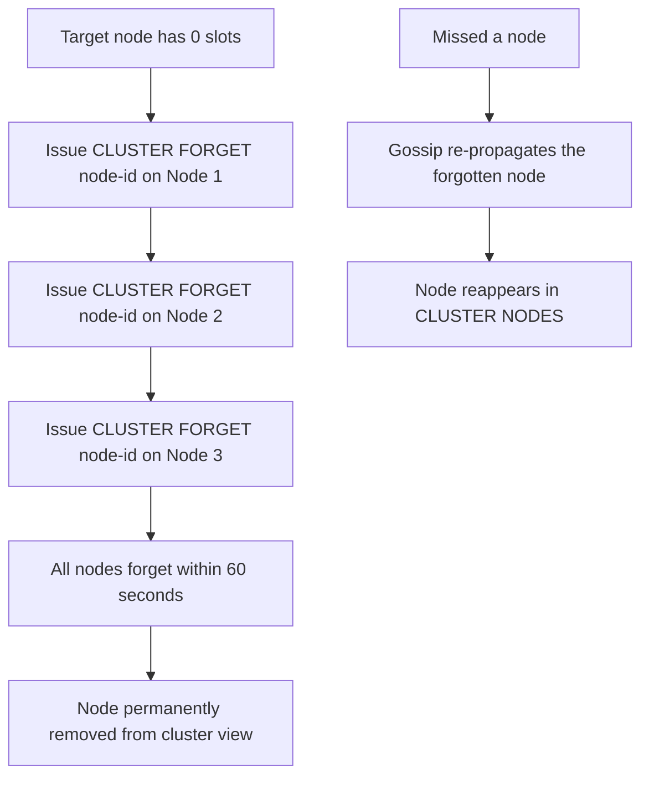
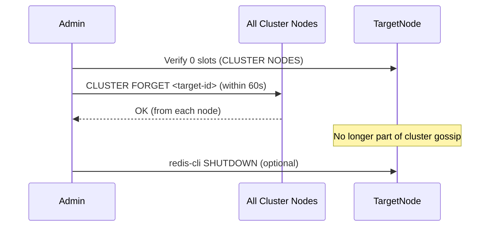

# How to Use CLUSTER FORGET in Redis to Remove a Node

Author: [nawazdhandala](https://www.github.com/nawazdhandala)

Tags: Redis, Cluster, CLUSTER FORGET, Node Management, Operations

Description: Learn how to use CLUSTER FORGET in Redis to permanently remove a node from the cluster's node table, and why it must be issued on all remaining nodes within a time window.

---

## Overview

`CLUSTER FORGET` removes a node from the cluster's internal node table. Once forgotten, the cluster stops trying to communicate with that node. Because Redis Cluster uses a gossip protocol, the command must be issued on every remaining cluster node within 60 seconds, or the forgotten node will be re-learned through gossip from nodes that still know about it.



## Syntax

```redis
CLUSTER FORGET node-id
```

The `node-id` is the 40-character hex ID from `CLUSTER NODES`. Returns `OK`.

## Prerequisites

Before forgetting a node:
1. The node must have 0 slots assigned (migrate all slots away first for primaries)
2. You cannot forget yourself (the node you are connected to)
3. You cannot forget a node whose primary you are (replicas must be freed first)

## Getting the Node ID

```redis
CLUSTER NODES
```

```text
a1b2c3d4e5f6 192.168.1.13:7007@17007 master - 0 1711900000000 0 connected
```

The first field is the node ID: `a1b2c3d4e5f6...`

## Basic Usage

### Forget a node from one cluster member

```redis
CLUSTER FORGET a1b2c3d4e5f6789012345678901234567890abcd
```

```text
OK
```

## The 60-Second Window

You must issue `CLUSTER FORGET` on all remaining cluster nodes within 60 seconds. The practical way to do this is to script it:

```bash
#!/bin/bash
NODE_ID="a1b2c3d4e5f6789012345678901234567890abcd"
PASSWORD="clusterpassword"

NODES=(
  "192.168.1.10:7001"
  "192.168.1.11:7002"
  "192.168.1.12:7003"
  "192.168.1.10:7004"
  "192.168.1.11:7005"
  "192.168.1.12:7006"
)

for node in "${NODES[@]}"; do
  HOST=$(echo $node | cut -d: -f1)
  PORT=$(echo $node | cut -d: -f2)
  echo "Forgetting $NODE_ID on $node"
  redis-cli -h $HOST -p $PORT -a $PASSWORD CLUSTER FORGET $NODE_ID
done
```

## Attempting to Forget Yourself

```redis
# Issued on the node you are connected to -- this fails
CLUSTER FORGET <my-own-node-id>
```

```text
(error) ERR I tried hard but I can't forget myself.
```

## Safe Removal Workflow



### Full removal workflow

```bash
# 1. Verify the node has no slots
redis-cli -p 7001 CLUSTER NODES | grep "7007"

# 2. Get the node ID
NODE_ID=$(redis-cli -p 7001 CLUSTER NODES | grep "7007" | awk '{print $1}')
echo "Removing node: $NODE_ID"

# 3. Forget from all other nodes (run fast, within 60 seconds)
for port in 7001 7002 7003 7004 7005 7006; do
  redis-cli -p $port CLUSTER FORGET $NODE_ID
done

# 4. Verify removal
redis-cli -p 7001 CLUSTER NODES | grep $NODE_ID
# (empty output)
```

## Using redis-cli --cluster del-node (Recommended)

`redis-cli --cluster del-node` wraps the `CLUSTER FORGET` logic and handles the timing requirement automatically:

```bash
redis-cli --cluster del-node 192.168.1.10:7001 <node-id> -a clusterpassword
```

This is the preferred approach for removing nodes in production.

## Summary

`CLUSTER FORGET node-id` removes a node from the current node's cluster membership table. Since Redis Cluster uses gossip, the command must be issued on every remaining cluster node within 60 seconds, or the forgotten node will be re-discovered through gossip. A node must have zero slots before it can be safely removed. In practice, use `redis-cli --cluster del-node` which handles the timing and broadcasts `CLUSTER FORGET` to all nodes automatically.
