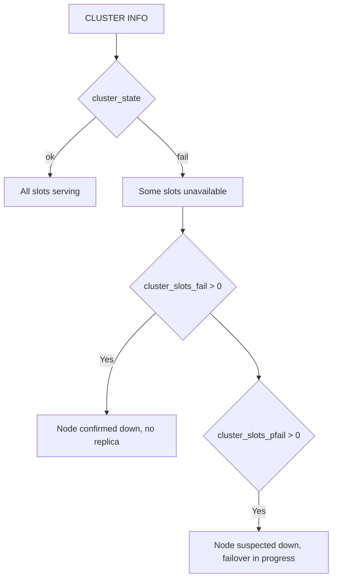

# How to Use CLUSTER INFO in Redis to Check Cluster Status

Author: [nawazdhandala](https://www.github.com/nawazdhandala)

Tags: Redis, Cluster, Monitoring, Operations, CLUSTER INFO

Description: Learn how to use CLUSTER INFO in Redis to get a comprehensive overview of cluster state, slot assignments, node counts, and epoch values for health monitoring and troubleshooting.

---

## Overview

`CLUSTER INFO` returns a structured summary of the current node's view of the Redis Cluster state. It shows whether the cluster is healthy, how many slots are assigned and operational, the number of known nodes, and internal epoch counters. It is the first command to run when diagnosing cluster issues.

## Syntax

```redis
CLUSTER INFO
```

Returns a series of `field:value` pairs, one per line.

## Sample Output

```redis
CLUSTER INFO
```

```text
cluster_enabled:1
cluster_state:ok
cluster_slots_assigned:16384
cluster_slots_ok:16384
cluster_slots_pfail:0
cluster_slots_fail:0
cluster_known_nodes:6
cluster_size:3
cluster_current_epoch:6
cluster_my_epoch:1
cluster_stats_messages_sent:100234
cluster_stats_messages_received:99876
total_cluster_links_buffer_limit_exceeded:0
```

## Field Reference

| Field | Description |
|-------|-------------|
| `cluster_enabled` | 1 if cluster mode is enabled, 0 if standalone |
| `cluster_state` | `ok` if healthy; `fail` if cluster cannot operate |
| `cluster_slots_assigned` | Number of slots assigned to nodes (should be 16384) |
| `cluster_slots_ok` | Number of slots in working state |
| `cluster_slots_pfail` | Slots on nodes suspected to be down |
| `cluster_slots_fail` | Slots on nodes confirmed to be down |
| `cluster_known_nodes` | Total nodes known to this node |
| `cluster_size` | Number of primary nodes handling slots |
| `cluster_current_epoch` | Cluster-wide epoch (logical clock) |
| `cluster_my_epoch` | This node's configuration epoch |
| `cluster_stats_messages_sent` | Gossip messages sent |
| `cluster_stats_messages_received` | Gossip messages received |

## Interpreting Cluster State

### Healthy cluster

```text
cluster_state:ok
cluster_slots_assigned:16384
cluster_slots_ok:16384
cluster_slots_pfail:0
cluster_slots_fail:0
```

All 16384 slots are assigned and functioning normally.

### Cluster with suspected node failure

```text
cluster_state:ok
cluster_slots_pfail:1024
cluster_slots_fail:0
```

`pfail` (probable failure) means some nodes suspect a node is down but have not yet reached quorum. The cluster is still serving traffic.

### Cluster in fail state

```text
cluster_state:fail
cluster_slots_fail:1024
```

One or more primaries are confirmed down with no replica available to take over. The cluster stops accepting writes for affected slots.



## Monitoring Cluster Health

### Shell script for health check

```bash
#!/bin/bash
REDIS_HOST=192.168.1.10
REDIS_PORT=7001

STATE=$(redis-cli -h $REDIS_HOST -p $REDIS_PORT CLUSTER INFO | grep cluster_state | cut -d: -f2 | tr -d '[:space:]')
FAIL_SLOTS=$(redis-cli -h $REDIS_HOST -p $REDIS_PORT CLUSTER INFO | grep cluster_slots_fail | cut -d: -f2 | tr -d '[:space:]')

if [ "$STATE" != "ok" ] || [ "$FAIL_SLOTS" -gt "0" ]; then
  echo "ALERT: Redis cluster is not healthy. State=$STATE FailSlots=$FAIL_SLOTS"
  exit 1
else
  echo "Redis cluster is OK"
fi
```

## cluster_enabled:0

If `cluster_enabled` is 0, the node is running in standalone mode. `CLUSTER INFO` still works but most fields reflect a non-clustered state:

```text
cluster_enabled:0
cluster_state:ok
cluster_slots_assigned:0
cluster_known_nodes:0
cluster_size:0
```

## cluster_state:fail Causes

The cluster enters `fail` state when:
1. A primary node fails and has no replica to promote
2. More than half the primary nodes fail simultaneously
3. A node cannot reach enough cluster members to maintain quorum

## Summary

`CLUSTER INFO` provides a single-command health snapshot of Redis Cluster. Key fields to monitor are `cluster_state` (must be `ok`), `cluster_slots_assigned` (must be 16384), `cluster_slots_ok` (must equal `cluster_slots_assigned`), and `cluster_slots_fail` (must be 0). Use `cluster_slots_pfail` as an early warning indicator that failover may be in progress. Run `CLUSTER INFO` from multiple nodes to detect inconsistent views of cluster state.
