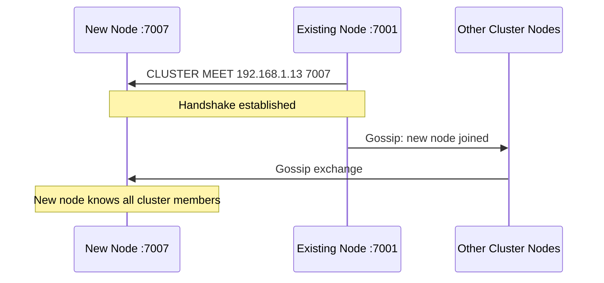
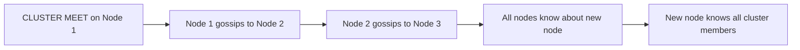

# How to Use CLUSTER MEET in Redis to Join a Cluster

Author: [nawazdhandala](https://www.github.com/nawazdhandala)

Tags: Redis, Cluster, CLUSTER MEET, Node Management, Configuration

Description: Learn how to use CLUSTER MEET in Redis to introduce a new node to an existing cluster, enabling it to gossip with other nodes and become a full cluster member.

---

## Overview

`CLUSTER MEET` tells the current node to initiate a handshake with another node at the given address. Once the handshake succeeds, the two nodes exchange cluster topology information through the gossip protocol, and the new node propagates through the cluster. `CLUSTER MEET` is the low-level mechanism behind `redis-cli --cluster add-node`.



## Syntax

```redis
CLUSTER MEET ip port
```

Issued on any existing cluster node. Returns `OK`.

## Basic Usage

### Add a new standalone node to an existing cluster

First, start the new node with cluster mode enabled but without any cluster configuration:

```text
port 7007
cluster-enabled yes
cluster-config-file nodes-7007.conf
cluster-node-timeout 5000
```

```bash
redis-server /etc/redis/node-7007.conf
```

Connect to an existing cluster node and issue CLUSTER MEET:

```redis
CLUSTER MEET 192.168.1.13 7007
```

```text
OK
```

### Verify the new node is known

```redis
CLUSTER NODES
```

```text
...
x9y8z7w6v5u4 192.168.1.13:7007@17007 master - 0 1711900000000 0 connected
...
```

The new node appears with no slots (`connected` but no slot range).

## Gossip Propagation

You only need to issue `CLUSTER MEET` on one existing node. The gossip protocol automatically propagates the new node's presence to all other cluster members within a few seconds:



## After CLUSTER MEET: Assign Slots or Set Replica

A node that joins via `CLUSTER MEET` has no role until slots are assigned or it is told to replicate:

### Make it a replica of an existing primary

```redis
# Connect to the new node
redis-cli -p 7007

# Set it as a replica of the primary with the given node ID
CLUSTER REPLICATE a1b2c3d4e5f6789012345678901234567890abcd
```

### Assign slots (for a new primary)

```redis
# Connect to the new node and assign specific slots
CLUSTER ADDSLOTS 15000 15001 15002 ...
```

In practice, use `redis-cli --cluster reshard` rather than manual `ADDSLOTS`.

## CLUSTER MEET vs redis-cli --cluster add-node

| Method | What it does |
|--------|-------------|
| `CLUSTER MEET ip port` | Low-level: introduces nodes to each other, no role assignment |
| `redis-cli --cluster add-node` | High-level: calls CLUSTER MEET and optionally sets replica role |

Use `redis-cli --cluster add-node` for day-to-day operations. Use `CLUSTER MEET` directly when scripting custom cluster management or when troubleshooting a node that dropped out of the cluster gossip.

## Re-joining a Node That Left the Cluster

If a node was removed with `CLUSTER FORGET` and needs to rejoin:

1. Reset the node: `CLUSTER RESET HARD` on the node itself
2. Re-introduce it: `CLUSTER MEET ip port` on an existing cluster node
3. Re-assign its role and slots

## Summary

`CLUSTER MEET ip port` initiates a handshake between the current node and the target node, causing them to exchange cluster topology via gossip. The new node's presence propagates to all other cluster members automatically. After `CLUSTER MEET`, assign the new node a role by either running `CLUSTER REPLICATE` on it (to become a replica) or resharding slots to it (to become a primary). For most operational use, `redis-cli --cluster add-node` is the preferred higher-level alternative.
