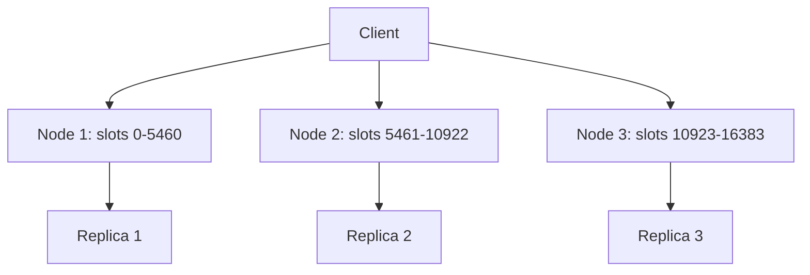

# How to Set Up Redis Cluster Mode

Author: [nawazdhandala](https://www.github.com/nawazdhandala)

Tags: Redis, Cluster, High Availability, Scalability, Configuration

Description: Learn how to set up Redis Cluster mode from scratch with multiple nodes, create the cluster, verify slot assignments, and configure replication for fault tolerance.

---

## Overview

Redis Cluster provides automatic sharding across multiple nodes, with data distributed across 16384 hash slots. Each node handles a subset of slots. With replicas configured, the cluster can survive node failures with automatic failover. Cluster mode is the recommended approach for horizontal scaling beyond what a single Redis instance can handle.



## Requirements

- At least 3 primary nodes (Redis minimum for cluster mode)
- For fault tolerance: 3 primaries + 3 replicas (6 nodes total)
- Redis 3.0+

## Node Configuration

Create a `redis.conf` for each node. Example for node 1:

```text
port 7001
cluster-enabled yes
cluster-config-file nodes-7001.conf
cluster-node-timeout 5000
appendonly yes
requirepass clusterpassword
masterauth clusterpassword
bind 0.0.0.0
```

Repeat for ports 7001 through 7006 (6 nodes total).

## Starting the Nodes

```bash
redis-server /etc/redis/node-7001.conf
redis-server /etc/redis/node-7002.conf
redis-server /etc/redis/node-7003.conf
redis-server /etc/redis/node-7004.conf
redis-server /etc/redis/node-7005.conf
redis-server /etc/redis/node-7006.conf
```

## Creating the Cluster

Use `redis-cli --cluster create` to form the cluster and assign slots:

```bash
redis-cli --cluster create \
  192.168.1.10:7001 \
  192.168.1.11:7002 \
  192.168.1.12:7003 \
  192.168.1.10:7004 \
  192.168.1.11:7005 \
  192.168.1.12:7006 \
  --cluster-replicas 1 \
  -a clusterpassword
```

The `--cluster-replicas 1` flag assigns one replica per primary. Redis CLI will propose a configuration:

```text
>>> Performing hash slots allocation on 6 nodes...
Master[0] -> Slots 0 - 5460
Master[1] -> Slots 5461 - 10922
Master[2] -> Slots 10923 - 16383
Adding replica 192.168.1.10:7004 to 192.168.1.11:7002
Adding replica 192.168.1.11:7005 to 192.168.1.12:7003
Adding replica 192.168.1.12:7006 to 192.168.1.10:7001
>>> Trying to optimize replicas allocation for anti-affinity
...
Can I set the above configuration? (type 'yes' to accept): yes
```

Type `yes` to proceed.

## Verifying the Cluster

```bash
redis-cli -c -h 192.168.1.10 -p 7001 -a clusterpassword CLUSTER INFO
```

```text
cluster_enabled:1
cluster_state:ok
cluster_slots_assigned:16384
cluster_slots_ok:16384
cluster_slots_pfail:0
cluster_slots_fail:0
cluster_known_nodes:6
cluster_size:3
```

`cluster_state:ok` confirms all slots are assigned and the cluster is healthy.

## Testing Key Distribution

With the `-c` flag, redis-cli follows MOVED redirects automatically:

```bash
redis-cli -c -h 192.168.1.10 -p 7001 -a clusterpassword
```

```redis
SET user:1001 "Alice"
```

```text
-> Redirected to slot [12050] located at 192.168.1.12:7003
OK
```

```redis
GET user:1001
```

```text
-> Redirected to slot [12050] located at 192.168.1.12:7003
"Alice"
```

## Cluster Node Overview

```redis
CLUSTER NODES
```

```text
a1b2c3... 192.168.1.10:7001@17001 master - 0 1711900000000 1 connected 0-5460
d4e5f6... 192.168.1.11:7002@17002 master - 0 1711900000100 2 connected 5461-10922
g7h8i9... 192.168.1.12:7003@17003 master - 0 1711900000200 3 connected 10923-16383
j1k2l3... 192.168.1.10:7004@17004 slave a1b2c3... 0 1711900000300 1 connected
m4n5o6... 192.168.1.11:7005@17005 slave d4e5f6... 0 1711900000400 2 connected
p7q8r9... 192.168.1.12:7006@17006 slave g7h8i9... 0 1711900000500 3 connected
```

## Hash Tags for Co-location

To ensure related keys land on the same slot (required for multi-key commands in cluster mode), use hash tags:

```redis
# Both keys go to the same slot because {order:1001} is the hash tag
SET {order:1001}:details "..."
SET {order:1001}:items "..."
MGET {order:1001}:details {order:1001}:items
```

## Summary

Redis Cluster mode requires at least 3 primary nodes, each configured with `cluster-enabled yes`. Use `redis-cli --cluster create` to form the cluster and distribute the 16384 hash slots. For fault tolerance, include replicas with `--cluster-replicas 1`. Verify health with `CLUSTER INFO` and key distribution with the `-c` flag in redis-cli. Use hash tags `{tag}` to co-locate related keys on the same slot when you need multi-key operations across related data.
