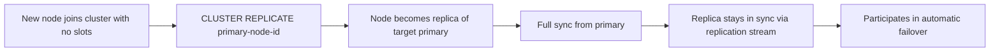

# How to Use CLUSTER REPLICATE in Redis to Set Replica

Author: [nawazdhandala](https://www.github.com/nawazdhandala)

Tags: Redis, Cluster, Replication, CLUSTER REPLICATE, Node Management

Description: Learn how to use CLUSTER REPLICATE in Redis to convert a primary node with no slots into a replica of another primary, enabling replication within a cluster topology.

---

## Overview

`CLUSTER REPLICATE` tells the current node to become a replica of the specified primary node within the cluster. The command is issued on the node that should become a replica. The target must be a primary node. After replication is established, the replica synchronizes data from the primary and participates in automatic failover if the primary fails.



## Syntax

```redis
CLUSTER REPLICATE node-id
```

Issued on the node that should become a replica. `node-id` is the 40-character ID of the target primary. Returns `OK`.

## Prerequisites

- The node issuing the command must be a primary with no slots assigned (or already a replica)
- The target `node-id` must be a primary node in the cluster
- Both nodes must already know each other (connected via `CLUSTER MEET` or `redis-cli --cluster add-node`)

## Getting the Target Primary's Node ID

```redis
CLUSTER NODES
```

```text
a1b2c3d4e5f6 192.168.1.10:7001@17001 master - 0 1711900000000 1 connected 0-5460
```

The primary ID is `a1b2c3d4e5f6...` (first field).

## Basic Usage

### Convert a standalone node into a replica

Connect to the node that should become a replica:

```bash
redis-cli -h 192.168.1.13 -p 7007
```

```redis
CLUSTER REPLICATE a1b2c3d4e5f6789012345678901234567890abcd
```

```text
OK
```

### Verify replication is established

```redis
CLUSTER NODES
```

```text
# The node now shows as slave with the primary's ID
x9y8z7w6 192.168.1.13:7007@17007 slave a1b2c3d4e5f6 0 1711900000000 1 connected
```

```redis
# On the new replica, check replication state
INFO replication
```

```text
role:slave
master_host:192.168.1.10
master_port:7001
master_link_status:up
master_last_io_seconds_ago:1
master_sync_in_progress:0
slave_read_repl_offset:12345
slave_repl_offset:12345
slave_priority:100
slave_read_only:1
```

## Changing Replica's Primary

A replica can switch to replicate from a different primary:

```redis
# Currently replicating from primary A
# Switch to replicate from primary B
CLUSTER REPLICATE d4e5f678abcdef012345678901234567890abcde
```

```text
OK
```

This causes a full resync from the new primary.

## Adding a Replica for an Existing Primary

This is the typical workflow for adding fault tolerance to an under-replicated shard:

```bash
# 1. Start a new node
redis-server /etc/redis/node-7007.conf

# 2. Add it to the cluster
redis-cli -p 7001 CLUSTER MEET 192.168.1.13 7007

# 3. Wait for gossip propagation (a few seconds)
sleep 2

# 4. Get the new node's ID
NEW_NODE_ID=$(redis-cli -p 7001 CLUSTER NODES | grep "7007" | awk '{print $1}')

# 5. Connect to the new node and make it a replica
redis-cli -h 192.168.1.13 -p 7007 CLUSTER REPLICATE <primary-node-id>
```

Or using the higher-level command:

```bash
redis-cli --cluster add-node \
  192.168.1.13:7007 \
  192.168.1.10:7001 \
  --cluster-slave \
  --cluster-master-id <primary-node-id>
```

## CLUSTER REPLICATE vs REPLICAOF

| Command | Used in | Effect |
|---------|---------|--------|
| `CLUSTER REPLICATE node-id` | Cluster mode | Sets replication by node ID within the cluster |
| `REPLICAOF host port` | Standalone mode | Sets replication by host and port |

Do not use `REPLICAOF` in cluster mode. Always use `CLUSTER REPLICATE`.

## Replica Failing to Sync

If `INFO replication` shows `master_link_status:down`, check:
- `masterauth` is configured on the replica (must match primary's `requirepass`)
- Network connectivity between nodes on both client and cluster bus ports

## Summary

`CLUSTER REPLICATE node-id` is issued on a node to make it a replica of the specified primary within a Redis Cluster. The node must have no slots assigned. After the command, the node synchronizes data from the primary and participates in automatic failover. Use it when adding new replicas to increase fault tolerance, or to reassign a replica to a different primary. In practice, `redis-cli --cluster add-node --cluster-slave` is the preferred high-level approach that wraps `CLUSTER MEET` and `CLUSTER REPLICATE`.
