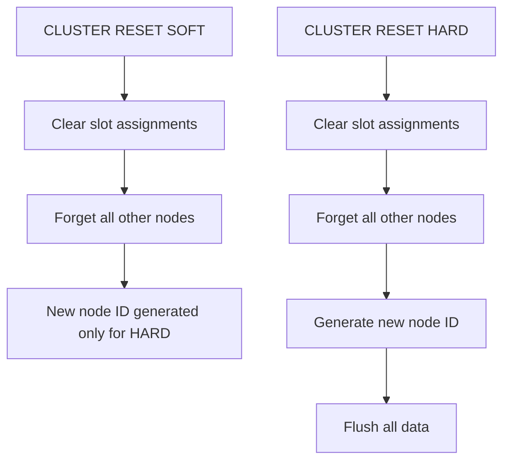
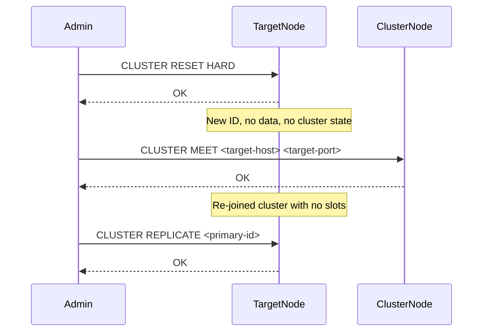

# How to Use CLUSTER RESET in Redis to Reset a Node

Author: [nawazdhandala](https://www.github.com/nawazdhandala)

Tags: Redis, Cluster, CLUSTER RESET, Operation, Node Management

Description: Learn how to use CLUSTER RESET in Redis to clear a node's cluster state, making it suitable for rejoining a cluster as a clean member or converting it back to standalone mode.

---

## Overview

`CLUSTER RESET` clears a node's cluster state, removing all known nodes, slot assignments, and the cluster configuration file. This is used when decommissioning a cluster node for reuse, recovering from a misconfiguration, or resetting a node so it can join a different cluster. It comes in two variants: `SOFT` (default) and `HARD`.



## Syntax

```redis
CLUSTER RESET [HARD | SOFT]
```

- `SOFT` (default): Clears cluster state but retains the node ID and does not flush data
- `HARD`: Clears cluster state, generates a new node ID, and flushes all data

Returns `OK`.

## SOFT Reset

```redis
CLUSTER RESET SOFT
```

```text
OK
```

### Effect of SOFT reset:
- All slot assignments are cleared
- All known nodes are removed from the node table
- The node ID remains unchanged
- Existing data keys are retained
- The cluster configuration file (`nodes-XXXX.conf`) is cleared

## HARD Reset

```redis
CLUSTER RESET HARD
```

```text
OK
```

### Effect of HARD reset:
- All slot assignments are cleared
- All known nodes are removed from the node table
- A new node ID is generated
- All data is deleted (equivalent to `FLUSHALL`)
- The cluster configuration file is cleared

## Restrictions

`CLUSTER RESET` cannot be issued on a primary node that has assigned slots and has replicas:

```redis
CLUSTER RESET HARD
```

```text
(error) ERR master still has attached slaves
```

Disconnect replicas first, then reset.

## Use Cases

### Repurpose a node for a different cluster

```redis
# On the node to be reset
CLUSTER RESET HARD
```

The node is now clean with a new ID and can join a different cluster via `CLUSTER MEET`.

### Recover from cluster misconfiguration

If a node has a corrupted or inconsistent cluster state:

```redis
CLUSTER RESET SOFT
```

Then re-introduce it with `CLUSTER MEET` and `CLUSTER REPLICATE`.

### Convert cluster node back to standalone

```redis
CLUSTER RESET HARD
```

Then remove `cluster-enabled yes` from `redis.conf` and restart.

## Full Reset and Rejoin Workflow



```bash
# 1. Reset the node
redis-cli -h 192.168.1.13 -p 7007 CLUSTER RESET HARD

# 2. Re-introduce to cluster
redis-cli -h 192.168.1.10 -p 7001 CLUSTER MEET 192.168.1.13 7007

# 3. Set as replica
NEW_NODE_ID=$(redis-cli -p 7001 CLUSTER NODES | grep "7007" | awk '{print $1}')
redis-cli -h 192.168.1.13 -p 7007 CLUSTER REPLICATE <primary-id>
```

## Checking State After Reset

```redis
CLUSTER INFO
```

```text
cluster_enabled:1
cluster_state:ok
cluster_slots_assigned:0
cluster_known_nodes:1
cluster_size:0
```

Only the node itself is known; it has no slots and no peers yet.

## Summary

`CLUSTER RESET` clears a Redis node's cluster membership, slot assignments, and known nodes. `SOFT` mode retains the node ID and data. `HARD` mode generates a new node ID and flushes all data. Use it to repurpose nodes for different clusters, recover from misconfiguration, or prepare a node for clean re-admission to a cluster. After resetting, use `CLUSTER MEET` to re-introduce the node and `CLUSTER REPLICATE` to assign it a role.
