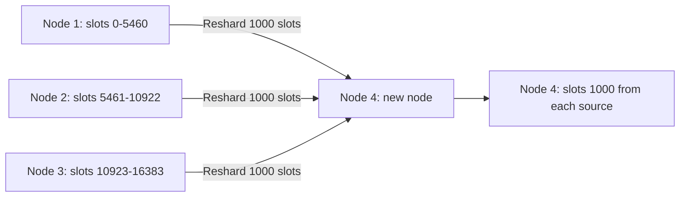
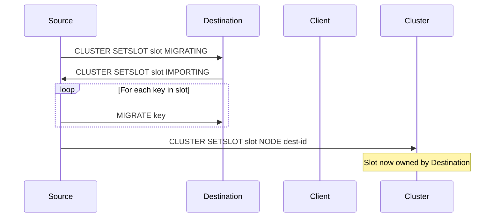

# How to Handle Resharding in Redis Cluster

Author: [nawazdhandala](https://www.github.com/nawazdhandala)

Tags: Redis, Cluster, Resharding, Scalability, Operation

Description: Learn how to reshard slot assignments in Redis Cluster to rebalance data across nodes, add capacity to new nodes, or prepare a node for removal, using redis-cli cluster tools.

---

## Overview

Resharding in Redis Cluster means moving hash slots (and the keys they contain) from one primary node to another. This is necessary when adding new nodes (to distribute data to them), removing nodes (to evacuate their data), or rebalancing an uneven distribution. Redis Cluster supports live resharding with zero downtime.



## Understanding Hash Slots

Redis Cluster uses 16384 hash slots. Every key maps to a slot: `slot = CRC16(key) % 16384`. Resharding moves slot ownership and all keys in those slots from one node to another.

## Prerequisites

- An existing Redis Cluster
- `redis-cli` from Redis 3.0+
- Sufficient network bandwidth between nodes for key migration

## Interactive Resharding with redis-cli

```bash
redis-cli --cluster reshard 192.168.1.10:7001 -a clusterpassword
```

You will be prompted:

```text
How many slots do you want to move (from 1 to 16384)?
```

Enter the number of slots to move, e.g., `1365` (to distribute evenly across 4 nodes from 3).

```text
What is the receiving node ID?
```

Enter the node ID of the destination node.

```text
Please enter all the source node IDs.
  Type 'all' to use all the nodes as source nodes for the hash slots.
  Type 'done' once you entered all the source nodes IDs.
Source node #1:
```

Type `all` to take slots proportionally from all primaries, or enter specific source node IDs followed by `done`.

Redis CLI shows the migration plan and asks for confirmation:

```text
Do you want to proceed with the proposed reshard plan (yes/no)?
```

Type `yes` to begin.

## Non-Interactive Resharding

For automation, pass all parameters on the command line:

```bash
redis-cli --cluster reshard 192.168.1.10:7001 \
  --cluster-from <source-node-id> \
  --cluster-to <dest-node-id> \
  --cluster-slots 1365 \
  --cluster-yes \
  -a clusterpassword
```

`--cluster-yes` skips the confirmation prompt.

## Rebalancing All Nodes Equally

After adding a new node, use `--cluster rebalance` to distribute slots evenly:

```bash
redis-cli --cluster rebalance 192.168.1.10:7001 -a clusterpassword
```

```text
>>> Rebalancing across 4 nodes. Total weight = 4.00
Moving 1 slots from 192.168.1.10:7001 to 192.168.1.13:7007
...
```

With `--cluster-use-empty-masters`:

```bash
redis-cli --cluster rebalance 192.168.1.10:7001 \
  --cluster-use-empty-masters \
  -a clusterpassword
```

## How Slot Migration Works

During resharding, Redis uses a three-phase slot migration protocol:



During migration, clients receive `ASK` redirects for keys being migrated and `MOVED` redirects after migration completes.

## Monitoring Reshard Progress

During a reshard, the CLI outputs progress:

```text
Moving slot 1000 from 192.168.1.10:7001 to 192.168.1.13:7007: .
Moving slot 1001 from 192.168.1.10:7001 to 192.168.1.13:7007: .
...
```

In another terminal, check cluster health:

```bash
redis-cli -p 7001 CLUSTER INFO
redis-cli -p 7001 --cluster check 192.168.1.10:7001 -a clusterpassword
```

## Evacuating a Node Before Removal

To remove node X, move all its slots to other nodes:

```bash
redis-cli --cluster reshard 192.168.1.10:7001 \
  --cluster-from <node-x-id> \
  --cluster-to <any-other-primary-id> \
  --cluster-slots <all-slots-on-node-x> \
  --cluster-yes \
  -a clusterpassword
```

Then verify the node has 0 slots:

```redis
CLUSTER NODES
```

Once it shows no slot range, you can safely run `CLUSTER FORGET`.

## Summary

Resharding in Redis Cluster moves hash slots and their keys from one primary node to another, enabling live scaling without downtime. Use `redis-cli --cluster reshard` interactively or with `--cluster-from`, `--cluster-to`, `--cluster-slots`, and `--cluster-yes` for automation. Use `--cluster rebalance` to automatically equalize slot distribution. Always verify with `CLUSTER INFO` and `--cluster check` after resharding. Evacuate all slots from a node before removing it with `CLUSTER FORGET`.
