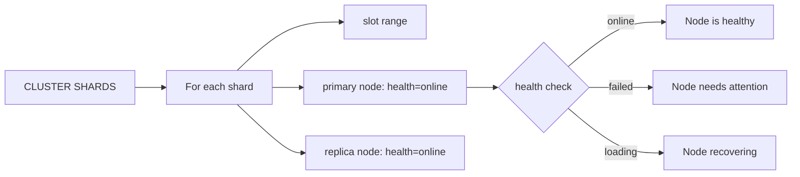

# How to Use CLUSTER SHARDS in Redis to Get Shard Information

Author: [nawazdhandala](https://www.github.com/nawazdhandala)

Tags: Redis, Cluster, CLUSTER SHARDS, Monitoring, Operations

Description: Learn how to use CLUSTER SHARDS in Redis 7.0+ to get structured shard information including slot ranges, node details, health status, and replication offsets for each shard.

---

## Overview

`CLUSTER SHARDS` (introduced in Redis 7.0) returns structured information about each shard in the cluster, grouping slot ranges with their associated primary and replica nodes. It replaces the deprecated `CLUSTER SLOTS` and provides richer data including node health status and replication offsets. Client libraries use this to build routing tables.

## Syntax

```redis
CLUSTER SHARDS
```

Available in Redis 7.0+. Returns an array of shard objects.

## Sample Output

```redis
CLUSTER SHARDS
```

```text
1) 1) "slots"
   2) 1) (integer) 0
      2) (integer) 5460
   3) "nodes"
   4) 1) 1) "id"
         2) "a1b2c3d4e5f6789012345678901234567890abcd"
         3) "port"
         4) (integer) 7001
         5) "ip"
         6) "192.168.1.10"
         7) "endpoint"
         8) "192.168.1.10"
         9) "role"
        10) "master"
        11) "replication-offset"
        12) (integer) 12345
        13) "health"
        14) "online"
      2) 1) "id"
         2) "j1k2l3m4n5o6789012345678901234567890abcd"
         3) "port"
         4) (integer) 7004
         5) "ip"
         6) "192.168.1.10"
         7) "endpoint"
         8) "192.168.1.10"
         9) "role"
        10) "replica"
        11) "replication-offset"
        12) (integer) 12340
        13) "health"
        14) "online"
2) ...
```

## Field Reference

### Shard-level fields

| Field | Description |
|-------|-------------|
| `slots` | Array of slot range pairs (start, end) |
| `nodes` | Array of nodes handling this shard |

### Node-level fields

| Field | Description |
|-------|-------------|
| `id` | 40-char node ID |
| `port` | Client port |
| `ip` | IP address |
| `endpoint` | Endpoint (same as IP unless using hostnames) |
| `role` | `master` or `replica` |
| `replication-offset` | Replication offset for consistency checking |
| `health` | `online`, `failed`, or `loading` |

## Health States

The `health` field provides node availability at a glance:

| Health value | Meaning |
|-------------|---------|
| `online` | Node is reachable and serving traffic |
| `failed` | Node is confirmed down |
| `loading` | Node is loading data (e.g., after restart) |



## Checking Replication Lag

Compare `replication-offset` between primary and replicas to detect lag:

```redis
CLUSTER SHARDS
```

```text
# Primary offset: 12345
# Replica offset: 12340
# Lag: 5 bytes
```

A large gap indicates the replica is falling behind.

## CLUSTER SHARDS vs CLUSTER SLOTS

| Feature | CLUSTER SHARDS | CLUSTER SLOTS |
|---------|---------------|--------------|
| Available since | Redis 7.0 | Redis 3.0 |
| Status | Current | Deprecated (Redis 7.0) |
| Health field | Yes | No |
| Replication offset | Yes | No |
| Response format | Structured map | Nested arrays |
| Slot ranges | Grouped per shard | Grouped per shard |

For Redis 7.0+ deployments, always prefer `CLUSTER SHARDS`.

## Scripting with CLUSTER SHARDS

### List all nodes with health status

```bash
redis-cli -p 7001 CLUSTER SHARDS | grep -A 1 '"health"'
```

### Python example

```python
import redis

r = redis.RedisCluster(
    host='192.168.1.10',
    port=7001
)

# Access a single node for CLUSTER SHARDS
node = r.get_redis_connection(host='192.168.1.10', port=7001)
shards = node.execute_command('CLUSTER SHARDS')
for shard in shards:
    print(shard)
```

## Summary

`CLUSTER SHARDS` is the Redis 7.0+ replacement for the deprecated `CLUSTER SLOTS`. It returns structured shard data grouping each slot range with its primary and replica nodes, including health status (`online`, `failed`, `loading`) and replication offsets. Use it instead of `CLUSTER SLOTS` for new deployments to get richer node health information and to detect replication lag. Client libraries that support Redis 7.0+ use `CLUSTER SHARDS` to build their routing tables.
