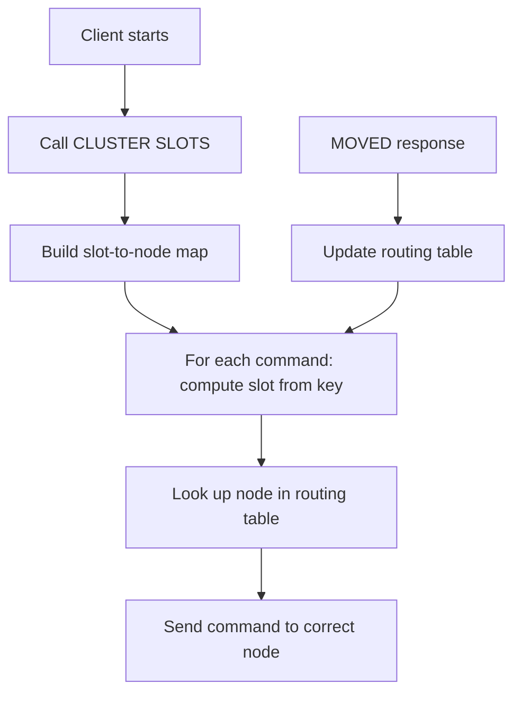

# How to Use CLUSTER SLOTS in Redis to Get Slot Assignments

Author: [nawazdhandala](https://www.github.com/nawazdhandala)

Tags: Redis, Cluster, CLUSTER SLOTS, Monitoring, Operations

Description: Learn how to use CLUSTER SLOTS in Redis to retrieve the current slot-to-node mapping, including primary and replica addresses for each slot range, useful for client routing.

---

## Overview

`CLUSTER SLOTS` returns the current slot ranges assigned to each node, along with the IP, port, and node ID of the primary and all replicas for each slot range. Client libraries use this information to build their routing tables, directing keys to the correct node based on slot assignment.

Note: `CLUSTER SLOTS` is deprecated as of Redis 7.0 in favor of `CLUSTER SHARDS`, which provides the same information in a more structured format.

## Syntax

```redis
CLUSTER SLOTS
```

Returns a nested array. Each entry contains: slot start, slot end, primary node details, then replica node details.

## Sample Output

```redis
CLUSTER SLOTS
```

```text
1) 1) (integer) 0
   2) (integer) 5460
   3) 1) "192.168.1.10"
      2) (integer) 7001
      3) "a1b2c3d4e5f6789012345678901234567890abcd"
   4) 1) "192.168.1.10"
      2) (integer) 7004
      3) "j1k2l3m4n5o6789012345678901234567890abcd"
2) 1) (integer) 5461
   2) (integer) 10922
   3) 1) "192.168.1.11"
      2) (integer) 7002
      3) "d4e5f678abcd012345678901234567890abcdef"
   4) 1) "192.168.1.11"
      2) (integer) 7005
      3) "p7q8r9s0t1u2345678901234567890abcdefgh"
3) 1) (integer) 10923
   2) (integer) 16383
   3) 1) "192.168.1.12"
      2) (integer) 7003
      3) "g7h8i9j0ef12345678901234567890abcdefgh"
   4) 1) "192.168.1.12"
      2) (integer) 7006
      3) "v3w4x5y6z7a8901234567890abcdefghijklmn"
```

## Output Structure

Each element in the response array:

```text
[slot_start, slot_end, [primary_ip, primary_port, primary_id], [replica_ip, replica_port, replica_id], ...]
```

- First two integers: the slot range (inclusive)
- Third element: primary node (IP, port, node ID)
- Subsequent elements: replica nodes (IP, port, node ID)

## Finding Which Node Owns a Slot

```redis
CLUSTER SLOTS
```

Parse the output to find which primary handles slot 12000:

```text
Slot 12000 falls in range 10923-16383
Primary: 192.168.1.12:7003
```

## Calculating Which Slot a Key Uses

```redis
CLUSTER KEYSLOT mykey
```

```text
(integer) 14687
```

Then use `CLUSTER SLOTS` to find which node handles slot 14687.

## CLUSTER SLOTS vs CLUSTER SHARDS

`CLUSTER SHARDS` (Redis 7.0+) supersedes `CLUSTER SLOTS`:

```redis
CLUSTER SHARDS
```

`CLUSTER SHARDS` returns a more structured response with additional fields like `health` and `replication-offset`, and groups replicas with their primary more clearly. For new code, prefer `CLUSTER SHARDS`.

| Feature | CLUSTER SLOTS | CLUSTER SHARDS |
|---------|--------------|----------------|
| Available since | Redis 3.0 | Redis 7.0 |
| Deprecated | Yes (Redis 7.0) | No |
| Response format | Nested array | Structured map |
| Additional fields | No | Yes (health, offset) |

## Practical Use: Routing Table

Client libraries call `CLUSTER SLOTS` on startup to build a routing table:



## Scripting with CLUSTER SLOTS

```bash
#!/bin/bash
# Print a summary of slot ranges and their primaries
redis-cli -p 7001 CLUSTER SLOTS | \
  python3 -c "
import sys, redis
r = redis.Redis(port=7001)
for shard in r.cluster('SLOTS'):
    start, end, primary = shard[0], shard[1], shard[2]
    print(f'Slots {start}-{end}: {primary[0].decode()}:{primary[1]}')
"
```

## Summary

`CLUSTER SLOTS` returns the current slot-to-node mapping, showing which primary (and its replicas) handles each slot range. Each entry contains the slot range boundaries and the IP, port, and node ID of the primary and all its replicas. It is primarily used by client libraries to build routing tables. As of Redis 7.0, `CLUSTER SLOTS` is deprecated in favor of `CLUSTER SHARDS`, which provides a more structured and informative response. Use `CLUSTER KEYSLOT key` to find which slot a specific key belongs to.
