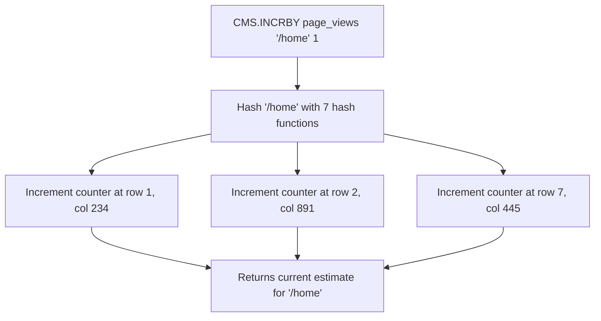

# How to Use CMS.INCRBY in Redis Count-Min Sketch

Author: [nawazdhandala](https://www.github.com/nawazdhandala)

Tags: Redis, RedisBloom, Count-Min Sketch, Probabilistic, Command

Description: Learn how to use CMS.INCRBY in Redis to increment the frequency count of one or more items in a Count-Min Sketch for approximate frequency tracking.

---

## How CMS.INCRBY Works

`CMS.INCRBY` increments the frequency count of one or more items in a Count-Min Sketch. Each item is hashed to multiple positions in the sketch's 2D array, and all corresponding counters are incremented by the specified amount. This is the primary write operation for Count-Min Sketches, equivalent to recording an event or incrementing a counter.



## Syntax

```redis
CMS.INCRBY key item increment [item increment ...]
```

- `key` - the Count-Min Sketch key (auto-created if not present)
- `item` - the element whose count to increment
- `increment` - amount to add (positive integer)
- Multiple `item increment` pairs can be provided in one call

Returns an array of current frequency estimates, one per item.

## Examples

### Increment a Single Item by 1

```redis
CMS.INITBYDIM search_terms 2000 7
CMS.INCRBY search_terms "redis" 1
```

```text
1) (integer) 1
```

### Increment by a Different Amount

```redis
-- Record 5 views at once (batch reporting)
CMS.INCRBY page_views "/about" 5
```

```text
1) (integer) 5
```

### Increment Multiple Items at Once

```redis
CMS.INCRBY api_calls "/api/users" 1 "/api/products" 3 "/api/orders" 2
```

```text
1) (integer) 1
2) (integer) 3
3) (integer) 2
```

Returns the current estimate for each item.

### Repeated Increments

```redis
CMS.INCRBY events "click" 1
CMS.INCRBY events "click" 1
CMS.INCRBY events "click" 1
```

```text
(result after each call)
1) (integer) 1
1) (integer) 2
1) (integer) 3
```

## Auto-Creation on First Use

If the key does not exist, `CMS.INCRBY` auto-creates a sketch with default dimensions:

```redis
-- No CMS.INITBYDIM needed
CMS.INCRBY word_count "hello" 1
```

For production use, always initialize explicitly with `CMS.INITBYDIM` or `CMS.INITBYPROB` to control dimensions and memory.

## Batch Reporting Pattern

When event sources report in batches rather than one-by-one, increment by the batch count:

```redis
-- 1000 events logged in a batch
CMS.INCRBY hourly_events "login" 342 "logout" 289 "purchase" 47 "search" 512
```

Returns current estimates for all four events in one round trip.

## Use Cases

### Real-Time Search Term Frequency

Track which search terms are most popular:

```redis
CMS.INITBYDIM search_terms 5000 7

-- On each search
CMS.INCRBY search_terms "redis tutorial" 1
CMS.INCRBY search_terms "docker compose" 1
CMS.INCRBY search_terms "redis tutorial" 1

-- Query frequency later
CMS.QUERY search_terms "redis tutorial"
-- (integer) 2
```

### API Endpoint Hit Counting

Count requests per endpoint without storing all endpoint strings:

```redis
CMS.INITBYDIM endpoint_hits 10000 7

-- On each API request
CMS.INCRBY endpoint_hits "/api/users" 1
CMS.INCRBY endpoint_hits "/api/products" 1
```

### Word Frequency Analysis

Process a text document and count word frequencies:

```redis
CMS.INITBYDIM word_freq 50000 10

-- For each word in the document
CMS.INCRBY word_freq "the" 1
CMS.INCRBY word_freq "quick" 1
CMS.INCRBY word_freq "brown" 1
CMS.INCRBY word_freq "the" 1
```

### Event Stream Analytics

Aggregate event counts from multiple producers:

```redis
-- Producer 1
CMS.INCRBY daily_events "page_view" 100 "purchase" 5 "signup" 12

-- Producer 2
CMS.INCRBY daily_events "page_view" 80 "purchase" 3 "signup" 8
```

## CMS.INCRBY vs HINCRBY

| Feature | CMS.INCRBY | HINCRBY (Redis Hash) |
|---------|-----------|---------------------|
| Memory | Fixed (width * depth) | Grows with unique items |
| Accuracy | Approximate (overcount) | Exact |
| Scale | Millions of unique items | Thousands before memory concern |
| Speed | O(depth) | O(1) |
| Use case | High-cardinality counting | Low-cardinality exact counting |

## Understanding the Return Value

The returned value is the current frequency estimate after the increment. Due to hash collisions in the sketch, this value may be slightly higher than the true count, but never lower:

```text
True count: 1000 times
Estimated count: 1003 (small overcount due to collisions)
```

The overcount is bounded by `total_increments / width`.

## Summary

`CMS.INCRBY` increments the frequency count of one or more items in a Redis Count-Min Sketch and returns the current estimate for each item. Use it to track event frequencies, search term popularity, API hit counts, and word frequencies at scale where exact counts are not required. Batch multiple item increments in one call to reduce round trips. Always initialize the sketch explicitly with `CMS.INITBYDIM` for predictable memory usage.
