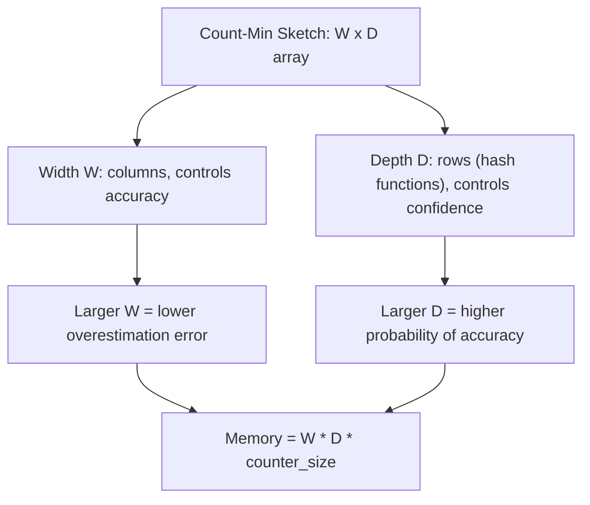
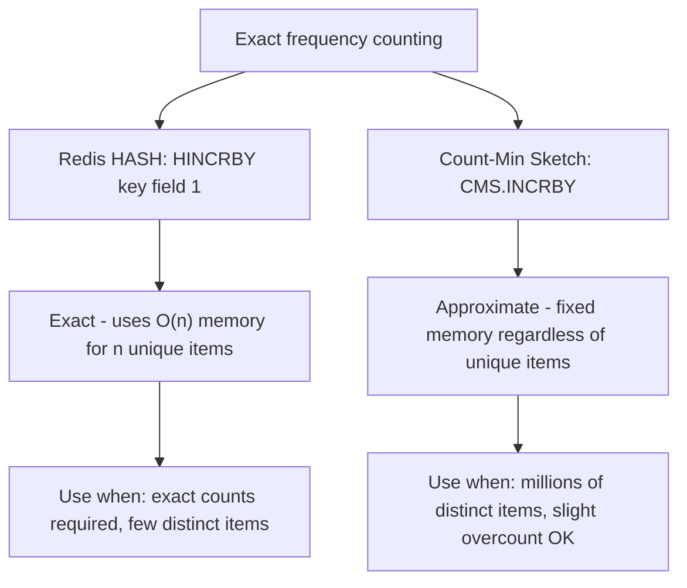

# How to Use CMS.INITBYDIM in Redis Count-Min Sketch

Author: [nawazdhandala](https://www.github.com/nawazdhandala)

Tags: Redis, RedisBloom, Count-Min Sketch, Probabilistic, Command

Description: Learn how to use CMS.INITBYDIM in Redis to create a Count-Min Sketch with explicit width and depth dimensions for approximate frequency counting.

---

## What Is a Count-Min Sketch?

A Count-Min Sketch (CMS) is a probabilistic data structure for estimating the frequency of elements in a data stream. It uses a 2D array of counters (width x depth) and multiple hash functions to count how often each element appears. It always overestimates (never underestimates) and uses a fraction of the memory required for exact counting.



## CMS.INITBYDIM vs CMS.INITBYPROB

Redis provides two commands to create a Count-Min Sketch:

| Command | Parameters | When to Use |
|---------|-----------|-------------|
| `CMS.INITBYDIM` | Width and depth directly | When you know exact dimensions |
| `CMS.INITBYPROB` | Error rate and probability | When you want statistical guarantees |

`CMS.INITBYDIM` gives you direct control over dimensions and memory usage.

## Syntax

```redis
CMS.INITBYDIM key width depth
```

- `key` - the Count-Min Sketch key
- `width` - number of counters per row (controls accuracy: larger = less error)
- `depth` - number of rows / hash functions (controls confidence: larger = more reliable)

Returns `OK` on success. Returns an error if the key already exists.

## Examples

### Create a Basic Sketch

```redis
CMS.INITBYDIM word_frequency 2000 7
```

Creates a sketch with 2000 counters per row and 7 hash functions. Approximate error rate: `e / width` (about 0.14% per element).

### Small Sketch for Prototyping

```redis
CMS.INITBYDIM demo_sketch 100 5
```

### Large High-Accuracy Sketch

```redis
-- For tracking 100 million events with low error
CMS.INITBYDIM api_calls 100000 10
```

### Verify Creation

```redis
CMS.INFO word_frequency
```

```text
1) "width"
2) (integer) 2000
3) "depth"
4) (integer) 7
5) "count"
6) (integer) 0
```

## Choosing Width and Depth

### Width (Controls Error)

The expected overestimation error for any element is approximately `total_count / width`:

| Width | Error (assuming 1M total counts) |
|-------|----------------------------------|
| 1,000 | ~1,000 per element (0.1%) |
| 10,000 | ~100 per element (0.01%) |
| 100,000 | ~10 per element (0.001%) |

### Depth (Controls Confidence)

The probability that the estimate exceeds the error bound:

| Depth | Failure Probability |
|-------|---------------------|
| 5 | ~0.67% |
| 7 | ~0.09% |
| 10 | ~0.0045% |

### Rule of Thumb

For most applications, start with:
- Width: `ceil(2.72 / error_rate)` where error_rate is a fraction like 0.001
- Depth: `ceil(log(1 / delta))` where delta is the desired failure probability

For 0.1% error with 99.9% confidence:
- Width = `ceil(2.72 / 0.001)` = 2720
- Depth = `ceil(log(1000))` = 7

```redis
CMS.INITBYDIM events 2720 7
```

## Memory Calculation

```text
Memory = width * depth * bytes_per_counter
       = 2720  * 7   * 4 bytes (32-bit counter)
       = 76,160 bytes (~74 KB)
```

Compare this to an exact HashMap of 1 million unique elements:
- HashMap: ~50 MB
- Count-Min Sketch: ~74 KB

That is a 700x memory reduction.

## After Initialization

Once created with `CMS.INITBYDIM`, use these commands:

```redis
-- Increment counts
CMS.INCRBY events "api_call" 1

-- Query frequency
CMS.QUERY events "api_call"

-- Merge multiple sketches
CMS.MERGE combined 2 events events2
```

## Comparison with Other Approaches



## Summary

`CMS.INITBYDIM` creates a Count-Min Sketch with explicit width and depth parameters. Width controls accuracy (larger = smaller error), and depth controls confidence (larger = more reliable estimates). The sketch uses fixed memory determined at creation time, making it ideal for tracking frequencies of millions of distinct elements like search terms, API endpoints, or user actions where approximate counts are acceptable.
