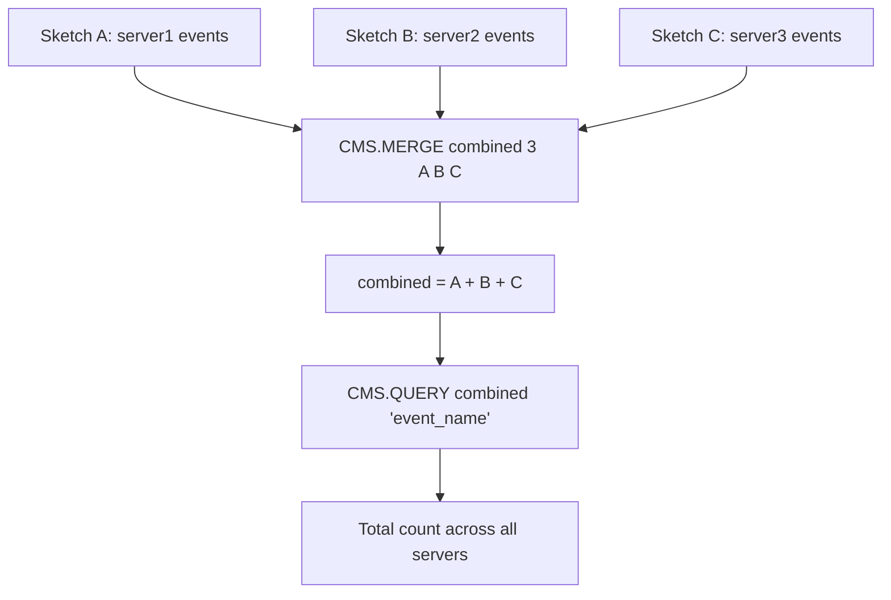
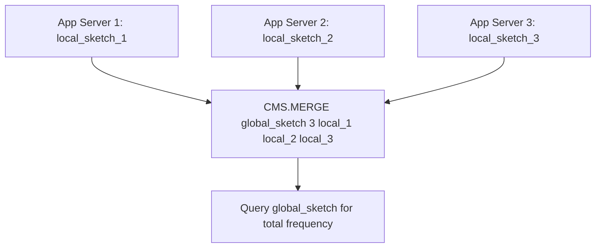

# How to Use CMS.MERGE in Redis to Combine Sketches

Author: [nawazdhandala](https://www.github.com/nawazdhandala)

Tags: Redis, RedisBloom, Count-Min Sketch, Probabilistic, Command

Description: Learn how to use CMS.MERGE in Redis to combine multiple Count-Min Sketches into one, enabling distributed frequency counting and time-window aggregation.

---

## How CMS.MERGE Works

`CMS.MERGE` combines multiple Count-Min Sketches into a destination sketch. The destination counters are set to the weighted sum of the corresponding counters from all source sketches. All sketches must have the same dimensions (width and depth). This enables distributed counting (merge sketches from multiple nodes) and time-window aggregation (merge hourly sketches into a daily one).



## Syntax

```redis
CMS.MERGE destination numkeys source [source ...] [WEIGHTS weight [weight ...]]
```

- `destination` - key to store the merged result (created or overwritten)
- `numkeys` - number of source sketches
- `source [source ...]` - source sketch keys (must all have the same dimensions)
- `WEIGHTS weight [weight ...]` - multiply each source's counters by the given weight before merging (default 1 for each)

Returns `OK` on success. Returns an error if dimensions mismatch or a source key does not exist.

## Examples

### Merge Two Sketches

```redis
-- Create two identical-dimension sketches
CMS.INITBYDIM events_us 2000 7
CMS.INITBYDIM events_eu 2000 7

-- Add events to each
CMS.INCRBY events_us "login" 500 "purchase" 120
CMS.INCRBY events_eu "login" 300 "purchase" 80

-- Merge into a global sketch
CMS.INITBYDIM events_global 2000 7
CMS.MERGE events_global 2 events_us events_eu
```

```text
OK
```

```redis
CMS.QUERY events_global "login" "purchase"
```

```text
1) (integer) 800
2) (integer) 200
```

### Merge Three Sketches

```redis
CMS.INITBYDIM sketch_a 1000 5
CMS.INITBYDIM sketch_b 1000 5
CMS.INITBYDIM sketch_c 1000 5

CMS.INCRBY sketch_a "item" 100
CMS.INCRBY sketch_b "item" 200
CMS.INCRBY sketch_c "item" 150

CMS.INITBYDIM combined 1000 5
CMS.MERGE combined 3 sketch_a sketch_b sketch_c

CMS.QUERY combined "item"
```

```text
1) (integer) 450
```

### Weighted Merge

Weight recent data more heavily when merging time windows:

```redis
CMS.INITBYDIM hourly_old 2000 7
CMS.INITBYDIM hourly_new 2000 7

CMS.INCRBY hourly_old "search:redis" 1000
CMS.INCRBY hourly_new "search:redis" 800

-- Weight old at 0.5 (half), new at 1.0 (full)
CMS.INITBYDIM weighted_combined 2000 7
CMS.MERGE weighted_combined 2 hourly_old hourly_new WEIGHTS 0.5 1.0

CMS.QUERY weighted_combined "search:redis"
-- (integer) 1300 (1000*0.5 + 800*1.0)
```

## Merging into an Existing Non-Empty Sketch

If the destination already contains data, `CMS.MERGE` adds the source counters to the existing values:

```redis
CMS.INITBYDIM total 2000 7
CMS.INCRBY total "base" 100

CMS.INITBYDIM addition 2000 7
CMS.INCRBY addition "base" 50

CMS.MERGE total 1 addition

CMS.QUERY total "base"
-- (integer) 150 (100 original + 50 merged)
```

## Use Cases

### Distributed Counting Architecture

Each application server maintains its own local sketch. Periodically merge into a central aggregate:



```redis
-- Every 5 minutes: merge local sketches into global
CMS.MERGE global_events 3 server1_events server2_events server3_events
CMS.QUERY global_events "api_call" "login" "purchase"
```

### Rolling Time Window Aggregation

Keep per-hour sketches and merge for multi-hour analysis:

```redis
-- Each hour has its own sketch
CMS.INITBYDIM "events:2026-03-31:14" 2000 7
CMS.INITBYDIM "events:2026-03-31:15" 2000 7
CMS.INITBYDIM "events:2026-03-31:16" 2000 7

-- Merge last 3 hours for trend analysis
CMS.INITBYDIM "events:3hr_window" 2000 7
CMS.MERGE "events:3hr_window" 3 "events:2026-03-31:14" "events:2026-03-31:15" "events:2026-03-31:16"
```

### A/B Test Aggregation

Merge event counts from different test variants:

```redis
CMS.MERGE combined_events 2 variant_a_events variant_b_events WEIGHTS 1 1
```

## Dimension Requirement

All source sketches and the destination must have identical width and depth:

```redis
CMS.INITBYDIM sketch_a 1000 5
CMS.INITBYDIM sketch_b 2000 5  -- Different width!
CMS.MERGE result 2 sketch_a sketch_b
-- (error) ERR width/depth mismatch
```

Plan your dimensions consistently across all nodes when designing a distributed counting system.

## Summary

`CMS.MERGE` combines multiple Count-Min Sketches of identical dimensions into a destination sketch by summing their counters with optional per-source weights. Use it to aggregate frequency counts from distributed application servers, combine time-window sketches for historical analysis, and perform weighted aggregations where recent data should count more. All source sketches must have matching width and depth.
