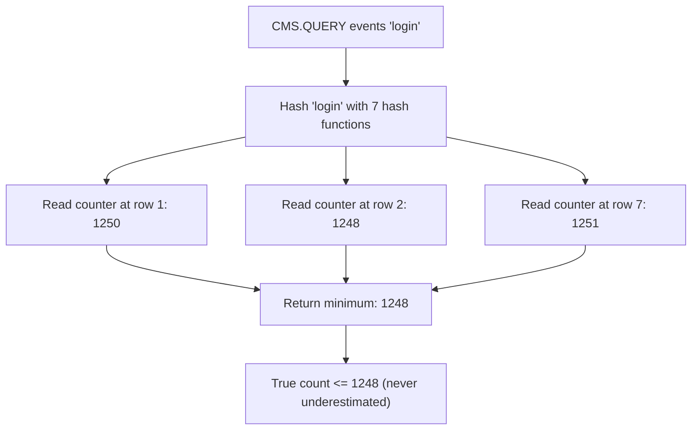

# How to Use CMS.QUERY in Redis Count-Min Sketch

Author: [nawazdhandala](https://www.github.com/nawazdhandala)

Tags: Redis, RedisBloom, Count-Min Sketch, Probabilistic, Command

Description: Learn how to use CMS.QUERY in Redis to retrieve the approximate frequency count of one or more items from a Count-Min Sketch.

---

## How CMS.QUERY Works

`CMS.QUERY` retrieves the approximate frequency count of one or more items from a Count-Min Sketch. It hashes each item with all hash functions, looks up the corresponding counters in the sketch's 2D array, and returns the minimum value across all rows for each item. The minimum reduces the overcount caused by hash collisions.



## Syntax

```redis
CMS.QUERY key item [item ...]
```

- `key` - the Count-Min Sketch key
- `item [item ...]` - one or more items to query

Returns an array of frequency estimates, one per item. Returns `0` for items never incremented. Returns an error if the key does not exist.

## Examples

### Query a Single Item

```redis
CMS.INITBYDIM events 2000 7
CMS.INCRBY events "login" 1
CMS.INCRBY events "login" 1
CMS.INCRBY events "login" 1

CMS.QUERY events "login"
```

```text
1) (integer) 3
```

### Query Multiple Items at Once

```redis
CMS.INCRBY api_calls "/users" 500 "/products" 1200 "/orders" 350

CMS.QUERY api_calls "/users" "/products" "/orders" "/missing"
```

```text
1) (integer) 500
2) (integer) 1200
3) (integer) 350
4) (integer) 0
```

`/missing` was never incremented so returns `0`.

### Query an Item Not Present

```redis
CMS.QUERY events "never_seen_event"
```

```text
1) (integer) 0
```

## The Minimum Estimation Property

`CMS.QUERY` always returns the minimum counter value across all rows. This is the best estimate because hash collisions only increase counter values, never decrease them:

- The true count is always less than or equal to the minimum
- It is impossible for `CMS.QUERY` to undercount (no false negatives in count)
- It may overcount slightly due to hash collisions (bounded overestimation)

## Use Cases

### Trending Topics Detection

Track and query term frequency to find trending content:

```redis
CMS.INITBYDIM search_terms 10000 7

-- Real-time increments
CMS.INCRBY search_terms "redis" 1
CMS.INCRBY search_terms "kubernetes" 1
CMS.INCRBY search_terms "redis" 1

-- Query current counts for trending candidates
CMS.QUERY search_terms "redis" "kubernetes" "docker" "postgres"
```

### Rate Limiting Check

Check how many requests an IP has made in the current window:

```redis
-- Key expires with the window
CMS.INITBYDIM "ratelimit:2026-03-31:14" 1000 5

-- On each request from IP
CMS.INCRBY "ratelimit:2026-03-31:14" "192.168.1.100" 1

-- Before processing request: check rate
CMS.QUERY "ratelimit:2026-03-31:14" "192.168.1.100"
-- If count > 1000: reject request
```

### Content Recommendation by Frequency

Find the most viewed articles for a user:

```redis
CMS.INITBYDIM "user:42:views" 2000 7

-- Track article views
CMS.INCRBY "user:42:views" "article:1" 3
CMS.INCRBY "user:42:views" "article:2" 7
CMS.INCRBY "user:42:views" "article:3" 1

-- Query specific article view counts
CMS.QUERY "user:42:views" "article:1" "article:2" "article:3"
```

```text
1) (integer) 3
2) (integer) 7
3) (integer) 1
```

### Fraud Detection

Check frequency of suspicious patterns:

```redis
-- Track failed login attempts per username
CMS.INCRBY failed_logins "user:alice" 1
CMS.INCRBY failed_logins "user:alice" 1
CMS.INCRBY failed_logins "user:alice" 1

-- Query before allowing login attempt
CMS.QUERY failed_logins "user:alice"
-- (integer) 3 -> lock account if > threshold
```

## Accuracy Considerations

The accuracy of `CMS.QUERY` depends on:
1. The sketch dimensions (width and depth)
2. How many total increments have been made

For a sketch with width `W` and total count `N`:
- Expected overestimation per element: `N / W`
- Probability overestimation exceeds bound: `(1/e)^depth`

With width=2000 and 1 million total events, overestimation per element is at most ~500 (0.05%).

## CMS.QUERY vs Exact Counting

| Scenario | Use |
|----------|-----|
| < 10K unique items, exact count needed | Redis HASH (HGETALL, HGET) |
| Millions of unique items, approximate OK | CMS.QUERY |
| Top-K only (not all counts) | TOPK.QUERY |

## Summary

`CMS.QUERY` retrieves the approximate frequency count of one or more items from a Count-Min Sketch by returning the minimum counter value across all hash function rows. It never underestimates (returns at least the true count) and overestimates only by a bounded amount determined by the sketch dimensions. Use it for trending topics, rate limiting, user behavior analysis, and any high-cardinality frequency query where a slight overcount is acceptable.
