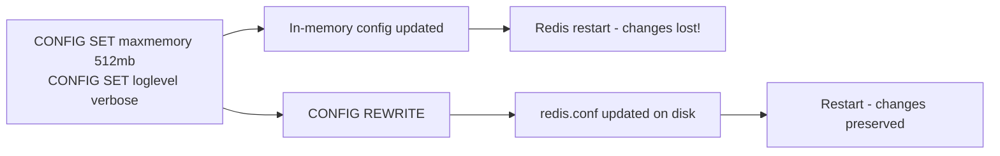

# How to Use CONFIG REWRITE in Redis to Persist Configuration

Author: [nawazdhandala](https://www.github.com/nawazdhandala)

Tags: Redis, CONFIG, REWRITE, Configuration, Operations

Description: Learn how to use CONFIG REWRITE to write the current in-memory Redis configuration back to the redis.conf file, persisting runtime changes across restarts.

---

When you use `CONFIG SET` to change Redis parameters at runtime, those changes exist only in memory. They are lost when Redis restarts. `CONFIG REWRITE` writes the current in-memory configuration back to the `redis.conf` file, synchronizing file and runtime state.

## How CONFIG REWRITE Works

`CONFIG REWRITE` reads the current in-memory configuration and updates the `redis.conf` file that Redis was started with. It modifies existing directives in place and adds new ones at the end of the file, preserving comments and formatting for unchanged lines.



## Syntax

```redis
CONFIG REWRITE
```

No arguments. Returns `OK` on success, or an error if no config file was loaded.

## Prerequisites

Redis must have been started with a configuration file:

```bash
redis-server /etc/redis/redis.conf
```

If Redis was started without a config file or with `--config-file ""`, `CONFIG REWRITE` returns an error:

```text
(error) ERR The server is running without a config file
```

## Examples

### Standard Workflow

Make runtime changes and then persist them:

```redis
CONFIG SET maxmemory 536870912
CONFIG SET maxmemory-policy allkeys-lru
CONFIG SET loglevel notice
CONFIG REWRITE
```

Returns:

```text
OK
```

### Verify What Was Written

Check the config file to confirm changes:

```bash
grep -E "maxmemory|loglevel" /etc/redis/redis.conf
```

Output:

```text
maxmemory 536870912
maxmemory-policy allkeys-lru
loglevel notice
```

### Automated Deployment Pattern

Apply configuration changes without downtime:

```bash
# 1. Apply runtime changes
redis-cli CONFIG SET maxmemory 1073741824
redis-cli CONFIG SET maxmemory-policy volatile-lru

# 2. Verify changes applied correctly
redis-cli CONFIG GET maxmemory
redis-cli CONFIG GET maxmemory-policy

# 3. Persist to file
redis-cli CONFIG REWRITE

echo "Configuration changes applied and persisted"
```

## How CONFIG REWRITE Handles the File

`CONFIG REWRITE` follows these rules when updating the file:

1. For parameters already in the file - updates the existing line in place
2. For parameters not in the file but changed from defaults - appends them at the end
3. For comments - preserves them unchanged
4. For parameters at their default values - may not write them (avoids clutter)

Example before rewrite:

```text
# Memory limit
maxmemory 256mb
loglevel notice
```

After `CONFIG SET maxmemory 512mb` and `CONFIG REWRITE`:

```text
# Memory limit
maxmemory 536870912
loglevel notice
```

## Error Cases

| Condition | Error |
|---|---|
| No config file loaded | `ERR The server is running without a config file` |
| Config file is read-only | `ERR Rewriting config file: Permission denied` |
| Config file deleted since startup | `ERR Rewriting config file: No such file or directory` |

## Use Cases

- **Live tuning persistence** - persist `CONFIG SET` changes made during incident response
- **Deployment automation** - apply and persist config changes via scripts without Redis restarts
- **Configuration drift detection** - diff `redis.conf` against `CONFIG GET *` output to find unperisted changes
- **Gradual rollouts** - test a config change with `CONFIG SET`, then persist with `CONFIG REWRITE` after validation

## Summary

`CONFIG REWRITE` is the bridge between runtime configuration changes and durable configuration. Always call it after important `CONFIG SET` changes to prevent configuration drift between Redis restarts. In containerized environments where `redis.conf` is mounted from a ConfigMap or volume, consider whether `CONFIG REWRITE` should update the mounted file or if configuration management should be handled externally.
