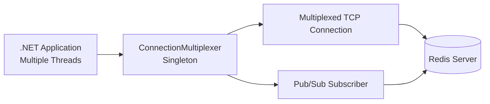

# How to Connect Redis with .NET using StackExchange.Redis

Author: [nawazdhandala](https://github.com/nawazdhandala)

Tags: Redis, .NET, Caching, Backend, Performance

Description: Learn how to connect to Redis from .NET using StackExchange.Redis, covering ConnectionMultiplexer, async commands, pipelining, pub/sub, and IDistributedCache integration.

---

## Introduction

`StackExchange.Redis` is the leading .NET client for Redis, developed by the team at Stack Overflow. It uses a single multiplexed connection per server, supports async/await, pipelining, pub/sub, Lua scripting, Sentinel, and Cluster. It is also the Redis provider used by `Microsoft.Extensions.Caching.StackExchangeRedis` for ASP.NET Core applications.

## Installation

```bash
dotnet add package StackExchange.Redis
```

For ASP.NET Core distributed caching:

```bash
dotnet add package Microsoft.Extensions.Caching.StackExchangeRedis
```

## Basic Connection

```csharp
using StackExchange.Redis;

var mux = await ConnectionMultiplexer.ConnectAsync("localhost:6379,password=yourpassword");
var db = mux.GetDatabase();

Console.WriteLine(await db.PingAsync()); // True
```

## Connection Architecture



The `ConnectionMultiplexer` is designed to be a long-lived singleton. Create it once at startup and reuse it.

## Registering as a Singleton in ASP.NET Core

```csharp
// Program.cs
builder.Services.AddSingleton<IConnectionMultiplexer>(
    ConnectionMultiplexer.Connect("localhost:6379,password=yourpassword")
);
```

## String Operations

```csharp
var db = mux.GetDatabase();

// Set with expiry
await db.StringSetAsync("session:abc", "{\"userId\": 42}", TimeSpan.FromHours(1));

// Get
string? raw = await db.StringGetAsync("session:abc");
if (raw != null)
{
    var session = System.Text.Json.JsonSerializer.Deserialize<Dictionary<string, int>>(raw);
    Console.WriteLine(session?["userId"]); // 42
}

// Increment counter
await db.StringIncrementAsync("page:views:home");
await db.StringIncrementAsync("page:views:home", 5);

// Set if not exists
bool acquired = await db.StringSetAsync("lock:resource", "1", TimeSpan.FromSeconds(30), When.NotExists);
```

## Hash Operations

```csharp
// Store user profile
await db.HashSetAsync("user:1001", new HashEntry[]
{
    new("name", "Alice"),
    new("email", "alice@example.com"),
    new("role", "admin"),
});

// Get individual field
RedisValue name = await db.HashGetAsync("user:1001", "name");
Console.WriteLine(name); // Alice

// Get all fields
HashEntry[] all = await db.HashGetAllAsync("user:1001");
foreach (var e in all)
    Console.WriteLine($"{e.Name}: {e.Value}");

// Increment numeric field
await db.HashIncrementAsync("user:1001", "login_count", 1);
```

## List Operations

```csharp
// Producer: push job
string job = System.Text.Json.JsonSerializer.Serialize(new { type = "email", to = "user@example.com" });
await db.ListLeftPushAsync("jobs:pending", job);

// Consumer
RedisValue payload = await db.ListRightPopAsync("jobs:pending");
if (!payload.IsNullOrEmpty)
{
    Console.WriteLine($"Processing: {payload}");
}
```

## Sorted Set Operations

```csharp
// Add to leaderboard
await db.SortedSetAddAsync("leaderboard", new SortedSetEntry[]
{
    new("alice", 9500),
    new("bob",   8700),
    new("carol", 11200),
});

// Top 3 with scores
SortedSetEntry[] top3 = await db.SortedSetRangeByRankWithScoresAsync(
    "leaderboard", 0, 2, Order.Descending);
foreach (var entry in top3)
    Console.WriteLine($"{entry.Element}: {entry.Score}");

// Rank
long? rank = await db.SortedSetRankAsync("leaderboard", "alice", Order.Descending);
Console.WriteLine($"Alice rank: {rank + 1}");
```

## Pipelining

```csharp
var tasks = new List<Task>();
var batch = db.CreateBatch();

for (int i = 0; i < 100; i++)
{
    tasks.Add(batch.StringSetAsync($"key:{i}", $"value:{i}", TimeSpan.FromHours(1)));
}

batch.Execute();
await Task.WhenAll(tasks);
Console.WriteLine($"Batched {tasks.Count} commands");
```

## Pub/Sub

```csharp
var sub = mux.GetSubscriber();

// Subscribe
await sub.SubscribeAsync(RedisChannel.Literal("notifications"), (channel, message) =>
{
    Console.WriteLine($"[{channel}] {message}");
});

// Publish
await sub.PublishAsync(RedisChannel.Literal("notifications"), "{\"type\":\"alert\",\"text\":\"Deploy done\"}");
```

## Lua Scripting

```csharp
const string rateLimitScript = @"
local key = KEYS[1]
local limit = tonumber(ARGV[1])
local window = tonumber(ARGV[2])
local current = redis.call('INCR', key)
if current == 1 then
    redis.call('EXPIRE', key, window)
end
if current > limit then
    return 0
end
return 1";

var result = await db.ScriptEvaluateAsync(
    rateLimitScript,
    keys: new RedisKey[] { "ratelimit:user:42" },
    values: new RedisValue[] { 10, 60 }
);

Console.WriteLine((int)result == 1 ? "Allowed" : "Rate limited");
```

## ASP.NET Core IDistributedCache

```csharp
// Program.cs
builder.Services.AddStackExchangeRedisCache(options =>
{
    options.Configuration = "localhost:6379";
    options.InstanceName = "myapp:";
});

// Usage in a controller or service
public class ProductService(IDistributedCache cache)
{
    public async Task<string?> GetProductAsync(int id)
    {
        string cacheKey = $"product:{id}";
        string? cached = await cache.GetStringAsync(cacheKey);

        if (cached != null) return cached;

        // Fetch from DB and cache
        string data = "{\"id\":1,\"name\":\"Widget\"}"; // DB result
        await cache.SetStringAsync(cacheKey, data, new DistributedCacheEntryOptions
        {
            AbsoluteExpirationRelativeToNow = TimeSpan.FromMinutes(10)
        });
        return data;
    }
}
```

## Redis Sentinel Configuration

```csharp
var config = new ConfigurationOptions
{
    ServiceName = "mymaster",
    Password = "yourpassword",
};
config.EndPoints.Add("sentinel-1:26379");
config.EndPoints.Add("sentinel-2:26379");

var mux = await ConnectionMultiplexer.SentinelConnectAsync(config);
var db = mux.GetDatabase();
```

## Connection Resilience

```csharp
var config = ConfigurationOptions.Parse("localhost:6379");
config.AbortOnConnectFail = false;
config.ConnectRetry = 5;
config.ReconnectRetryPolicy = new ExponentialRetry(5000);
config.ConnectTimeout = 5000;
config.SyncTimeout = 5000;

var mux = await ConnectionMultiplexer.ConnectAsync(config);
```

## Summary

`StackExchange.Redis` uses a single multiplexed connection per server that is safe to share across all threads. Create one `ConnectionMultiplexer` singleton per application, call `GetDatabase()` to get a `IDatabase` interface for commands, and use the async API throughout. For ASP.NET Core, register `AddStackExchangeRedisCache` to get `IDistributedCache` integration with minimal setup. Configure `AbortOnConnectFail = false` in production for graceful reconnection.
