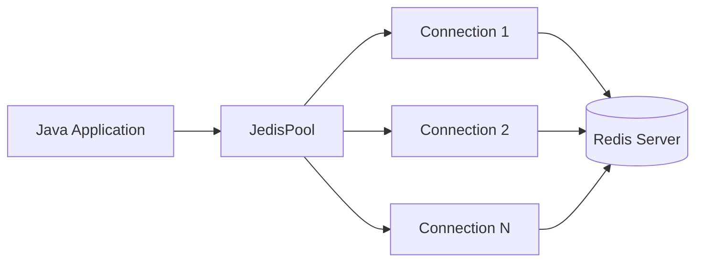

# How to Connect Redis with Java using Jedis

Author: [nawazdhandala](https://github.com/nawazdhandala)

Tags: Redis, Java, Caching, Backend, Performance

Description: Learn how to connect to Redis from Java using the Jedis client library, covering connection pooling, pipelining, transactions, pub/sub, and Lua scripting.

---

## Introduction

Jedis is a synchronous Java client for Redis. It is widely used, simple to understand, and has been the standard Java Redis client for over a decade. Jedis supports connection pooling via JedisPool, pipelining for batch operations, MULTI/EXEC transactions, pub/sub, and Lua scripting. This guide covers the essentials for connecting and working with Redis from Java using Jedis.

## Maven Dependency

```xml
<dependency>
    <groupId>redis.clients</groupId>
    <artifactId>jedis</artifactId>
    <version>5.1.0</version>
</dependency>
```

## Gradle Dependency

```groovy
implementation 'redis.clients:jedis:5.1.0'
```

## Basic Connection

```java
import redis.clients.jedis.Jedis;

try (Jedis jedis = new Jedis("localhost", 6379)) {
    jedis.auth("yourpassword"); // optional
    System.out.println(jedis.ping()); // PONG
}
```

## Connection Architecture



## JedisPool for Connection Pooling

Direct `new Jedis()` creates a new connection each time. Use `JedisPool` to reuse connections:

```java
import redis.clients.jedis.JedisPool;
import redis.clients.jedis.JedisPoolConfig;

JedisPoolConfig config = new JedisPoolConfig();
config.setMaxTotal(50);
config.setMaxIdle(10);
config.setMinIdle(2);
config.setTestOnBorrow(true);

JedisPool pool = new JedisPool(config, "localhost", 6379, 2000, "yourpassword");

try (Jedis jedis = pool.getResource()) {
    jedis.set("key", "value");
    System.out.println(jedis.get("key")); // value
}

// Shutdown
pool.close();
```

## String Operations

```java
try (Jedis jedis = pool.getResource()) {
    // Set with expiry (seconds)
    jedis.setex("session:abc", 3600, "{\"userId\": 42}");

    // Get
    String raw = jedis.get("session:abc");
    System.out.println(raw);

    // Increment counter
    jedis.incr("page:views:home");
    jedis.incrBy("page:views:home", 5);

    // Set if not exists
    long acquired = jedis.setnx("lock:resource", "1");
    if (acquired == 1) jedis.expire("lock:resource", 30);
}
```

## Hash Operations

```java
import java.util.Map;

try (Jedis jedis = pool.getResource()) {
    // Store user profile
    Map<String, String> user = Map.of(
        "name", "Alice",
        "email", "alice@example.com",
        "role", "admin"
    );
    jedis.hset("user:1001", user);

    // Get individual field
    String name = jedis.hget("user:1001", "name");
    System.out.println(name); // Alice

    // Get all fields
    Map<String, String> allFields = jedis.hgetAll("user:1001");
    System.out.println(allFields);

    // Increment numeric field
    jedis.hincrBy("user:1001", "login_count", 1);
}
```

## List Operations (Job Queue)

```java
try (Jedis jedis = pool.getResource()) {
    // Producer: push job
    jedis.lpush("jobs:pending", "{\"type\":\"email\",\"to\":\"user@example.com\"}");

    // Consumer: blocking pop (wait 5 seconds)
    List<String> result = jedis.brpop(5, "jobs:pending");
    if (result != null) {
        String queue = result.get(0);
        String payload = result.get(1);
        System.out.println("Processing job: " + payload);
    }
}
```

## Sorted Set Operations

```java
try (Jedis jedis = pool.getResource()) {
    // Add to leaderboard
    jedis.zadd("leaderboard", 9500, "alice");
    jedis.zadd("leaderboard", 8700, "bob");
    jedis.zadd("leaderboard", 11200, "carol");

    // Top 3 players with scores
    List<redis.clients.jedis.resps.Tuple> top3 = jedis.zrevrangeWithScores("leaderboard", 0, 2);
    for (redis.clients.jedis.resps.Tuple t : top3) {
        System.out.printf("%s: %.0f%n", t.getElement(), t.getScore());
    }

    // Rank (0-indexed)
    Long rank = jedis.zrevrank("leaderboard", "alice");
    System.out.println("Alice rank: " + (rank + 1));
}
```

## Pipelining

```java
import redis.clients.jedis.Pipeline;

try (Jedis jedis = pool.getResource()) {
    Pipeline pipe = jedis.pipelined();
    for (int i = 0; i < 100; i++) {
        pipe.setex("key:" + i, 3600, "value:" + i);
    }
    List<Object> results = pipe.syncAndReturnAll();
    System.out.println("Pipelined " + results.size() + " commands");
}
```

## Transactions

```java
try (Jedis jedis = pool.getResource()) {
    Transaction tx = jedis.multi();
    tx.incr("balance:user:1");
    tx.decr("balance:user:2");
    List<Object> results = tx.exec();
    System.out.println("Transaction results: " + results);
}
```

## Pub/Sub

```java
import redis.clients.jedis.JedisPubSub;

JedisPubSub subscriber = new JedisPubSub() {
    @Override
    public void onMessage(String channel, String message) {
        System.out.println("[" + channel + "] " + message);
    }
};

// Subscribe in a background thread
Thread subThread = new Thread(() -> {
    try (Jedis jedis = pool.getResource()) {
        jedis.subscribe(subscriber, "notifications");
    }
});
subThread.setDaemon(true);
subThread.start();

// Publish
try (Jedis jedis = pool.getResource()) {
    jedis.publish("notifications", "{\"type\":\"alert\",\"text\":\"Deploy done\"}");
}
```

## Lua Scripting

```java
String script = """
local key = KEYS[1]
local limit = tonumber(ARGV[1])
local window = tonumber(ARGV[2])
local current = redis.call('INCR', key)
if current == 1 then
    redis.call('EXPIRE', key, window)
end
if current > limit then
    return 0
end
return 1
""";

try (Jedis jedis = pool.getResource()) {
    Object result = jedis.eval(script, 1, "ratelimit:user:42", "10", "60");
    System.out.println(result.equals(1L) ? "Allowed" : "Rate limited");
}
```

## Redis Sentinel

```java
import redis.clients.jedis.JedisSentinelPool;

Set<String> sentinels = Set.of(
    "sentinel-1:26379",
    "sentinel-2:26379"
);

JedisSentinelPool sentinelPool = new JedisSentinelPool("mymaster", sentinels, "yourpassword");

try (Jedis jedis = sentinelPool.getResource()) {
    jedis.set("key", "value");
    System.out.println(jedis.get("key"));
}
sentinelPool.close();
```

## Summary

Jedis is a mature, synchronous Java client for Redis. Use `JedisPool` for connection reuse, `.pipelined()` for batch operations, `jedis.multi()` for transactions, and background threads for pub/sub subscriptions. For async or reactive workloads, consider Lettuce as an alternative. For Spring Boot applications, Spring Data Redis abstracts Jedis configuration automatically.
