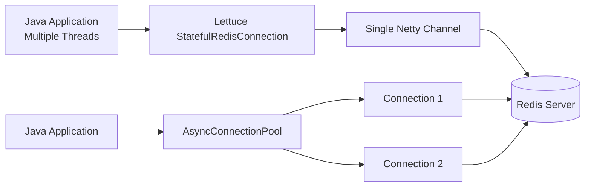

# How to Connect Redis with Java using Lettuce

Author: [nawazdhandala](https://github.com/nawazdhandala)

Tags: Redis, Java, Caching, Backend, Performance

Description: Learn how to connect to Redis from Java using the Lettuce client, covering async commands, reactive streams, connection pooling, cluster support, and Sentinel.

---

## Introduction

Lettuce is a modern, thread-safe, asynchronous Java client for Redis built on Netty. Unlike Jedis, a single Lettuce connection can be shared across multiple threads without blocking. It supports both synchronous and asynchronous APIs, Reactor-based reactive streams, Redis Cluster, Sentinel, SSL, and connection pooling. Lettuce is the default Redis client used by Spring Data Redis.

## Maven Dependency

```xml
<dependency>
    <groupId>io.lettuce</groupId>
    <artifactId>lettuce-core</artifactId>
    <version>6.3.2.RELEASE</version>
</dependency>
```

## Gradle Dependency

```groovy
implementation 'io.lettuce:lettuce-core:6.3.2.RELEASE'
```

## Connection Architecture



## Basic Synchronous Connection

```java
import io.lettuce.core.RedisClient;
import io.lettuce.core.RedisURI;
import io.lettuce.core.api.StatefulRedisConnection;
import io.lettuce.core.api.sync.RedisCommands;

RedisClient client = RedisClient.create(
    RedisURI.builder()
        .withHost("localhost")
        .withPort(6379)
        .withPassword("yourpassword".toCharArray())
        .withDatabase(0)
        .build()
);

StatefulRedisConnection<String, String> connection = client.connect();
RedisCommands<String, String> commands = connection.sync();

System.out.println(commands.ping()); // PONG

connection.close();
client.shutdown();
```

## Asynchronous Commands

```java
import io.lettuce.core.api.async.RedisAsyncCommands;
import java.util.concurrent.CompletableFuture;

RedisAsyncCommands<String, String> async = connection.async();

CompletableFuture<String> future = async.set("key", "value")
    .thenCompose(ok -> async.get("key"))
    .toCompletableFuture();

future.thenAccept(val -> System.out.println("Got: " + val));
```

## Reactive Commands

```java
import io.lettuce.core.api.reactive.RedisReactiveCommands;
import reactor.core.publisher.Mono;

RedisReactiveCommands<String, String> reactive = connection.reactive();

Mono<String> result = reactive.set("reactive:key", "hello")
    .then(reactive.get("reactive:key"));

result.subscribe(val -> System.out.println("Reactive value: " + val));
```

## String Operations

```java
RedisCommands<String, String> commands = connection.sync();

// Set with expiry
commands.setex("session:abc", 3600, "{\"userId\": 42}");

// Get
String raw = commands.get("session:abc");
System.out.println(raw);

// Atomic increment
commands.incr("page:views:home");
commands.incrby("page:views:home", 5);

// Set only if not exists
commands.setnx("lock:resource", "1");
commands.expire("lock:resource", 30);
```

## Hash Operations

```java
import java.util.Map;

commands.hset("user:1001", Map.of(
    "name", "Alice",
    "email", "alice@example.com",
    "role", "admin"
));

String name = commands.hget("user:1001", "name");
System.out.println(name); // Alice

Map<String, String> user = commands.hgetall("user:1001");
System.out.println(user);

commands.hincrby("user:1001", "login_count", 1);
```

## Sorted Set Operations

```java
import io.lettuce.core.ScoredValue;

commands.zadd("leaderboard", 9500, "alice");
commands.zadd("leaderboard", 8700, "bob");
commands.zadd("leaderboard", 11200, "carol");

List<ScoredValue<String>> top3 = commands.zrevrangeWithScores("leaderboard", 0, 2);
for (ScoredValue<String> sv : top3) {
    System.out.printf("%s: %.0f%n", sv.getValue(), sv.getScore());
}
```

## Pipelining (Async Batch)

```java
RedisAsyncCommands<String, String> async = connection.async();
async.setAutoFlushCommands(false);

List<RedisFuture<String>> futures = new ArrayList<>();
for (int i = 0; i < 100; i++) {
    futures.add(async.setex("key:" + i, 3600, "value:" + i));
}

async.flushCommands();

for (RedisFuture<String> f : futures) {
    System.out.println(f.get()); // "OK"
}

async.setAutoFlushCommands(true);
```

## Transactions

```java
commands.multi();
commands.incr("balance:user:1");
commands.decr("balance:user:2");
TransactionResult result = commands.exec();
System.out.println("Transaction result: " + result);
```

## Pub/Sub

```java
import io.lettuce.core.pubsub.StatefulRedisPubSubConnection;
import io.lettuce.core.pubsub.RedisPubSubListener;
import io.lettuce.core.pubsub.api.sync.RedisPubSubCommands;

StatefulRedisPubSubConnection<String, String> pubSubConnection = client.connectPubSub();
pubSubConnection.addListener(new RedisPubSubListener<String, String>() {
    @Override
    public void message(String channel, String message) {
        System.out.println("[" + channel + "] " + message);
    }
    // other methods omitted
});

RedisPubSubCommands<String, String> pubSub = pubSubConnection.sync();
pubSub.subscribe("notifications");

// Publish from another connection
commands.publish("notifications", "{\"type\":\"alert\"}");
```

## Connection Pooling for Blocking Commands

For commands like BRPOP that block a connection, use a connection pool:

```java
import io.lettuce.core.support.AsyncConnectionPoolSupport;
import io.lettuce.core.support.BoundedAsyncPool;
import io.lettuce.core.support.BoundedPoolConfig;

BoundedAsyncPool<StatefulRedisConnection<String, String>> pool =
    AsyncConnectionPoolSupport.createBoundedObjectPool(
        () -> client.connectAsync(StringCodec.UTF8, RedisURI.create("redis://localhost")),
        BoundedPoolConfig.builder().maxTotal(20).build()
    );

pool.acquire().thenAccept(conn -> {
    conn.async().brpop(5, "jobs:pending").thenAccept(kv -> {
        if (kv != null) System.out.println("Job: " + kv.getValue());
        pool.release(conn);
    });
});
```

## Redis Sentinel

```java
RedisURI sentinelUri = RedisURI.builder()
    .withSentinel("sentinel-1", 26379)
    .withSentinel("sentinel-2", 26379)
    .withSentinelMasterId("mymaster")
    .withPassword("yourpassword".toCharArray())
    .build();

RedisClient sentinelClient = RedisClient.create(sentinelUri);
StatefulRedisConnection<String, String> conn = sentinelClient.connect();
```

## Redis Cluster

```java
import io.lettuce.core.cluster.RedisClusterClient;
import io.lettuce.core.cluster.api.StatefulRedisClusterConnection;

RedisClusterClient clusterClient = RedisClusterClient.create(
    List.of(
        RedisURI.create("redis://redis-node-1:6379"),
        RedisURI.create("redis://redis-node-2:6379")
    )
);

StatefulRedisClusterConnection<String, String> clusterConn = clusterClient.connect();
clusterConn.sync().set("cluster:key", "cluster:value");
System.out.println(clusterConn.sync().get("cluster:key"));
```

## Summary

Lettuce is a fully asynchronous, thread-safe Redis client for Java built on Netty. A single connection instance is safe to share across threads, making it highly efficient compared to Jedis connection-per-thread model. Use the sync API for simple code, the async API for non-blocking operations, and the reactive API for integration with Project Reactor or RxJava. Lettuce is the preferred client when using Spring Data Redis or building high-throughput services.
