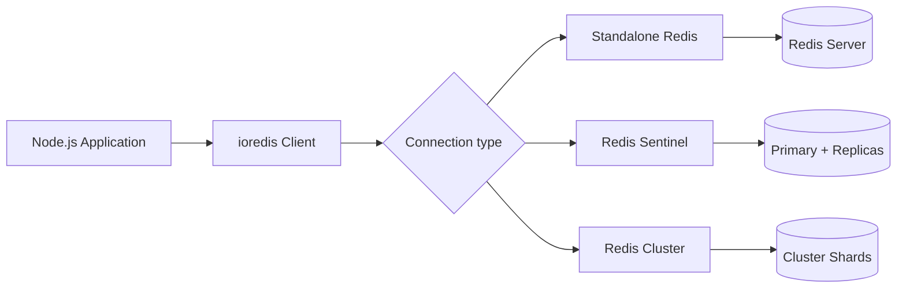

# How to Connect Redis with Node.js using ioredis

Author: [nawazdhandala](https://github.com/nawazdhandala)

Tags: Redis, Node.js, Caching, Backend, Performance

Description: Learn how to connect to Redis from Node.js using the ioredis library, covering connection setup, pipelining, Lua scripts, cluster mode, and common patterns.

---

## Introduction

`ioredis` is the most feature-rich Redis client for Node.js. It supports Redis Cluster, Sentinel, pipelining, Lua scripting, async/await, and automatic reconnection out of the box. This guide covers installing ioredis, connecting to Redis, and implementing the most common patterns.

## Installation

```bash
npm install ioredis
```

## Basic Connection

```javascript
const Redis = require("ioredis");

// Simple connection
const redis = new Redis({
  host: "127.0.0.1",
  port: 6379,
  password: "yourpassword", // optional
  db: 0,
});

redis.on("connect", () => console.log("Connected to Redis"));
redis.on("error", (err) => console.error("Redis error:", err));
```

## Connection Architecture



## String Operations

```javascript
async function stringExamples(redis) {
  // Set with expiry
  await redis.set("session:abc", JSON.stringify({ userId: 42 }), "EX", 3600);

  // Get and parse
  const raw = await redis.get("session:abc");
  const session = JSON.parse(raw);
  console.log(session.userId);  // 42

  // Increment counter
  await redis.incr("page:views:home");
  await redis.incrby("page:views:home", 5);
  const views = await redis.get("page:views:home");
  console.log(`Views: ${views}`);

  // Set if not exists
  const acquired = await redis.setnx("lock:resource", "1");
  if (acquired) await redis.expire("lock:resource", 30);
}
```

## Hash Operations

```javascript
async function hashExamples(redis) {
  // Store user profile
  await redis.hset("user:1001", {
    name: "Alice",
    email: "alice@example.com",
    role: "admin",
  });

  // Get individual field
  const name = await redis.hget("user:1001", "name");
  console.log(name);  // Alice

  // Get all fields
  const user = await redis.hgetall("user:1001");
  console.log(user);  // { name: 'Alice', email: '...', role: 'admin' }

  // Increment numeric field
  await redis.hincrby("user:1001", "login_count", 1);
}
```

## List Operations

```javascript
async function listExamples(redis) {
  // Push jobs to a queue
  await redis.lpush("jobs:pending", JSON.stringify({ type: "email", to: "user@example.com" }));
  await redis.lpush("jobs:pending", JSON.stringify({ type: "sms", to: "+15551234" }));

  // Pop a job (blocking, wait up to 5 seconds)
  const result = await redis.brpop("jobs:pending", 5);
  if (result) {
    const [queue, payload] = result;
    const job = JSON.parse(payload);
    console.log(`Processing ${job.type} job`);
  }
}
```

## Sorted Set Operations

```javascript
async function sortedSetExamples(redis) {
  // Add scores to leaderboard
  await redis.zadd("leaderboard", 9500, "alice");
  await redis.zadd("leaderboard", 8700, "bob");
  await redis.zadd("leaderboard", 11200, "carol");

  // Top 3 players with scores
  const top3 = await redis.zrevrange("leaderboard", 0, 2, "WITHSCORES");
  console.log(top3);  // ['carol', '11200', 'alice', '9500', 'bob', '8700']

  // Rank of a player (0-based)
  const rank = await redis.zrevrank("leaderboard", "alice");
  console.log(`Alice's rank: ${rank + 1}`);  // 2
}
```

## Pipelining for Batch Operations

```javascript
async function pipelineExample(redis) {
  const pipe = redis.pipeline();

  for (let i = 0; i < 100; i++) {
    pipe.set(`key:${i}`, `value:${i}`, "EX", 3600);
  }

  const results = await pipe.exec();
  const errors = results.filter(([err]) => err !== null);
  console.log(`Pipeline completed: ${results.length - errors.length} succeeded`);
}
```

## Transactions with MULTI/EXEC

```javascript
async function transactionExample(redis) {
  const results = await redis.multi()
    .incr("balance:user:1")
    .decr("balance:user:2")
    .exec();
  console.log("Transaction results:", results);
}
```

## Pub/Sub Messaging

```javascript
const Redis = require("ioredis");

// Publisher and subscriber must be separate connections
const publisher = new Redis();
const subscriber = new Redis();

subscriber.subscribe("notifications", (err, count) => {
  console.log(`Subscribed to ${count} channel(s)`);
});

subscriber.on("message", (channel, message) => {
  console.log(`[${channel}] ${message}`);
});

// Publish a message
await publisher.publish("notifications", JSON.stringify({ type: "alert", text: "Server down" }));
```

## Lua Scripting

```javascript
// Rate limiter using Lua for atomicity
const rateLimiterScript = `
local key = KEYS[1]
local limit = tonumber(ARGV[1])
local window = tonumber(ARGV[2])
local current = redis.call("INCR", key)
if current == 1 then
  redis.call("EXPIRE", key, window)
end
if current > limit then
  return 0
end
return 1
`;

async function checkRateLimit(redis, identifier, limit, windowSeconds) {
  const key = `ratelimit:${identifier}`;
  return redis.eval(rateLimiterScript, 1, key, limit, windowSeconds);
}

const allowed = await checkRateLimit(redis, "user:42", 10, 60);
console.log(allowed ? "Request allowed" : "Rate limit exceeded");
```

## Redis Cluster Connection

```javascript
const cluster = new Redis.Cluster([
  { host: "redis-node-1", port: 6379 },
  { host: "redis-node-2", port: 6379 },
  { host: "redis-node-3", port: 6379 },
], {
  redisOptions: { password: "yourpassword" },
  clusterRetryStrategy: (times) => Math.min(times * 100, 3000),
});
```

## Redis Sentinel Connection

```javascript
const sentinel = new Redis({
  sentinels: [
    { host: "sentinel-1", port: 26379 },
    { host: "sentinel-2", port: 26379 },
  ],
  name: "mymaster",
  password: "yourpassword",
});
```

## Connection Pooling and Options

```javascript
const redis = new Redis({
  host: "127.0.0.1",
  port: 6379,
  maxRetriesPerRequest: 3,
  enableReadyCheck: true,
  connectTimeout: 10000,
  commandTimeout: 5000,
  retryStrategy: (times) => {
    if (times > 10) return null; // Stop retrying
    return Math.min(times * 200, 2000);
  },
  lazyConnect: true, // Only connect when first command is issued
});

await redis.connect();
```

## Graceful Shutdown

```javascript
process.on("SIGTERM", async () => {
  console.log("Closing Redis connection...");
  await redis.quit();
  process.exit(0);
});
```

## Summary

`ioredis` is a robust Node.js Redis client with full support for clustering, Sentinel, pipelining, transactions, and Lua scripting. Connect with `new Redis(options)`, use async/await for all commands, pipeline batch operations for throughput, and use separate connection instances for pub/sub. Configure `retryStrategy` and `commandTimeout` to handle network failures gracefully.
