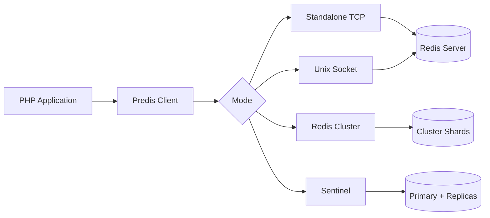

# How to Connect Redis with PHP using predis

Author: [nawazdhandala](https://github.com/nawazdhandala)

Tags: Redis, PHP, Caching, Backend, Performance

Description: Learn how to connect to Redis from PHP using the predis library, covering connection setup, pipelines, transactions, pub/sub, cluster, and common caching patterns.

---

## Introduction

`predis` is a pure-PHP Redis client library that requires no PHP extension. It supports all Redis commands, connection pooling via aggregate connections, pipelining, MULTI/EXEC transactions, pub/sub, Sentinel, and Cluster. It is the most widely used PHP Redis client and works out of the box in any PHP environment, including shared hosting.

## Installation

```bash
composer require predis/predis
```

## Basic Connection

```php
<?php
require 'vendor/autoload.php';

use Predis\Client;

$redis = new Client([
    'scheme' => 'tcp',
    'host'   => '127.0.0.1',
    'port'   => 6379,
    'password' => 'yourpassword', // optional
    'database' => 0,
]);

echo $redis->ping(); // PONG
```

## Connection Architecture



## Unix Socket Connection (for local Redis)

```php
$redis = new Client([
    'scheme' => 'unix',
    'path'   => '/var/run/redis/redis.sock',
]);
```

## String Operations

```php
// Set with expiry
$redis->setex('session:abc', 3600, json_encode(['user_id' => 42]));

// Get
$raw = $redis->get('session:abc');
$session = json_decode($raw, true);
echo $session['user_id']; // 42

// Increment counter
$redis->incr('page:views:home');
$redis->incrby('page:views:home', 5);

// Set if not exists
$acquired = $redis->setnx('lock:resource', '1');
if ($acquired) {
    $redis->expire('lock:resource', 30);
}
```

## Hash Operations

```php
// Store user profile
$redis->hmset('user:1001', [
    'name'  => 'Alice',
    'email' => 'alice@example.com',
    'role'  => 'admin',
]);

// Get individual field
$name = $redis->hget('user:1001', 'name');
echo $name; // Alice

// Get all fields
$user = $redis->hgetall('user:1001');
print_r($user);

// Increment numeric field
$redis->hincrby('user:1001', 'login_count', 1);
```

## List Operations (Job Queue)

```php
// Producer
$job = json_encode(['type' => 'send_email', 'to' => 'user@example.com']);
$redis->lpush('jobs:pending', $job);

// Consumer (blocking pop, wait up to 5 seconds)
$result = $redis->brpop(['jobs:pending'], 5);
if ($result) {
    [$queue, $payload] = $result;
    $job = json_decode($payload, true);
    echo "Processing: " . $job['type'];
}
```

## Sorted Set Operations

```php
// Leaderboard
$redis->zadd('leaderboard', ['alice' => 9500, 'bob' => 8700, 'carol' => 11200]);

// Top 3 with scores
$top3 = $redis->zrevrange('leaderboard', 0, 2, ['WITHSCORES' => true]);
foreach ($top3 as $name => $score) {
    echo "$name: $score\n";
}

// Player rank (0-indexed)
$rank = $redis->zrevrank('leaderboard', 'alice');
echo "Alice rank: " . ($rank + 1);
```

## Pipelining

```php
$pipeline = $redis->pipeline();
for ($i = 0; $i < 100; $i++) {
    $pipeline->setex("key:$i", 3600, "value:$i");
}
$results = $pipeline->execute();
echo "Pipelined " . count($results) . " commands";
```

## Transactions (MULTI/EXEC)

```php
$result = $redis->transaction(function ($tx) {
    $tx->incr('balance:user:1');
    $tx->decr('balance:user:2');
});
print_r($result);
```

## Pub/Sub

```php
// Subscriber (runs as a blocking loop)
$subscriber = new Client();
$subscriber->pubSubLoop(function ($loop, $message) {
    if ($message->kind === 'message') {
        $data = json_decode($message->payload, true);
        echo "Received: " . $data['text'] . "\n";
    }
}, function ($loop) {
    $loop->subscribe('notifications');
});
```

```php
// Publisher
$redis->publish('notifications', json_encode(['type' => 'alert', 'text' => 'Deploy done']));
```

## Caching Pattern

```php
function getCachedUser(Client $redis, int $userId): array {
    $key = "user:cache:$userId";
    $cached = $redis->get($key);

    if ($cached !== null) {
        return json_decode($cached, true);
    }

    // Fetch from database (example)
    $user = ['id' => $userId, 'name' => 'Alice', 'email' => 'alice@example.com'];

    $redis->setex($key, 300, json_encode($user));
    return $user;
}

$user = getCachedUser($redis, 1001);
echo $user['name'];
```

## Rate Limiting

```php
function isRateLimited(Client $redis, string $identifier, int $limit, int $window): bool {
    $key = "ratelimit:$identifier";
    $current = $redis->incr($key);
    if ($current === 1) {
        $redis->expire($key, $window);
    }
    return $current > $limit;
}

if (isRateLimited($redis, 'user:42', 10, 60)) {
    http_response_code(429);
    echo 'Too Many Requests';
    exit;
}
```

## Redis Cluster

```php
use Predis\Client;

$redis = new Client(
    [
        ['host' => 'redis-node-1', 'port' => 6379],
        ['host' => 'redis-node-2', 'port' => 6379],
        ['host' => 'redis-node-3', 'port' => 6379],
    ],
    ['cluster' => 'redis']
);

$redis->set('cluster:key', 'cluster:value');
echo $redis->get('cluster:key');
```

## Redis Sentinel

```php
$redis = new Client(
    [
        ['host' => 'sentinel-1', 'port' => 26379],
        ['host' => 'sentinel-2', 'port' => 26379],
    ],
    [
        'replication'   => 'sentinel',
        'service'       => 'mymaster',
        'parameters'    => ['password' => 'yourpassword'],
    ]
);
```

## Summary

`predis` is a feature-complete pure-PHP Redis client that works without any PHP extension. Connect using the `Client` class with either TCP or Unix socket, use `.pipeline()` for batch commands, `.transaction()` for MULTI/EXEC, and `.pubSubLoop()` for pub/sub. For production use, enable the `phpredis` PHP extension as a drop-in backend for better performance, or swap to the native `\Redis` extension class directly for maximum throughput.
