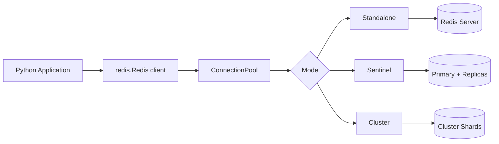

# How to Connect Redis with Python using redis-py

Author: [nawazdhandala](https://github.com/nawazdhandala)

Tags: Redis, Python, Caching, Backend, Performance

Description: Learn how to connect to Redis from Python using the redis-py library, covering connection pools, pipelining, pub/sub, Lua scripting, and async support with aioredis.

---

## Introduction

`redis-py` is the official Python client for Redis, maintained by the Redis team. It supports all Redis commands, connection pooling, pipelining, pub/sub, Lua scripting, Cluster, and Sentinel. This guide covers installing redis-py, connecting to Redis, and the most common usage patterns for Python applications.

## Installation

```bash
pip install redis
```

For async support:

```bash
pip install redis[hiredis]
```

## Basic Connection

```python
import redis

# Simple connection
r = redis.Redis(
    host="localhost",
    port=6379,
    password="yourpassword",  # optional
    db=0,
    decode_responses=True,    # return str instead of bytes
)

# Test connection
r.ping()  # Returns True
print(r.ping())
```

## Connection Architecture



## Connection Pooling

By default, redis-py uses a connection pool. You can share a single pool across your application:

```python
pool = redis.ConnectionPool(
    host="localhost",
    port=6379,
    password="yourpassword",
    max_connections=50,
    decode_responses=True,
)

r = redis.Redis(connection_pool=pool)
```

## String Operations

```python
# Set with expiry
r.set("session:abc", '{"user_id": 42}', ex=3600)

# Get
raw = r.get("session:abc")
import json
session = json.loads(raw)
print(session["user_id"])  # 42

# Increment counter
r.incr("page:views:home")
r.incrby("page:views:home", 5)
views = r.get("page:views:home")
print(f"Views: {views}")

# Set with options
r.set("flag", "1", nx=True, ex=30)  # Set if not exists, expire in 30s
```

## Hash Operations

```python
# Store a user profile
r.hset("user:1001", mapping={
    "name": "Alice",
    "email": "alice@example.com",
    "role": "admin",
    "login_count": "0",
})

# Get individual field
name = r.hget("user:1001", "name")
print(name)  # Alice

# Get all fields
user = r.hgetall("user:1001")
print(user)  # {'name': 'Alice', 'email': '...', 'role': 'admin', 'login_count': '0'}

# Increment numeric field
r.hincrby("user:1001", "login_count", 1)
```

## List Operations (Job Queue)

```python
import json

# Producer: push jobs
job = json.dumps({"type": "send_email", "to": "user@example.com"})
r.lpush("jobs:pending", job)

# Consumer: blocking pop
result = r.brpop("jobs:pending", timeout=5)
if result:
    queue_name, payload = result
    job = json.loads(payload)
    print(f"Processing {job['type']}")
```

## Sorted Set Operations

```python
# Leaderboard
r.zadd("leaderboard", {"alice": 9500, "bob": 8700, "carol": 11200})

# Top 3 with scores
top3 = r.zrevrange("leaderboard", 0, 2, withscores=True)
for name, score in top3:
    print(f"{name}: {score}")

# Player rank (0-indexed)
rank = r.zrevrank("leaderboard", "alice")
print(f"Alice rank: {rank + 1}")
```

## Pipelining

```python
pipe = r.pipeline()
for i in range(100):
    pipe.set(f"key:{i}", f"value:{i}", ex=3600)
results = pipe.execute()
print(f"Set {len(results)} keys")
```

## Transactions with WATCH

```python
def transfer_points(r, from_user, to_user, amount):
    with r.pipeline() as pipe:
        while True:
            try:
                pipe.watch(f"points:{from_user}", f"points:{to_user}")
                from_pts = int(pipe.get(f"points:{from_user}") or 0)
                if from_pts < amount:
                    raise ValueError("Insufficient points")
                pipe.multi()
                pipe.decrby(f"points:{from_user}", amount)
                pipe.incrby(f"points:{to_user}", amount)
                pipe.execute()
                break
            except redis.WatchError:
                continue  # Retry on concurrent modification
```

## Pub/Sub

```python
import threading

def subscribe_handler():
    sub = r.pubsub()
    sub.subscribe("notifications")
    for message in sub.listen():
        if message["type"] == "message":
            data = json.loads(message["data"])
            print(f"Received: {data}")

# Start subscriber in background thread
t = threading.Thread(target=subscribe_handler, daemon=True)
t.start()

# Publish
r.publish("notifications", json.dumps({"type": "alert", "text": "Deploy complete"}))
```

## Lua Scripting

```python
# Atomic rate limiter
rate_limit_script = r.register_script("""
local key = KEYS[1]
local limit = tonumber(ARGV[1])
local window = tonumber(ARGV[2])
local current = redis.call('INCR', key)
if current == 1 then
    redis.call('EXPIRE', key, window)
end
if current > limit then
    return 0
end
return 1
""")

def check_rate_limit(user_id, limit=10, window=60):
    key = f"ratelimit:{user_id}"
    return rate_limit_script(keys=[key], args=[limit, window])

allowed = check_rate_limit("user:42")
print("Allowed" if allowed else "Rate limited")
```

## Async Support

```python
import asyncio
import redis.asyncio as aioredis

async def main():
    r = aioredis.Redis(host="localhost", port=6379, decode_responses=True)

    await r.set("hello", "world", ex=60)
    value = await r.get("hello")
    print(value)  # world

    # Async pipeline
    async with r.pipeline() as pipe:
        for i in range(10):
            pipe.set(f"key:{i}", f"val:{i}")
        await pipe.execute()

    await r.aclose()

asyncio.run(main())
```

## Redis Sentinel

```python
from redis.sentinel import Sentinel

sentinel = Sentinel(
    [("sentinel-1", 26379), ("sentinel-2", 26379)],
    password="yourpassword",
    sentinel_kwargs={"password": "sentinel_password"},
)

master = sentinel.master_for("mymaster", decode_responses=True)
replica = sentinel.slave_for("mymaster", decode_responses=True)

master.set("key", "value")
print(replica.get("key"))
```

## Redis Cluster

```python
from redis.cluster import RedisCluster

rc = RedisCluster(
    startup_nodes=[
        {"host": "redis-node-1", "port": 6379},
        {"host": "redis-node-2", "port": 6379},
    ],
    password="yourpassword",
    decode_responses=True,
)

rc.set("cluster_key", "cluster_value")
print(rc.get("cluster_key"))
```

## Summary

`redis-py` is the official Python Redis client providing comprehensive access to all Redis features. Use `decode_responses=True` to get strings instead of bytes, share a `ConnectionPool` across your app, use `.pipeline()` for batching, `register_script()` for atomic Lua operations, and `redis.asyncio` for async/await support. For high-availability deployments, configure Sentinel or Cluster mode through the library's built-in abstractions.
