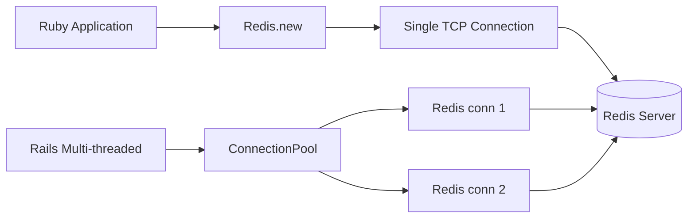

# How to Connect Redis with Ruby using redis-rb

Author: [nawazdhandala](https://github.com/nawazdhandala)

Tags: Redis, Ruby, Caching, Backend, Performance

Description: Learn how to connect to Redis from Ruby using the redis-rb gem, covering connection setup, pipelining, multi/exec transactions, pub/sub, and connection pooling with connection_pool.

---

## Introduction

`redis-rb` is the official Ruby client for Redis. It provides a simple, intuitive API that maps closely to Redis commands. The gem supports pipelining, MULTI/EXEC transactions, pub/sub, Lua scripting, Sentinel, and Cluster. For production applications, `redis-rb` is typically combined with the `connection_pool` gem to share connections across threads safely.

## Installation

```bash
gem install redis
# or add to Gemfile:
# gem 'redis', '~> 5.0'
```

```bash
bundle add redis
```

## Basic Connection

```ruby
require 'redis'

redis = Redis.new(
  host: 'localhost',
  port: 6379,
  password: 'yourpassword',  # optional
  db: 0
)

puts redis.ping  # PONG
```

## Connection Architecture



## Thread-Safe Connection Pooling

In multi-threaded environments (Puma, Sidekiq, etc.), use the `connection_pool` gem:

```bash
gem install connection_pool
```

```ruby
require 'redis'
require 'connection_pool'

REDIS_POOL = ConnectionPool.new(size: 10, timeout: 5) do
  Redis.new(host: 'localhost', port: 6379, password: 'yourpassword')
end

# Use the pool
REDIS_POOL.with do |redis|
  redis.set('key', 'value')
  puts redis.get('key')
end
```

## String Operations

```ruby
# Set with expiry
redis.setex('session:abc', 3600, { user_id: 42 }.to_json)

# Get
raw = redis.get('session:abc')
session = JSON.parse(raw)
puts session['user_id']  # 42

# Increment counter
redis.incr('page:views:home')
redis.incrby('page:views:home', 5)

# Set if not exists
acquired = redis.setnx('lock:resource', '1')
redis.expire('lock:resource', 30) if acquired == 1
```

## Hash Operations

```ruby
# Store user profile
redis.hset('user:1001',
  'name', 'Alice',
  'email', 'alice@example.com',
  'role', 'admin'
)

# Get individual field
name = redis.hget('user:1001', 'name')
puts name  # Alice

# Get all fields
user = redis.hgetall('user:1001')
puts user.inspect  # {"name"=>"Alice", "email"=>"...", "role"=>"admin"}

# Increment numeric field
redis.hincrby('user:1001', 'login_count', 1)
```

## List Operations (Job Queue)

```ruby
require 'json'

# Producer: push job
job = { type: 'send_email', to: 'user@example.com' }.to_json
redis.lpush('jobs:pending', job)

# Consumer: blocking pop (wait up to 5 seconds)
result = redis.brpop('jobs:pending', timeout: 5)
if result
  queue, payload = result
  job = JSON.parse(payload)
  puts "Processing: #{job['type']}"
end
```

## Sorted Set Operations

```ruby
# Leaderboard
redis.zadd('leaderboard', [
  [9500,  'alice'],
  [8700,  'bob'],
  [11200, 'carol'],
])

# Top 3 with scores
top3 = redis.zrevrange('leaderboard', 0, 2, with_scores: true)
top3.each do |name, score|
  puts "#{name}: #{score}"
end

# Rank (0-indexed)
rank = redis.zrevrank('leaderboard', 'alice')
puts "Alice rank: #{rank + 1}"
```

## Pipelining

```ruby
redis.pipelined do |pipe|
  100.times do |i|
    pipe.setex("key:#{i}", 3600, "value:#{i}")
  end
end
puts 'Pipelined 100 commands'
```

## Transactions (MULTI/EXEC)

```ruby
redis.multi do |tx|
  tx.incr('balance:user:1')
  tx.decr('balance:user:2')
end
```

## Optimistic Locking with WATCH

```ruby
def transfer_points(redis, from_user, to_user, amount)
  loop do
    redis.watch("points:#{from_user}", "points:#{to_user}") do
      current = redis.get("points:#{from_user}").to_i
      raise 'Insufficient points' if current < amount

      result = redis.multi do |tx|
        tx.decrby("points:#{from_user}", amount)
        tx.incrby("points:#{to_user}", amount)
      end

      break if result  # nil means WATCH was triggered, retry
    end
  end
end
```

## Pub/Sub

```ruby
require 'redis'

# Subscriber runs in a separate thread
subscriber = Redis.new
Thread.new do
  subscriber.subscribe('notifications') do |on|
    on.message do |channel, message|
      data = JSON.parse(message)
      puts "Received on #{channel}: #{data['text']}"
    end
  end
end

sleep 0.1  # Let subscriber connect

# Publish
redis.publish('notifications', { type: 'alert', text: 'Deploy done' }.to_json)
sleep 0.5
```

## Lua Scripting

```ruby
rate_limit_script = <<~LUA
  local key = KEYS[1]
  local limit = tonumber(ARGV[1])
  local window = tonumber(ARGV[2])
  local current = redis.call('INCR', key)
  if current == 1 then
    redis.call('EXPIRE', key, window)
  end
  if current > limit then
    return 0
  end
  return 1
LUA

def check_rate_limit(redis, user_id, limit: 10, window: 60)
  key = "ratelimit:#{user_id}"
  redis.eval(rate_limit_script, keys: [key], argv: [limit, window])
end

result = check_rate_limit(redis, 'user:42')
puts result == 1 ? 'Allowed' : 'Rate limited'
```

## Redis Sentinel

```ruby
redis = Redis.new(
  url: 'redis://mymaster',
  sentinels: [
    { host: 'sentinel-1', port: 26379 },
    { host: 'sentinel-2', port: 26379 },
  ],
  role: :master,
  password: 'yourpassword'
)
```

## Rails Integration (config/initializers/redis.rb)

```ruby
REDIS = ConnectionPool.new(size: ENV.fetch('REDIS_POOL_SIZE', 10).to_i, timeout: 5) do
  Redis.new(url: ENV.fetch('REDIS_URL', 'redis://localhost:6379'))
end
```

Use it anywhere in Rails:

```ruby
REDIS.with do |r|
  r.setex("product:#{id}", 300, product.to_json)
end
```

## Summary

`redis-rb` maps Redis commands directly to Ruby methods with minimal overhead. Use `Redis.new` for simple scripts and `connection_pool` + `ConnectionPool.new` for multi-threaded applications. Pipeline operations with `redis.pipelined`, run atomic sequences with `redis.multi`, and use `redis.watch` for optimistic locking. The `subscribe` method runs a blocking event loop, so always run it in a dedicated thread.
