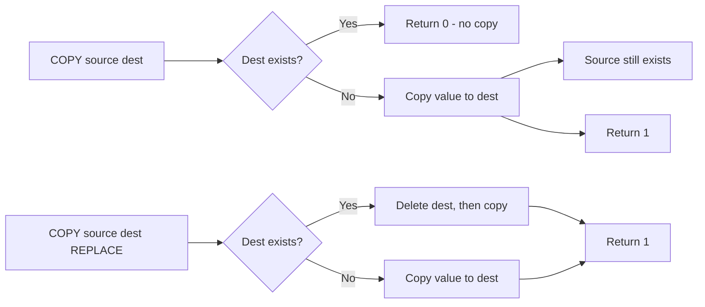

# How to Use COPY in Redis to Copy a Key

Author: [nawazdhandala](https://www.github.com/nawazdhandala)

Tags: Redis, COPY, Key Management, Data Structure

Description: Learn how to use the COPY command in Redis to duplicate a key to a new destination, with options for cross-database copying and destination replacement.

---

## How COPY Works

COPY duplicates a key and its value to a new destination key. It was introduced in Redis 6.2. Unlike RENAME, the source key is preserved after COPY completes. By default, COPY fails if the destination key already exists unless you use the REPLACE option.

COPY supports copying between databases in the same Redis instance using the DB option.



## Syntax

```redis
COPY source destination [DB destination-db] [REPLACE]
```

- `source` - the key to copy from
- `destination` - the key to copy to
- `DB destination-db` - target database number (default: current database)
- `REPLACE` - overwrite destination if it already exists

## Examples

### Basic COPY

```redis
SET config:template "default-settings"
COPY config:template config:tenant:42
```

```text
(integer) 1
```

Both keys now exist:

```redis
GET config:template
```

```text
"default-settings"
```

```redis
GET config:tenant:42
```

```text
"default-settings"
```

### COPY fails if destination exists

```redis
SET existing:dest "other-value"
COPY config:template existing:dest
```

```text
(integer) 0
```

Returns 0 and leaves `existing:dest` unchanged.

### COPY with REPLACE

```redis
COPY config:template existing:dest REPLACE
```

```text
(integer) 1
```

The destination is overwritten with the source value.

### COPY a hash

```redis
HSET user:template name "default" role "viewer" theme "light"
COPY user:template user:new:100
HGETALL user:new:100
```

```text
1) "name"
2) "default"
3) "role"
4) "viewer"
5) "theme"
6) "light"
```

### COPY a sorted set

```redis
ZADD rankings:template 100 "gold" 50 "silver" 25 "bronze"
COPY rankings:template rankings:season:2026

ZRANGE rankings:season:2026 0 -1 WITHSCORES
```

```text
1) "bronze"
2) "25"
3) "silver"
4) "50"
5) "gold"
6) "100"
```

### COPY to a different database

```redis
# Copy key from current database (0) to database 1
COPY session:user:1 session:user:1 DB 1
```

```text
(integer) 1
```

### COPY does not transfer TTL

```redis
SET token:abc "jwt-data"
EXPIRE token:abc 3600
TTL token:abc
```

```text
(integer) 3598
```

```redis
COPY token:abc token:backup
TTL token:backup
```

```text
(integer) -1
```

The copy does not inherit the source's TTL. The destination is a persistent key.

## Use Cases

**Template-based provisioning** - Copy a template key to create a new tenant or user configuration, then customize the copy.

**Snapshot before modification** - Copy a key to a backup name before making destructive changes, providing a rollback point.

**Cross-database promotion** - Move a key from a test database to a production database by copying it with DB option.

**A/B test data setup** - Duplicate a reference dataset to create independent copies for two test groups.

**Safe cloning** - Clone a complex data structure (sorted set, hash) to work on a copy without affecting the original.

## COPY vs RENAME vs DUMP/RESTORE

| Operation | Source After | Destination Must Be Empty | Cross-DB |
|-----------|-------------|--------------------------|----------|
| COPY | Preserved | Yes (unless REPLACE) | Yes (DB option) |
| RENAME | Deleted | No (overwrites) | No |
| DUMP + RESTORE | Preserved | Must not exist | Yes |

## Summary

COPY creates an independent duplicate of a key at a new destination. The source is preserved, making it ideal for template-based provisioning, snapshots, and cross-database promotion. By default, COPY returns 0 if the destination already exists; use REPLACE to allow overwriting. Note that TTL is not copied to the destination. For copying between databases, use the DB option with the target database number.
