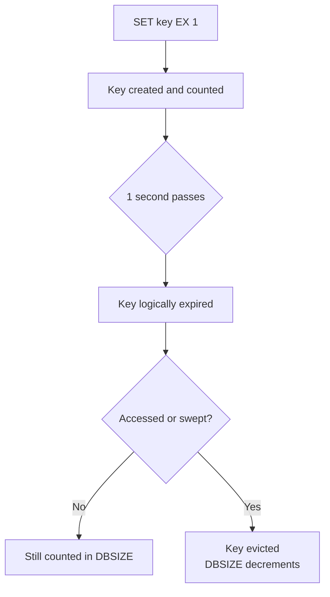
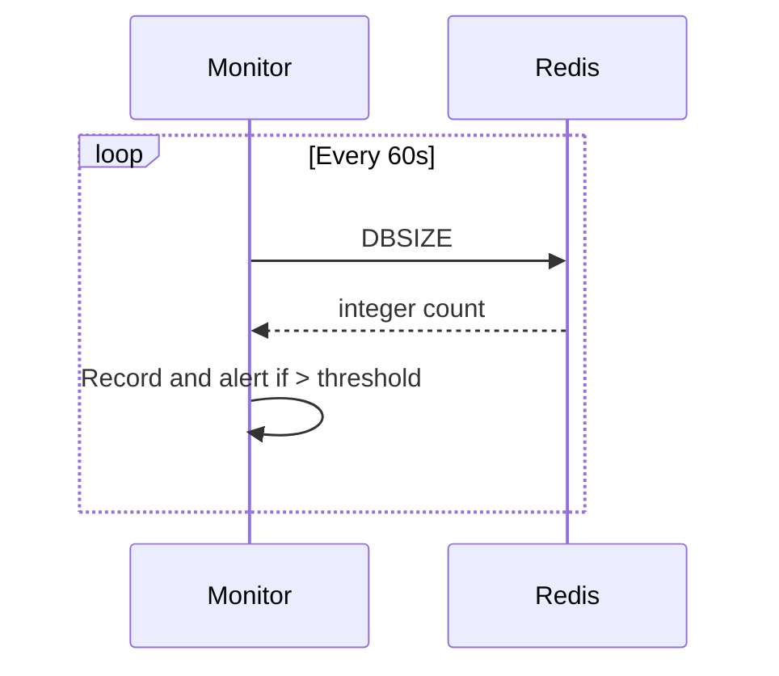

# How to Use DBSIZE in Redis to Count Keys

Author: [nawazdhandala](https://www.github.com/nawazdhandala)

Tags: Redis, Dbsize, Key, Monitoring, Administration

Description: Learn how to use the DBSIZE command to count the number of keys in the currently selected Redis database, and how to interpret the results in context.

---

## Introduction

`DBSIZE` returns the number of keys in the currently selected Redis database. It is an O(1) operation because Redis maintains an internal key count for each database. Use it to quickly gauge the size of your keyspace without scanning all keys.

## Basic Syntax

```redis
DBSIZE
```

Returns an integer representing the number of keys.

## Examples

### Count keys in the default database

```redis
SELECT 0
SET user:1 "Alice"
SET user:2 "Bob"
SET session:abc "token123"

DBSIZE
# (integer) 3
```

### Count keys in a specific database

```redis
SELECT 2
DBSIZE
# (integer) 0

HSET config:app env "production" version "3.1"
DBSIZE
# (integer) 1
```

### Count across multiple databases

```redis
SELECT 0
DBSIZE
# (integer) 5000

SELECT 1
DBSIZE
# (integer) 1200

SELECT 2
DBSIZE
# (integer) 300
```

### After a FLUSHDB

```redis
SELECT 0
DBSIZE
# (integer) 5000

FLUSHDB
DBSIZE
# (integer) 0
```

## Expired Keys and DBSIZE

`DBSIZE` includes keys that have expired but have not yet been lazily evicted. Redis uses a lazy expiration model: a key's expiry is checked on access or by the background expiry sweep. Until evicted, expired keys are still counted.



## Using DBSIZE in Shell Scripts

```redis
# Check if database is empty before proceeding
redis-cli DBSIZE
```

```bash
#!/bin/bash
COUNT=$(redis-cli -n 0 DBSIZE)
if [ "$COUNT" -gt 0 ]; then
  echo "Database has $COUNT keys"
else
  echo "Database is empty"
fi
```

## Comparing DBSIZE to INFO keyspace

`INFO keyspace` provides richer per-database information including key count, expiration count, and average TTL:

```redis
INFO keyspace
# db0:keys=5000,expires=200,avg_ttl=86400
# db1:keys=1200,expires=50,avg_ttl=3600
```

Use `DBSIZE` for a quick count in the current database, or `INFO keyspace` for a full overview across all databases.

## Monitoring Key Growth



## Summary

`DBSIZE` is an O(1) command that returns the number of keys in the selected Redis database. It may slightly overcount because expired but un-evicted keys are included. For a cross-database overview, use `INFO keyspace`. For simple monitoring and scripting, `DBSIZE` is the fastest way to check how many keys are present.
