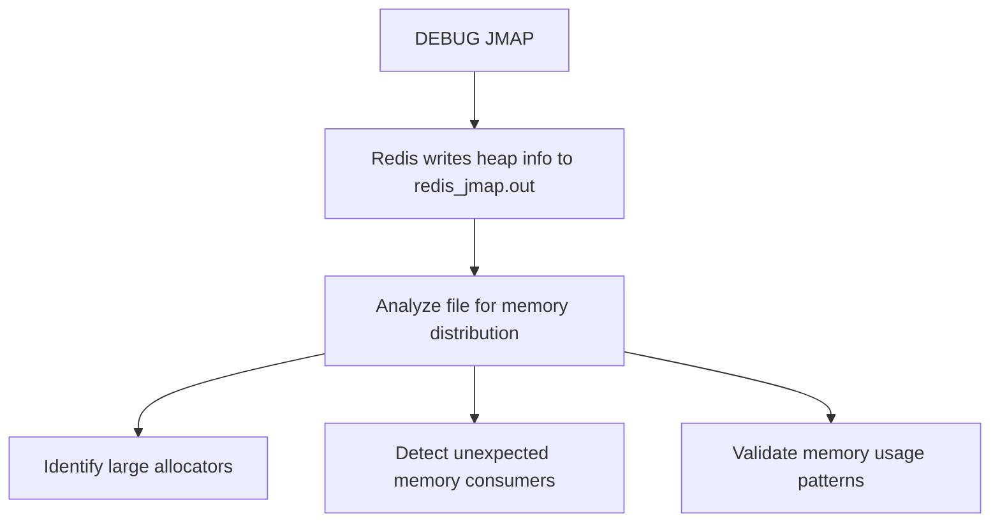

# How to Use DEBUG JMAP in Redis for Memory Analysis

Author: [nawazdhandala](https://www.github.com/nawazdhandala)

Tags: Redis, Debug, Memory, Analysis, Internal

Description: Learn how to use DEBUG JMAP in Redis to dump heap memory usage information for analysis, and understand its role alongside other memory inspection tools like MEMORY USAGE and OBJECT ENCODING.

---

## Overview

`DEBUG JMAP` writes a heap dump of the Redis process memory to a file named `redis_jmap.out` in the working directory (typically the Redis server's working directory). It is inspired by the Java `jmap` tool and is used for low-level memory analysis when investigating memory leaks, unexpected memory growth, or validating memory usage patterns in Redis internals.



## Syntax

```redis
DEBUG JMAP
```

Returns `OK` and writes the heap dump file.

## Basic Usage

```redis
DEBUG JMAP
```

```text
OK
```

The output file `redis_jmap.out` is created in the Redis server's current working directory (typically `/var/lib/redis/` or the directory from which Redis was started).

## Locating the Output File

```bash
# Find the Redis working directory
redis-cli CONFIG GET dir
```

```text
1) "dir"
2) "/var/lib/redis"
```

```bash
ls -la /var/lib/redis/redis_jmap.out
```

## Sample Output Format

The `redis_jmap.out` file contains a text-based heap summary listing memory allocations by type:

```text
jmap: 127.0.0.1:6379
Total: 5242880 bytes
  dict: 1048576 bytes (20%)
  quicklist: 786432 bytes (15%)
  sds: 2097152 bytes (40%)
  ziplist: 524288 bytes (10%)
  ...
```

The exact format varies by Redis version and memory allocator (jemalloc, libc, tcmalloc).

## When to Use DEBUG JMAP

`DEBUG JMAP` is a specialized tool for situations where higher-level memory commands are insufficient:

### Memory leak investigation

If `INFO memory` shows `used_memory` growing unexpectedly:

```redis
INFO memory
```

```text
used_memory:104857600
used_memory_human:100.00M
```

Run `DEBUG JMAP` to get a heap breakdown and identify which internal structures are consuming unexpected memory.

### Validating data structure encoding

After bulk loading data, confirm that Redis is using the expected compact encodings:

```redis
DEBUG JMAP
```

Compare the distribution of `ziplist`, `quicklist`, and `dict` entries against your expectations.

### Before and after comparison

```bash
# Before loading data
redis-cli DEBUG JMAP
cp /var/lib/redis/redis_jmap.out /tmp/before_jmap.out

# Load data
redis-cli SET key1 value1
redis-cli HSET myhash field1 val1

# After loading data
redis-cli DEBUG JMAP
cp /var/lib/redis/redis_jmap.out /tmp/after_jmap.out

# Compare
diff /tmp/before_jmap.out /tmp/after_jmap.out
```

## Complementary Memory Tools

`DEBUG JMAP` works best alongside other Redis memory analysis commands:

### MEMORY USAGE

Get the memory used by a specific key:

```redis
MEMORY USAGE mykey
```

```text
(integer) 72
```

### MEMORY DOCTOR

Get a high-level analysis of memory health:

```redis
MEMORY DOCTOR
```

```text
"Sam, I detected a few issues with this Redis instance memory implants:
* Peak memory: In the past this instance used more than 150% the memory it is using now.
..."
```

### MEMORY STATS

Detailed memory statistics:

```redis
MEMORY STATS
```

### OBJECT ENCODING

Verify encoding of specific keys:

```redis
OBJECT ENCODING myhash
```

```text
"ziplist"
```

## Availability and Restrictions

`DEBUG JMAP` availability depends on:
1. Whether the Redis binary was compiled with jemalloc heap profiling support
2. The Redis version (behavior varies across versions)
3. Whether `DEBUG` commands are enabled (some managed Redis services disable them)

On managed Redis services (AWS ElastiCache, Google Cloud Memorystore), `DEBUG` commands are typically disabled:

```redis
DEBUG JMAP
```

```text
(error) ERR command not allowed
```

## Permissions

In ACL configurations, `DEBUG JMAP` requires access to the `debug` command:

```redis
ACL SETUSER ops_user on >opspass +debug
```

## Summary

`DEBUG JMAP` writes a heap memory dump to `redis_jmap.out` in the Redis working directory, providing a breakdown of memory usage by internal data structure type. Use it for in-depth memory investigation when `INFO memory` and `MEMORY STATS` do not provide enough detail. It is most useful for diagnosing memory leaks, validating encoding choices, and comparing memory distribution before and after data loading. Combine it with `MEMORY USAGE`, `MEMORY DOCTOR`, and `OBJECT ENCODING` for a complete memory analysis workflow. Note that the command is disabled on most managed Redis services.
