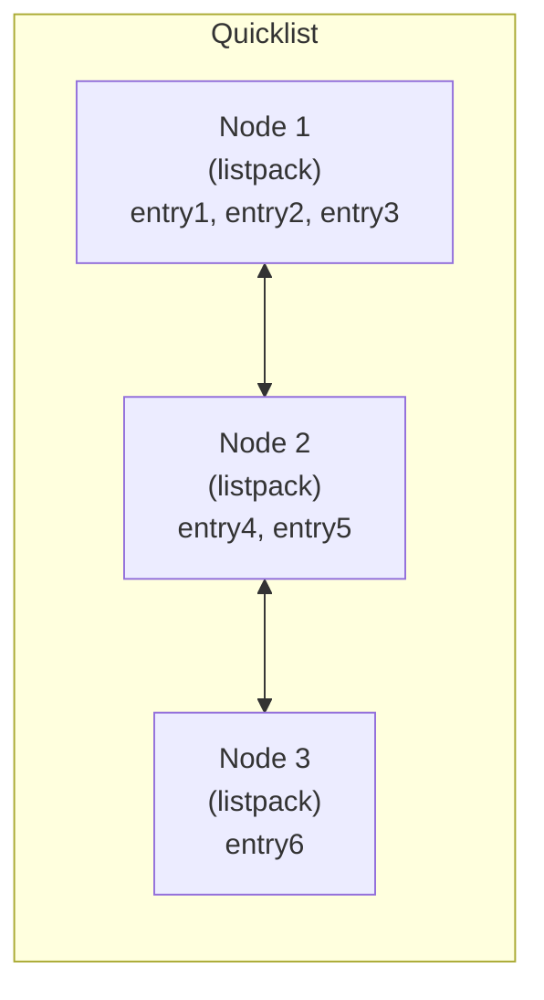

# How to Use DEBUG QUICKLIST-PACKED-THRESHOLD in Redis

Author: [nawazdhandala](https://www.github.com/nawazdhandala)

Tags: Redis, Debug, Quicklist, Encoding, Memory

Description: Learn how to use DEBUG QUICKLIST-PACKED-THRESHOLD to control the listpack node size threshold in Redis quicklists, useful for testing encoding transitions.

---

## Introduction

Redis lists are internally stored as quicklists -- a doubly-linked list of listpack (formerly ziplist) nodes. Each node holds multiple list entries in a compact listpack encoding. The `DEBUG QUICKLIST-PACKED-THRESHOLD` command overrides the size threshold at which quicklist nodes switch from the packed (listpack) format to the individual node format. It is primarily a testing and debugging tool.

## Basic Syntax

```redis
DEBUG QUICKLIST-PACKED-THRESHOLD size
```

- `size` - the new threshold in bytes. Nodes smaller than this size use the packed (listpack) encoding. Set to 0 to restore the default behavior.

Returns `OK`.

## Quicklist Architecture



Each node is a listpack that stores multiple entries compactly. When a node grows beyond the threshold, it is split.

## Examples

### Set a low threshold to force unpacked nodes quickly

```redis
DEBUG QUICKLIST-PACKED-THRESHOLD 10
# OK
```

Now any listpack node larger than 10 bytes will use the plain encoding.

### Create a list and observe encoding

```redis
RPUSH mylist "hello" "world" "foo" "bar"

OBJECT ENCODING mylist
# "listpack"   (small list fits in a single listpack node)
```

### Lower threshold to trigger quicklist

```redis
DEBUG QUICKLIST-PACKED-THRESHOLD 1
# OK

RPUSH mylist "hello" "world" "foo" "bar" "baz"
OBJECT ENCODING mylist
# "quicklist"
```

### Reset to default

```redis
DEBUG QUICKLIST-PACKED-THRESHOLD 0
# OK
```

### Checking current quicklist configuration

The `list-max-listpack-size` config controls the maximum listpack node size and element count:

```redis
CONFIG GET list-max-listpack-size
# 1) "list-max-listpack-size"
# 2) "-2"   (-2 = 8kb per node)
```

Values:
- `-1` = 4 KB
- `-2` = 8 KB (default)
- `-3` = 16 KB
- `-4` = 32 KB
- `-5` = 64 KB
- Positive integer = max number of entries per node

## Relationship to list-max-ziplist-size

In Redis 7.0+, `list-max-ziplist-size` was renamed to `list-max-listpack-size`. Both names are accepted for backward compatibility.

```redis
CONFIG GET list-max-ziplist-size
CONFIG GET list-max-listpack-size
```

## When to Use This Command

- **Unit testing encoding transitions**: Verify that your application correctly handles lists regardless of internal encoding
- **Benchmarking**: Measure performance differences between packed and unpacked quicklist nodes
- **Memory analysis**: Understand how encoding choices affect `MEMORY USAGE` on list keys
- **Development**: Force specific encodings to reproduce edge-case bugs

## Production Considerations

`DEBUG QUICKLIST-PACKED-THRESHOLD` is an internal testing command and is not intended for production use. Changes made with this command affect all lists globally and reset on restart. Restrict access:

```redis
ACL SETUSER app_user ~* +@all -DEBUG
```

## Summary

`DEBUG QUICKLIST-PACKED-THRESHOLD size` overrides the byte threshold at which Redis quicklist nodes use the packed (listpack) encoding. Set it to a low value to force quicklist encoding for testing, or to 0 to restore default behavior. This command is intended for development, testing, and memory analysis -- not for production configuration.
