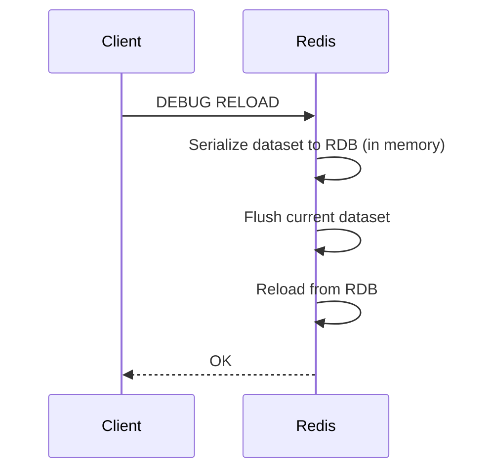

# How to Use DEBUG RELOAD in Redis to Force a Reload

Author: [nawazdhandala](https://www.github.com/nawazdhandala)

Tags: Redis, Debug, Reload, Testing, Administration

Description: Learn how to use the DEBUG RELOAD command to force Redis to save and reload the RDB snapshot in memory, useful for testing persistence and encoding changes.

---

## Introduction

`DEBUG RELOAD` is an internal Redis command intended for testing and debugging. When invoked, it forces Redis to serialize the current dataset to an RDB file and immediately reload it from disk into memory. This simulates a restart without actually restarting the process, making it useful for verifying that your data serializes and deserializes correctly.

## Basic Syntax

```redis
DEBUG RELOAD
```

Returns `OK` when the reload completes.

## What DEBUG RELOAD Does



The operation is synchronous and blocks the server until it completes. For large datasets this can cause significant latency.

## Examples

### Basic reload

```redis
SET user:1 "Alice"
HSET profile:1 name "Alice" age "30"
LPUSH queue "job1" "job2"

DEBUG RELOAD
# OK

GET user:1
# "Alice"

HGETALL profile:1
# 1) "name"
# 2) "Alice"
# 3) "age"
# 4) "30"
```

### Verify encoding changes survive serialization

Redis sometimes promotes a compact encoding (e.g., listpack) to a full encoding (e.g., hashtable) based on size thresholds. `DEBUG RELOAD` helps verify that encodings are correctly applied after deserialization:

```redis
HSET small:hash f1 v1 f2 v2
OBJECT ENCODING small:hash
# "listpack"

DEBUG RELOAD

OBJECT ENCODING small:hash
# "listpack"   (still compact after reload)
```

### Force encoding downgrade test

```redis
# Add many fields to exceed listpack threshold
HSET large:hash f1 v1 f2 v2 f3 v3 f4 v4 f5 v5 f6 v6
OBJECT ENCODING large:hash
# "hashtable"

DEBUG RELOAD

OBJECT ENCODING large:hash
# "hashtable"   (confirmed preserved)
```

### Test TTL persistence

```redis
SET session:abc "token" EX 3600
TTL session:abc
# (integer) 3600

DEBUG RELOAD

TTL session:abc
# (integer) ~3600   (slightly less due to elapsed time)
```

## Use Cases

- **Testing RDB serialization**: Confirm that custom data structures and encoding configurations survive a save-reload cycle
- **Encoding validation**: Verify that compact encodings (listpack, ziplist, intset) behave correctly after reload
- **Simulating restart**: Debug issues that only appear after a Redis restart without actually restarting the process
- **Development and CI**: Use in integration tests to validate persistence correctness

## Important Warnings

- `DEBUG RELOAD` is a blocking operation. Do not run it on a production server under load.
- It is not part of the stable public API. Its behavior may change between Redis versions.
- Access should be restricted using ACLs in production:

```redis
ACL SETUSER app_user ~* +@all -DEBUG
```

## Restricting DEBUG Commands

```redis
# Disable all DEBUG subcommands in redis.conf
rename-command DEBUG ""
```

Or restrict to specific users:

```redis
ACL SETUSER developer +DEBUG +@read +@write ~*
ACL SETUSER app -DEBUG +@all ~*
```

## Summary

`DEBUG RELOAD` forces Redis to serialize its current dataset to RDB format and immediately reload it, simulating a restart in place. It is primarily a development and testing tool for verifying persistence correctness, TTL handling, and encoding behavior. Never run it on a production server under load, and protect it with ACLs or `rename-command` to prevent accidental use.
