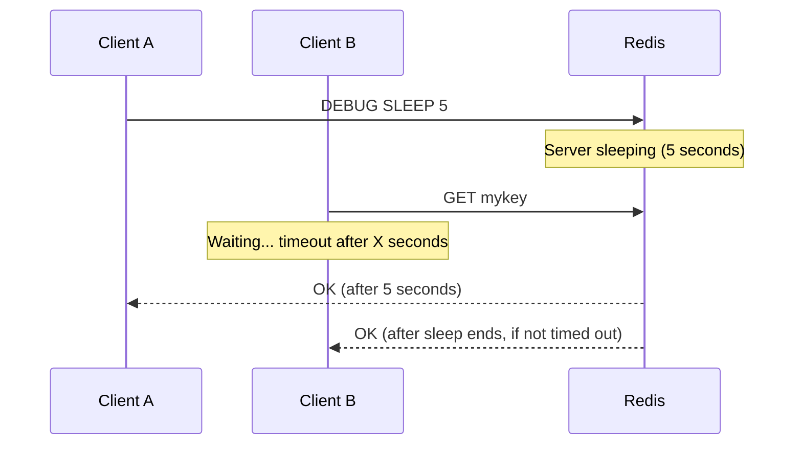
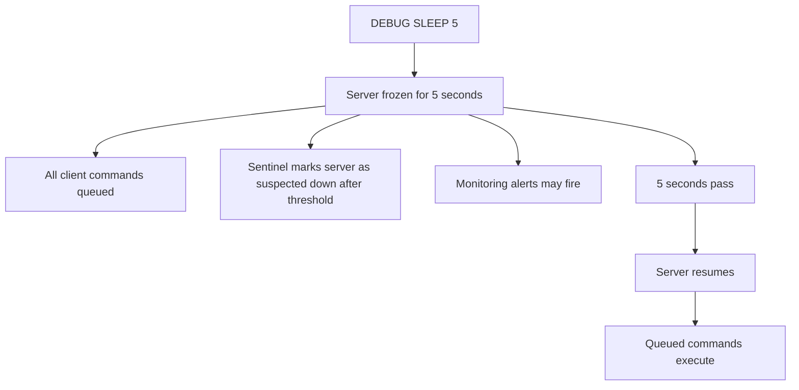

# How to Use DEBUG SLEEP in Redis for Testing

Author: [nawazdhandala](https://www.github.com/nawazdhandala)

Tags: Redis, Debug, Testing, Performance, Timeout

Description: Learn how to use DEBUG SLEEP in Redis to force the server to sleep for a specified duration, enabling testing of client timeout handling, connection retry logic, and monitoring alert pipelines.

---

## Overview

`DEBUG SLEEP` causes the Redis server to pause for the specified number of seconds (which can be fractional). During the sleep, the server does not process any other commands from any client. This makes it useful for simulating server unresponsiveness in tests -- verifying that clients timeout correctly, that monitoring systems fire alerts, and that connection retry logic works as expected.



## Syntax

```redis
DEBUG SLEEP seconds
```

- `seconds`: Duration in seconds. Accepts decimal values (e.g., `0.5` for 500ms).

Returns `OK` after the sleep completes.

## Basic Usage

### Sleep for 2 seconds

```redis
DEBUG SLEEP 2
```

```text
OK
```

(Response comes 2 seconds later)

### Sleep for 500 milliseconds

```redis
DEBUG SLEEP 0.5
```

### Sleep for 10 seconds (useful for triggering alerts)

```redis
DEBUG SLEEP 10
```

## What Happens During Sleep

The entire Redis server pauses. During this time:
- No other commands are processed
- Replicas receive no updates from the primary
- Sentinel detects the primary as unresponsive after `down-after-milliseconds`
- Client timeout counters start ticking



## Testing Client Timeout Behavior

`DEBUG SLEEP` is ideal for testing that your application handles Redis timeouts correctly:

### Test with Python (redis-py)

```python
import redis

r = redis.Redis(
    host='localhost',
    port=6379,
    socket_timeout=1.0,  # 1 second timeout
    socket_connect_timeout=1.0
)

try:
    # This will timeout after 1 second; DEBUG SLEEP holds for 5 seconds
    r.execute_command('DEBUG', 'SLEEP', 5)
except redis.exceptions.TimeoutError:
    print("Timeout occurred as expected")
```

### Test with Node.js (ioredis)

```javascript
const redis = new Redis({
  host: 'localhost',
  port: 6379,
  commandTimeout: 1000, // 1 second
});

try {
  await redis.debug('sleep', 5);
} catch (err) {
  console.log('Command timeout:', err.message);
}
```

## Testing Sentinel Failover Timing

`DEBUG SLEEP` is commonly used to simulate a primary becoming unresponsive to test Sentinel failover:

```bash
# Trigger a sleep longer than down-after-milliseconds (e.g., 5 seconds)
redis-cli -p 6379 DEBUG SLEEP 30 &

# Monitor Sentinel for failover detection
redis-cli -p 26379 SUBSCRIBE +sdown +odown +failover-triggered
```

```text
1) "message"
2) "+sdown"
3) "master mymaster 127.0.0.1 6379"
```

## Testing Monitoring Alert Pipelines

```bash
# Sleep for longer than your monitoring check interval
redis-cli DEBUG SLEEP 60 &

# Verify your monitoring fires an alert within the expected window
```

This validates that your Redis monitoring (Prometheus, Datadog, etc.) detects and alerts on unresponsive Redis instances.

## Permissions

`DEBUG SLEEP` is an administrative command. In ACL configurations, ensure users running tests have access:

```redis
ACL SETUSER test_user on >testpass ~* +debug
```

Or more specifically:

```redis
ACL SETUSER test_user on >testpass ~* +debug|sleep
```

## Safety Warning

`DEBUG SLEEP` freezes the entire Redis server. Never run it in production with a long duration. Even a few seconds can cause client timeouts, replication lag, and potential failovers. Restrict it to test and staging environments.

## Summary

`DEBUG SLEEP seconds` pauses the entire Redis server for the specified duration, during which no commands are processed. Use it to test client timeout handling, validate connection retry logic, trigger Sentinel failover in staging environments, and verify monitoring alert pipelines. Accepts fractional seconds for sub-second sleeps. Never use in production with long durations as it causes real client timeouts, replication lag, and potential automatic failovers.
