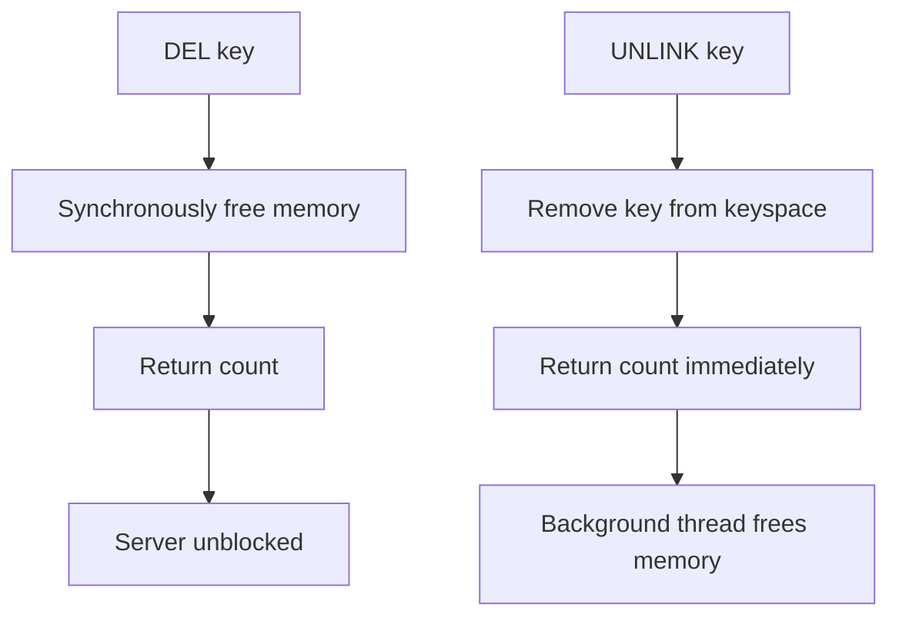

# How to Use DEL and UNLINK in Redis to Delete Keys

Author: [nawazdhandala](https://www.github.com/nawazdhandala)

Tags: Redis, DEL, UNLINK, Key Management, Performance

Description: Learn how to use DEL and UNLINK in Redis to delete keys, understand the difference between synchronous and asynchronous deletion, and choose the right command for your workload.

---

## How DEL and UNLINK Work

DEL removes one or more keys from Redis synchronously. The operation blocks the server until all specified keys are fully deleted. For small keys this is instant, but deleting large keys (e.g., a hash with millions of fields or a large sorted set) can block other commands for a noticeable time.

UNLINK was introduced in Redis 4.0 to solve this problem. It unlinks the key from the keyspace immediately (making it invisible to other commands) and then performs the actual memory reclamation asynchronously in a background thread. For large keys, UNLINK is significantly better for latency.



## Syntax

```redis
DEL key [key ...]
UNLINK key [key ...]
```

Both commands accept multiple keys and return the number of keys that were actually deleted (keys that did not exist are not counted).

## Examples

### Delete a single key

```redis
SET greeting "hello"
DEL greeting
```

```text
(integer) 1
```

### Delete multiple keys at once

```redis
SET user:1 "alice"
SET user:2 "bob"
SET user:3 "carol"

DEL user:1 user:2 user:3
```

```text
(integer) 3
```

### Delete with some missing keys

```redis
SET existing:key "value"
DEL existing:key missing:key another:missing
```

```text
(integer) 1
```

Returns 1 because only one key actually existed and was deleted.

### UNLINK - asynchronous deletion

```redis
SET large:dataset "huge amount of data..."
UNLINK large:dataset
```

```text
(integer) 1
```

The key is immediately invisible to other clients, but memory is reclaimed in the background.

### UNLINK multiple keys

```redis
UNLINK session:1 session:2 session:3 session:4
```

```text
(integer) 4
```

### Verify deletion

```redis
SET temp "value"
DEL temp
EXISTS temp
```

```text
(integer) 0
```

### Delete a large list with UNLINK

```redis
# Create a large list
RPUSH biglist item1 item2 item3
# ... many more items

# Use UNLINK to avoid blocking during memory reclaim
UNLINK biglist
```

### Batch delete keys matching a pattern (using SCAN)

For deleting many keys matching a pattern, combine SCAN with DEL or UNLINK to avoid blocking the server:

```bash
redis-cli --scan --pattern "session:*" | xargs redis-cli UNLINK
```

## When to Use DEL vs UNLINK

| Scenario | Use |
|----------|-----|
| Small keys (strings, short hashes) | DEL - overhead is negligible |
| Large data structures (big lists, hashes, sets) | UNLINK - avoids latency spikes |
| Latency-sensitive production environments | UNLINK - safer choice in general |
| Development/testing | DEL - simpler and immediate |
| Need guaranteed deletion before next operation | DEL - synchronous guarantee |

## Performance Consideration

The time complexity of DEL is O(N) where N is the number of fields in the data structure being deleted. For a string key, this is O(1). For a list with 1 million elements, DEL holds the server's main thread while freeing all those elements.

UNLINK's main thread work is O(1) - it just removes the key from the dictionary. The O(N) memory reclamation happens in a background thread, so the main thread is free to serve other commands immediately.

## Use Cases

**Cache invalidation** - Delete one or many cache entries when underlying data changes. Use UNLINK if entries can be large.

**Session cleanup** - Remove expired or logged-out user sessions. UNLINK is preferred if sessions contain large amounts of data.

**Feature flag removal** - Clean up temporary feature flag keys when a feature is fully rolled out.

**Test teardown** - Remove test data after a test run. DEL is fine here since performance is not critical.

## Summary

DEL and UNLINK both delete Redis keys and return the count of keys actually removed. DEL is synchronous and blocks the event loop during memory reclamation, making it risky for large data structures in production. UNLINK performs the key removal instantly and defers memory freeing to a background thread, keeping latency low. Prefer UNLINK in production for any key that could be large; DEL is acceptable for small keys or when you need synchronous deletion guarantees.
