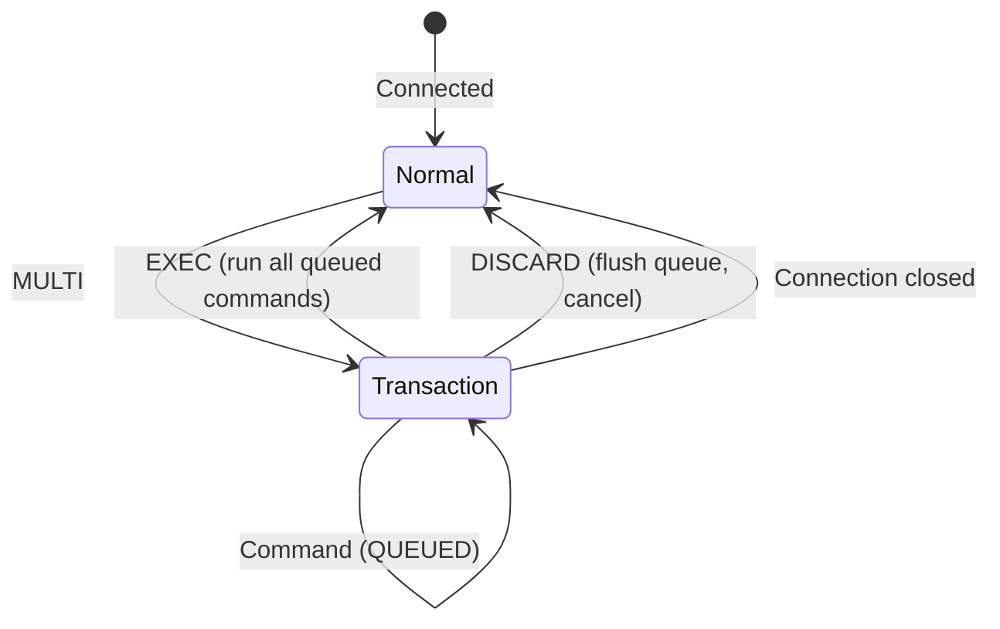

# How to Use DISCARD in Redis to Abort a Transaction

Author: [nawazdhandala](https://www.github.com/nawazdhandala)

Tags: Redis, DISCARD, MULTI, Transaction, Abort

Description: Learn how to use DISCARD in Redis to cancel a queued transaction block opened with MULTI, flushing all queued commands and releasing any WATCH locks.

---

## How DISCARD Works

DISCARD cancels a transaction that was started with MULTI. It flushes all commands that were queued since MULTI was called and exits the transaction state, returning the client to normal command execution mode. If any keys were being watched with WATCH, DISCARD also unWATCHes them.

Think of DISCARD as the rollback for the MULTI/EXEC workflow - but specifically for discarding the queued commands before they are ever executed.



## Syntax

```redis
DISCARD
```

No arguments. Returns `OK` on success. Returns an error if called outside of a transaction.

## Examples

### Basic DISCARD - cancel a queued transaction

```redis
MULTI
SET user:1 "alice"
SET user:2 "bob"
DISCARD
```

```text
OK
```

Neither SET command was executed. The keys remain unchanged.

### Verify keys were not modified

```redis
SET user:1 "original"

MULTI
SET user:1 "modified"
DISCARD

GET user:1
```

```text
"original"
```

DISCARD cancelled the queued SET, so `user:1` is still "original".

### DISCARD outside a transaction returns an error

```redis
DISCARD
```

```text
(error) ERR DISCARD without MULTI
```

DISCARD can only be called after MULTI has started a transaction.

### DISCARD after an error in the queue

If a syntax error occurred while queueing commands, DISCARD can be used to manually clean up:

```redis
MULTI
SET valid:key "ok"
BADCOMMAND
DISCARD
```

```text
OK
```

Though EXEC would have automatically discarded this transaction due to the syntax error, calling DISCARD explicitly is a clean way to handle error cases in application code.

### DISCARD releases WATCH locks

```redis
WATCH account:balance

MULTI
DECRBY account:balance 50

# Something went wrong - abort
DISCARD
```

After DISCARD, the WATCH on `account:balance` is cleared. The key can be watched again or operated on normally.

## DISCARD in Error Handling

A typical pattern in application code when using Redis transactions:

```bash
redis-cli MULTI

# Build the transaction
redis-cli SET order:123:status "processing"
redis-cli INCRBY inventory:product:456 -1

# If a validation check fails before EXEC
if [ "$validation_failed" = "true" ]; then
  redis-cli DISCARD
  echo "Transaction aborted"
else
  redis-cli EXEC
fi
```

## Difference Between DISCARD and Failed EXEC

| Scenario | What Happens to Queued Commands |
|---|---|
| DISCARD called | All queued commands are flushed, never executed |
| EXEC called - all commands valid | All commands execute atomically |
| EXEC called - syntax error in queue | EXECABORT error, no commands run |
| EXEC called - WATCH key modified | EXEC returns nil, no commands run |
| EXEC called - runtime error in one command | That command fails, others still execute |

## Use Cases

**Error handling in transaction builders** - If application code detects an invalid state while building a transaction (before EXEC), call DISCARD to cleanly cancel.

**Retry loops with WATCH** - In an optimistic locking pattern (WATCH + MULTI/EXEC), if EXEC returns nil (watched key changed), use the loop to retry from scratch. DISCARD is not needed in this case since EXEC already aborted, but is useful if you want to abort mid-queue before EXEC.

**User-initiated cancellation** - If a user cancels an action (e.g., cancels a checkout) after your code has already started a MULTI block, DISCARD aborts cleanly.

**Testing and interactive CLI work** - When building transactions interactively in the Redis CLI and making a mistake, DISCARD lets you start over without closing the connection.

## Summary

DISCARD cancels a Redis transaction started with MULTI, flushing all queued commands without executing any of them. It also releases any WATCH locks held by the connection. Calling DISCARD outside a MULTI block returns an error. Use DISCARD in error handling paths to cleanly abort transactions when validation fails or when a logical error is detected before EXEC is called.
